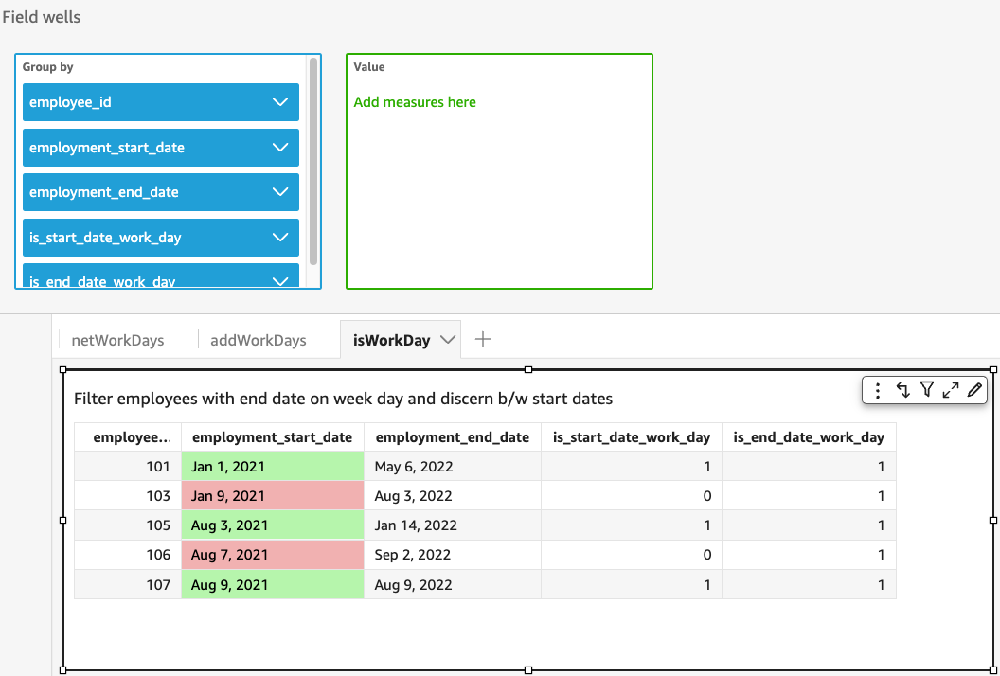

# isWorkDay

`isWorkDay` evaluates a given date-time value to determine if the value
is a workday or not.

`isWorkDay` assumes a standard 5-day work week starting from Monday and
ending on Friday. Saturday and Sunday are assumed to be weekends. The function
always calculates its result at the `DAY` granularity and is exclusive of
the given input date.

## Syntax

```
isWorkDay(`inputDate`)
```

## Arguments

_inputDate_

The date-time value that you want to evaluate. Valid values are as
follows:

- Dataset fields: Any `date` field from the
  dataset that you are adding this function to.
- Date Functions: Any date output from another
  `date` function, for example,
  `parseDate`.
- Calculated fields: Any Quick calculated field
  that returns a `date` value.
- Parameters: Any Quick `DateTime`
  parameter.

## Return type

Integer (`0` or `1`)

## Example

The following exaple determines whether or not the
`application_date` field is a work day.

Let's assume that there's a field named
`application_date` with the following values:

```
2022-08-10
2022-08-06
2022-08-07
```

When you use these fields and add the following calculations,
`isWorkDay` returns the below values:

```
isWorkDay({application_date})

1
0
0
```

The following example filters employees whose employment ends on a work day
and determines whether their employment began on work day or a weekend using
conditional formatting:

```
is_start_date_work_day = isWorkDay(employment_start_date)
is_end_date_work_day = isWorkDay(employment_end_date)
```


