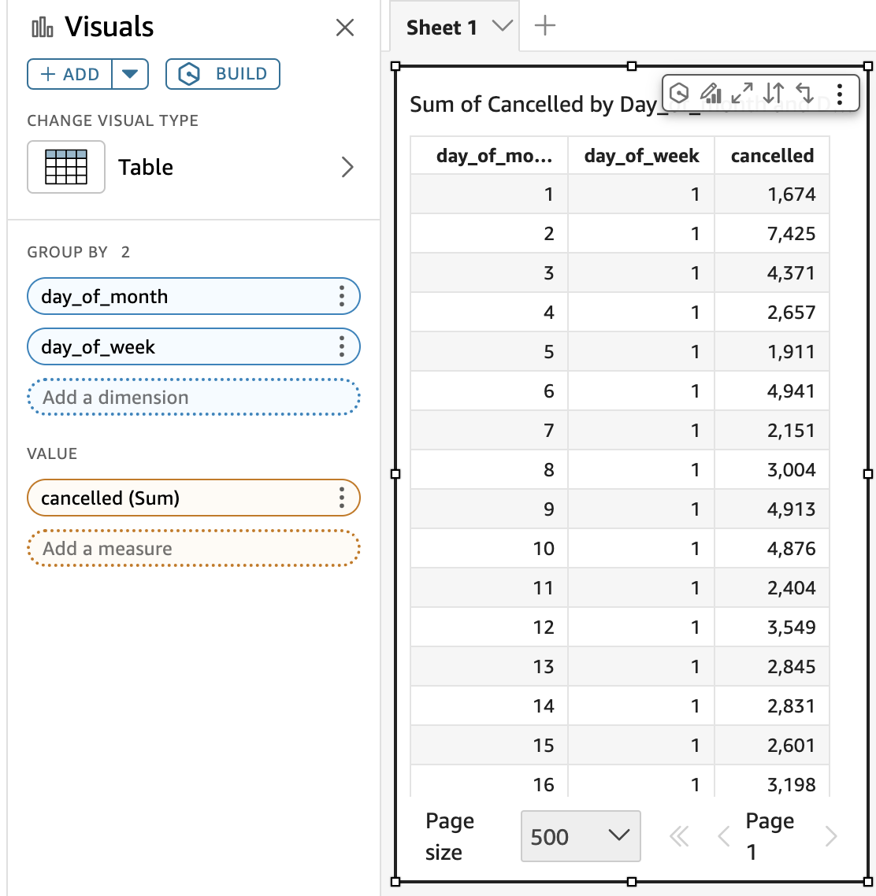

# Amazon Quick expressions

Amazon Quick offers additional expressions to enhance the functionality of
Highcharts visuals. Use the following sections to learn more about common
Quick expressions for highcharts visuals. For more information about
JSON expression language in Amazon Quick, see the [Highcharts Visual QuickStart Guide](https://democentral.learnquicksight.online/#Dashboard-FeatureDemo-Highcharts-Visual "https://democentral.learnquicksight.online/#Dashboard-FeatureDemo-Highcharts-Visual") in [DemoCentral](https://democentral.learnquicksight.online/# "https://democentral.learnquicksight.online/#").

###### Topics

- [getColumn](#highcharts-expressions-getcolumn "#highcharts-expressions-getcolumn")
- [formatValue](#highcharts-expressions-formatvalue "#highcharts-expressions-formatvalue")

## `getColumn`

Use the `getColumn` expressions to return values from specified
column indices. For example, the following table shows a list of products
alongside their category, and price.

| Product name | Category   | Price |
| ------------ | ---------- | ----- |
| Product A    | Technology | 100   |
| Product B    | Retail     | 50    |
| Product C    | Retail     | 75    |

The following `getColumn` query generates an array that shows
all product names alongside their price.

```
{
	product name: ["getColumn", 0],
	price: ["getColumn", 2]
}
```

The follwing JSON is returned:

```
{
	product name: ["Product A", "Product B", "Product C"],
	price: [100, 50, 75]
}
```

You can also pass multiple columns at once to generate an array of arrays,
shown in the following example.

**Input**

```
{
	values: ["getColumn", 0, 2]
}
```

**Output**

```
{
	values: [["Product A", 100], ["Product B", 50], ["Product C", 75]]
}
```

Similar to `getColumn`, the following expressions can be used
to return column values from field wells or themes:

- `getColumnFromGroupBy` returns columns from the group
  by field. The second argument is the index of the column to return.
  For example, `["getColumnFromGroupBy", 0]` returns values
  of the first field as an array. You can pass multiple indices to get
  an array of arrays where each element corresponds to the field in
  the group by field well.
- `getColumnFromValue` returns columns from the value
  field well. You can pass multiple indices to get an array of arrays
  where each element corresponds to the field in the values field
  well.
- `getColorTheme` returns the current color pallete of a
  Quick theme, shown in the following example.

```
{
"color": ["getColorTheme"]
}
```

```
{
"color": ["getPaletteColor", "secondaryBackground"]
}
```

**Example**



`getColumn` can access any column from the table:

- `["getColumn", 0]` - returns array `[1, 2, 3, 4,
5, ...]`
- `["getColumn", 1]` - returns array `[1, 1, 1, 1,
1, ...]`
- `["getColumn", 2]` - returns array `[1674, 7425,
4371, ...]`

`getColumnFromGroupBy` works similarly, but its index is
limited to the columns in the group by field well:

- `["getColumnFromGroupBy", 0]` - returns array `[1,
2, 3, 4, 5, ...]`
- `["getColumnFromGroupBy", 1]` - returns array `[1,
1, 1, 1, 1, ...]`
- `["getColumnFromGroupBy", 2]` - does not work, since
  there are only two columns in the group by field well

`getColumnFromValue` works similarly, but its index is limited
to the columns in the value field well:

- `["getColumnFromValue", 0]` - returns array `[1,
2, 3, 4, 5, ...]`
- `["getColumnFromValue", 1]` - does not work, since
  there is only one column in the value field well
- `["getColumnFromValue", 2]` - does not work, since
  there is only one column in the value field well

## `formatValue`

Use the `formatValue` expression to apply Quick
formatting to your values. For example, the following expression formats the
x-axis label with the format value that is specified in the first field of
Quick field wells.

```
 "xAxis": {
		"categories": ["getColumn", 0],
		"labels": {
		"formatter": ["formatValue", "value", 0]
		}
	}
```
