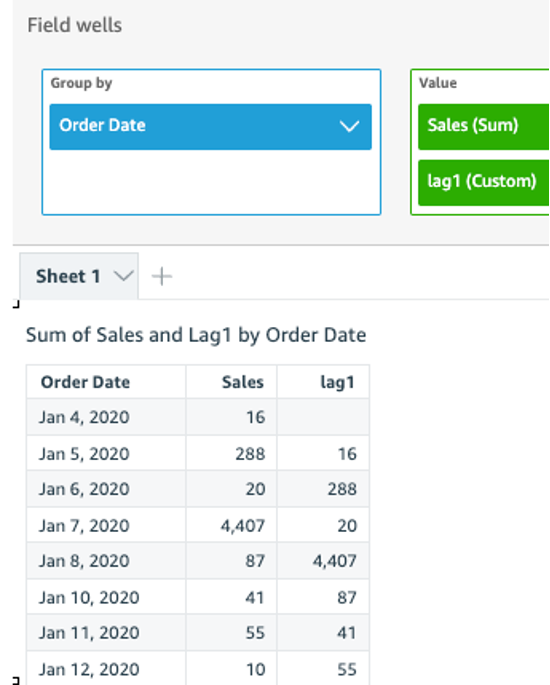
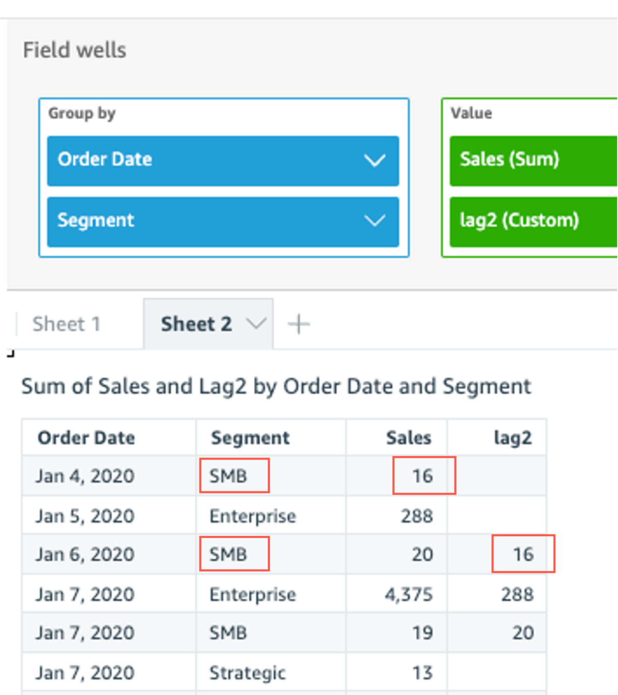

# lag

The `lag` function calculates the lag (previous) value for a measure based
on specified partitions and sorts.

`lag` is supported for use with analyses based on SPICE and
direct query data sets.

## Syntax

The brackets are required. To see which arguments are optional, see the following
descriptions.

```
lag
(
`lag
(
 measure
 ,[ sortorder_field ASC_or_DESC, ... ]
 ,lookup_index
 ,[ partition_field, ... ]
)`]
)
```

## Arguments

_measure_

The measure that you want to get the lag for. This can include an
aggregate, for example `sum({Sales Amt})`.

_sort order field_

One or more measures and dimensions that you want to sort the data by,
separated by commas. You can specify either ascending
(`ASC`) or descending
(`DESC`) sort order.

Each field in the list is enclosed in {} (curly braces), if it is more
than one word. The entire list is enclosed in [ ] (square
brackets).

_lookup index_

The lookup index can be positive or negative, indicating a following
row in the sort (positive) or a previous row in the sort (negative). The
lookup index can be 1–2,147,483,647. For the engines MySQL,
MariaDB, and Amazon Aurora MySQL-Compatible Edition, the lookup index is limited to just

1.

_partition field_

(Optional) One or more dimensions that you want to partition by,
separated by commas.

Each field in the list is enclosed in {} (curly braces), if it is more
than one word. The entire list is enclosed in [ ] (square
brackets).

## Example

The following example calculates the previous `sum(sales)`, partitioned
by the state of origin, in the ascending sort order on
`cancellation_code`.

```
lag
(
     sum(Sales),
     [cancellation_code ASC],
     1,
     [origin_state_nm]
)
```

The following example uses a calculated field with `lag` to display
sales amount for the previous row next to the amount for the current row, sorted by
`Order Date`. The fields in the table calculation are in the field
wells of the visual.

```
lag(
     sum({Sales}),
     [{Order Date} ASC],
     1
)
```

The following screenshot shows the results of the example.



The following example uses a calculated field with `lag` to display the
sales amount for the previous row next to the amount for the current row, sorted by
`Order Date` partitioned by `Segment`.

```
lag
	(
		sum(Sales),
		[Order Date ASC],
		1, [Segment]
	)
```

The following screenshot shows the results of the example.


