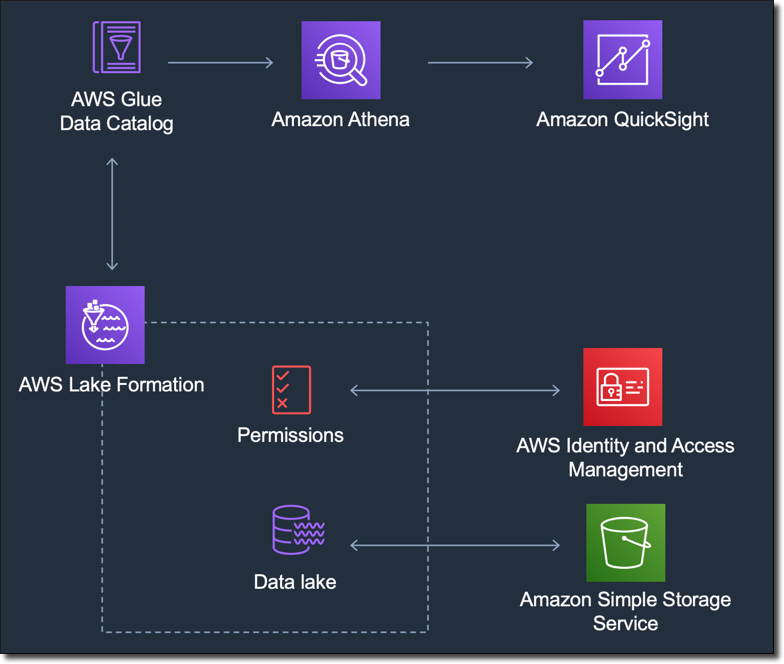

# Authorizing connections through AWS Lake Formation

|                                            |
| ------------------------------------------ |
| \*_Applies<br>to:_<br>• Enterprise Edition |

|                                             |
| ------------------------------------------- |
| Intended audience:<br>System administrators |

If you are querying data with Amazon Athena, you can use AWS Lake Formation to simplify
how you secure and connect to your data from Amazon Quick Sight. Lake Formation adds to the AWS Identity and Access Management (IAM)
permissions model by providing its own permissions model that is applied to AWS
analytics and machine learning services. This centrally defined permissions model
controls data access at a granular level through a simple grant and revoke mechanism.
You can use Lake Formation instead of, or in addition to, using scoped-down policies with
IAM.

When you set up Lake Formation, you register your data sources to allow it to move the data into
a new data lake in Amazon S3. Lake Formation and Athena both work seamlessly with
AWS Glue Data Catalog, making it easy to use them together. Athena databases and tables are
metadata containers. These containers describe the underlying schema of the data, the
data definition language (DDL) statements, and the location of the data in Amazon S3.

The following diagram shows the relationships of the AWS services
involved.


After Lake Formation is configured, you can use Amazon Quick to access databases and tables by
name or through SQL queries. Amazon Quick provides a full-featured editor where you can
write SQL queries. Or you can use the Athena console, the AWS CLI, or your favorite query
editor. For more information, see [Accessing Athena](../../../athena/latest/ug/accessing-ate.md "../../../athena/latest/ug/accessing-ate.md")
in the _Amazon Athena User Guide._

Use the topics below to configure a Lake Formation connection through Lake Formation or through
Amazon Quick.

###### Topics

- [Enabling connection from Lake Formation](#lake-formation-lf-steps "#lake-formation-lf-steps")
- [Enabling connection from
  Amazon Quick](#lake-formation-qs-steps "#lake-formation-qs-steps")

## Enabling connection from Lake Formation

Before you begin using this solution with Quick, make sure that you
can access your data using Athena with Lake Formation. After you verify that the connection is
working through Athena, you need to verify only that Amazon Quick can connect to
Athena. Doing this means you don't have to troubleshoot connections through all
three products at once. One easy way to test the connection is to use the [Athena query console](https://console.aws.amazon.com/athena/ "https://console.aws.amazon.com/athena/") to run
a simple SQL command, for example `SELECT 1 FROM table`.

To set up Lake Formation, the person or team who works on it needs access to create a new
IAM role and to Lake Formation. They also need the information shown in the following list.
For more information, see [Setting
up lake formation](../../../lake-formation/latest/dg/getting-started-setup.md "../../../lake-formation/latest/dg/getting-started-setup.md") in the _AWS Lake Formation Developer Guide._

- Collect the Amazon Resource Names (ARNs) of the Quick users
  and groups that need to access the data in Lake Formation. These users should be
  Amazon Quick authors or administrators.

###### To find Amazon Quick user and group ARNs

    1. Use the AWS CLI to find user ARNs for Amazon Quick authors and
     admins. To do this, run the following `list-users`
     command in your terminal (Linux or Mac) or at your command prompt
     (Windows).


    ```
    aws quicksight list-users --aws-account-id `111122223333` --namespace default --region `us-east-1`
    ```

    The response returns information for each user. We show the Amazon
     Resource Name (ARN) in bold in the following example.


    ```
    RequestId: `a27a4cef-4716-48c8-8d34-7d3196e76468`
    Status: 200
    UserList:
    - Active: `true`
      Arn: **arn:aws:quicksight:`us-east-1`:`111122223333`:user/default/`SaanviSarkar`**
      Email: `SaanviSarkar@example.com`
      PrincipalId: federated/iam/`AIDAJVCZOVSR3DESMJ7TA`
      Role: `ADMIN`
      UserName: `SaanviSarkar`
    ```

    To avoid using the AWS CLI, you can construct the ARNs for each user
     manually.
    2. (Optional) Use the AWS CLI to find ARNs for Amazon Quick groups by
     running the following `list-group` command in your
     terminal (Linux or Mac) or at your command prompt (Windows).


    ```
    aws quicksight list-groups --aws-account-id `111122223333` --namespace default --region us-east-1
    ```

    The response returns information for each group. The ARN appears
     in bold in the following example.


    ```
    GroupList:
    - Arn: **arn:aws:quicksight:us-east-1:`111122223333`:group/default/`DataLake-Scorecard`**  Description: `Data Lake for CXO Balanced Scorecard`
      GroupName: `DataLake-Scorecard`
      PrincipalId: group/`d-90671c9c12/6f9083c2-8400-4389-8477-97ef05e3f7db`
    RequestId: `c1000198-18fa-4277-a1e2-02163288caf6`
    Status: 200
    ```

    If you don't have any Amazon Quick groups, add a group by using
     the AWS CLI to run the `create-group` command. There
     currently isn't an option to do this from the Amazon Quick console.
     For more information, see [Creating and managing groups in
     Amazon Quick](../../../quicksight/latest/user/creating-quicksight-groups.md "../../../quicksight/latest/user/creating-quicksight-groups.md").


    To avoid using the AWS CLI, you can construct the ARNs for each
     group manually.

## Enabling connection from

Amazon Quick

To work with Lake Formation and Athena, make sure that you have AWS resource permissions
configured in Amazon Quick:

- Enable access to Amazon Athena.
- Enable access to the correct buckets in Amazon S3. Usually S3 access is enabled
  when you enable Athena. However, because you can change S3 permissions
  outside of that process, it's a good idea to verify them separately.

For information about how to verify or change AWS resource permissions in
Quick, see [Allowing autodiscovery of AWS resources](../../../quicksight/latest/user/autodiscover-aws-data-sources.md "../../../quicksight/latest/user/autodiscover-aws-data-sources.md") and
[Accessing data sources](../../../quicksight/latest/user/access-to-aws-resources.md "../../../quicksight/latest/user/access-to-aws-resources.md").
