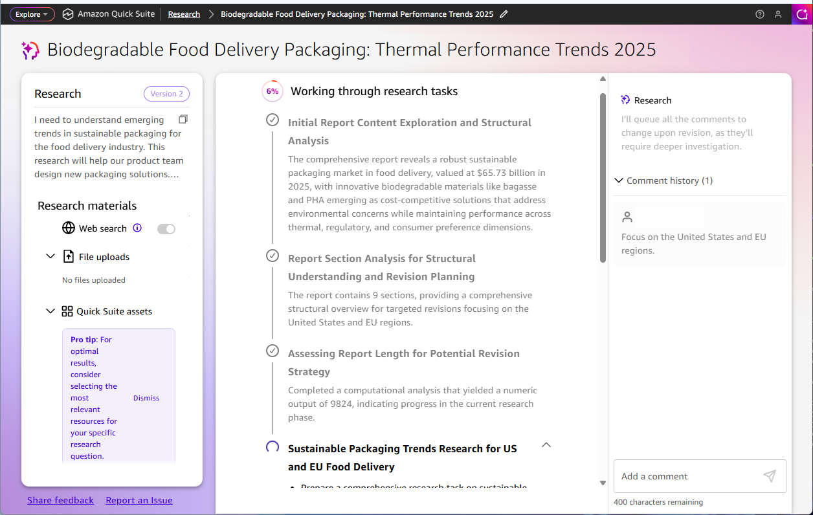
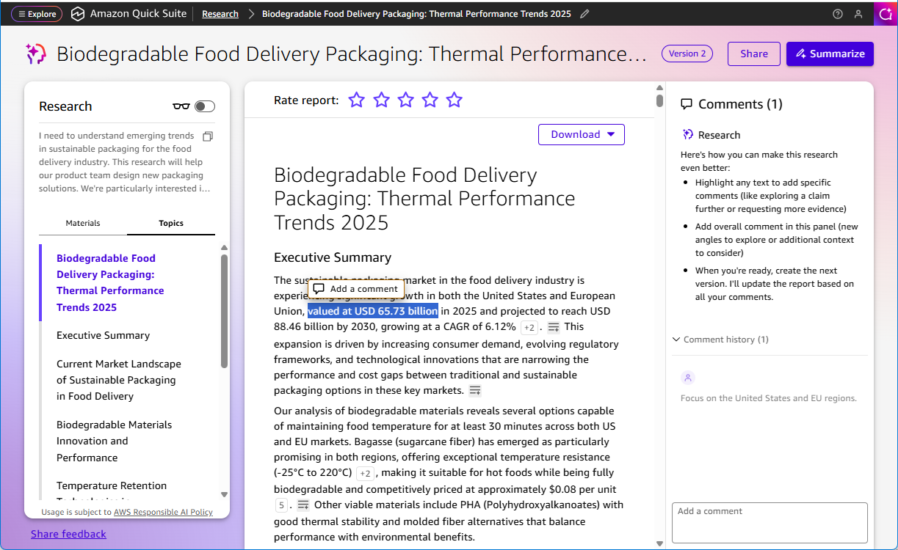

# Making updates

After reviewing your initial research report, you can make updates to refine and improve the results. Quick Research provides multiple ways to provide feedback and request modifications to better meet your needs.

Once you've added all your comments to the queue in the Research pane, the **Revise** button becomes available in the upper right. When you choose **Revise**, you see a message that "Review revision started". Quick Research goes back to work through its research tasks with your new comments in mind, analyzing the existing report's structure and content to determine how to apply your comments.

The version increments to Version 2 when the revision is complete.

## In-line feedback

Provide specific feedback on individual sections or findings within your research report by highlighting the word or section you want to comment on. In-line feedback allows you to request clarification, additional detail, or corrections for specific parts of the report without affecting the entire document.

## High level feedback

Submit broader feedback about the overall direction, focus, or approach of your research. High-level feedback is useful when you want to adjust the research scope, change the emphasis, or request additional analysis across the entire report.
