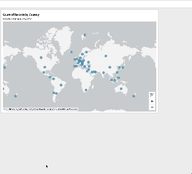

# Marker clustering on geospatial point

maps in Quick

Use marker clustering to improve readability of collocated points on a map.
Geospatial locations on point maps are represented using markers. Usually, there is
one marker per data point. However, if there are too many markers close together,
the map becomes difficult to read. To make it easier to interpret the map, you can
enable marker clustering to represent groupings of locations on the map. As the
reader zooms in on the map, the clustered markers leave the area marker to display
separately.

###### To add cluster points to a map

1. Open your analysis, and choose the geospatial map that you want to format.
   When you select a visual, it displays with a highlight around it.
2. To open the formatting pane, select the **Format visual** icon
   from the on-visual menu.
3. On the formatting pane at left, choose **Points**.
4. Choose one of the following options:
   - **Basic** – use the default
     display setting for map points.
   - **Cluster points** – cluster
     map points together when there are many in one area.
