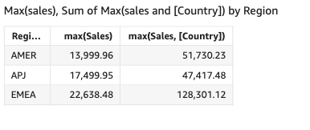

# max

The `max` function returns the maximum value of the specified measure or
date, grouped by the chosen dimension or dimensions. For example, `max(sales
 goal)` returns the maximum sales goals grouped by the (optional) chosen
dimension.

## Syntax

```
max(*measure*, [*group-by level*])
```

## Arguments

_measure_

The argument must be a measure or a date. Null values are omitted from
the results. Literal values don't work. The argument must be a
field.

Maximum dates work only in the **Value** field well
of tables and pivot tables.

_group-by level_

(Optional) Specifies the level to group the aggregation by. The level
added can be any dimension or dimensions independent of the dimensions
added to the visual.

The argument must be a dimension field. The group-by level must be
enclosed in square brackets `[ ]`. For more information, see
[Level-aware calculation - aggregate (LAC-A)
functions](../../../quicksight/latest/user/level-aware-calculations-aggregate.md "../../../quicksight/latest/user/level-aware-calculations-aggregate.md").

## Examples

The following example returns the max sales value for each region. It is compared
to the total, minimum, and median sales values.

```
max({Sales})
```


You can also specify at what level to group the computation using one or more
dimensions in the view or in your dataset. This is called a LAC-A function. For more
information about LAC-A functions, see [Level-aware calculation - aggregate (LAC-A)
functions](../../../quicksight/latest/user/level-aware-calculations-aggregate.md "../../../quicksight/latest/user/level-aware-calculations-aggregate.md"). The following example calculates the max sales at the Country
level, but not across other dimensions (Region) in the visual.

```
max({Sales}, [Country])
```


