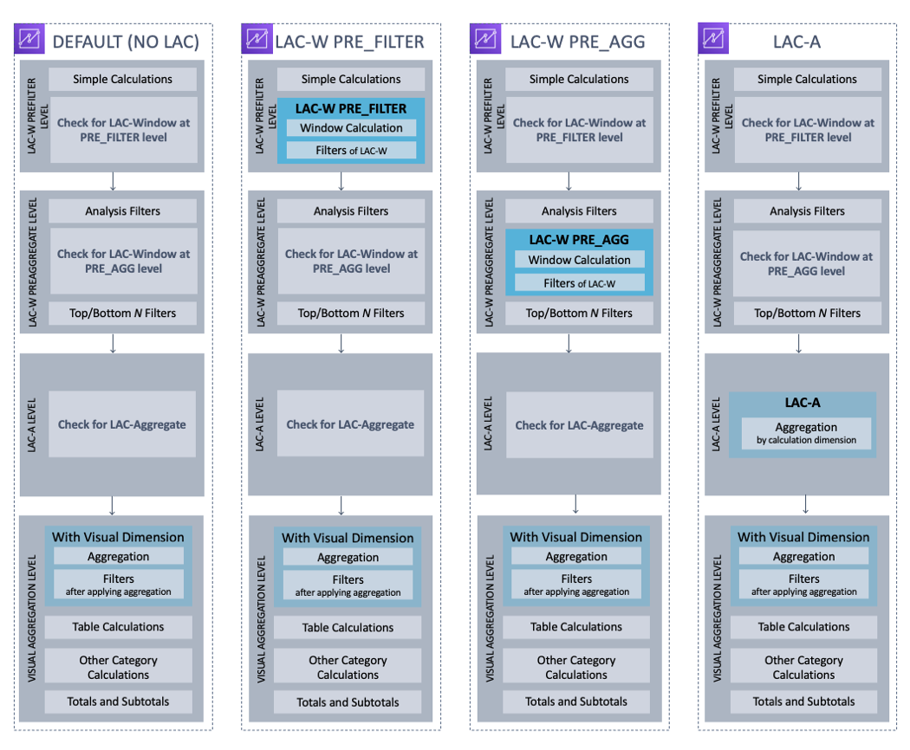

# Order of evaluation in Amazon Quick Sight

When you open or update an analysis, before displaying it Amazon Quick Sight evaluates everything
that is configured in the analysis in a specific sequence. Amazon Quick Sight translates the
configuration into a query that a database engine can run. The query returns the data in
a similar way whether you connect to a database, a software as a service (SaaS) source,
or the Amazon Quick Sight analytics engine ([SPICE](spice.md "spice.md")).

If you understand the order that the configuration is evaluated in, you know the
sequence that dictates when a specific filter or calculation is applied to your
data.

The following illustration shows the order of evaluation. The column on the left shows
the order of evaluation when no level aware calculation window (LAC-W) nor aggregate
(LAC-A) function is involved. The second column shows the order of evaluation for
analyses that contain calculated fields to compute LAC-W expressions at the prefilter
(`PRE_FILTER`) level. The third column shows the order of evaluation for
analyses that contain calculated fields to compute LAC-W expressions at the preaggregate
(`PRE_AGG`) level. The last column shows the order of evaluation for
analyses that contain calculated fields to compute LAC-A expressions. Following the
illustration, there is a more detailed explanation of the order of evaluation. For more
information about level aware calculations, see [Using level-aware calculations in
Quick Sight](level-aware-calculations.md "level-aware-calculations.md").

The following list shows the sequence in which Amazon Quick Sight applies the configuration in
your analysis. Anything that's set up in your data set happens outside your analysis,
for example calculations at the data set level, filters, and security settings. These
all apply to the underlying data. The following list only covers what happens inside the
analysis.

1. **LAC-W Prefilter level**: Evaluates the data at
   the original table cardinality before analysis filters
   1. **Simple calculations**: Calculations at
      scalar level without any aggregations or window calculations. For
      example, `date_metric/60, parseDate(date, 'yyyy/MM/dd'),
ifelse(metric > 0, metric, 0), split(string_column, '|'
0)`.
   2. **LAC-W function PRE_FILTER**: If any
      LAC-W PRE_FILTER expression is involved in the visual, Amazon Quick Sight firstly
      computes the window function at the original table level, before any
      filters. If the LAC-W PRE_FILTER expression is used in filters, it is
      applied at this point. For example, `maxOver(Population, [State,
County], PRE_FILTER) > 1000`.

2. **LAC-W PRE_AGG**: Evaluates the data at the
   original table cardinality before aggregations
   1. **Filters added during analysis**:
      Filters created for un-aggregated fields in the visuals are applied at
      this point, which are similar to WHERE clauses. For example, `year
      > 2020`.
   2. **LAC-W function PRE_AGG**: If any LAC-W
      PRE_AGG expression is involved in the visual, Amazon Quick Sight computes the
      window function before any aggregation applied. If the LAC-W PRE_AGG
      expression is used in filters, it is applied at this point. For example,
      `maxOver(Population, [State, County], PRE_AGG) >
1000`.
   3. **Top/bottom N filters**: Filters that
      are configured on dimensions to display top/bottom N items.

3. **LAC-A level**: Evaluate aggregations at
   customized level, before visual aggregations
   1. **Custom-level aggregations**: If any
      LAC-A expression is involved in the visual, it is calculated at this
      point. Based on the table after the filters mentioned above, Amazon
      QuickSight computes the aggregation, grouped by the dimensions that are
      specified in the calculated fields. For example, `max(Sales,
[Region])`.

4. **Visual level**: Evaluates aggregations at
   visual level, and post-aggregation table calculations, with the remaining
   configurations applied in the visuals
   1. **Visual-level aggregations**: Visual
      aggregations should always be applied except for tabular tables (where
      dimension is empty). With this setting, aggregations based on the fields
      in the field wells are calculated, grouped by the dimensions that put
      into the visuals. If any filter is built on top of aggregations, it is
      applied at this point, similar to HAVING clauses. For example,
      `min(distance) > 100`.
   2. **Table calculations**: If there is any
      post-aggregation table calculation (it should take aggregated expression
      as operand) referenced in the visual, it is calculated at this point.
      Amazon Quick Sight performs window calculations after visual aggregations.
      Similarly, filters built on such calculations are applied.
   3. **Other category calculations**: This
      type of calculation only exists in line/bar/pie/donut charts. For more
      information, see [Display limits](working-with-visual-types.md#display-limits "working-with-visual-types.md#display-limits").
   4. **Totals and subtotals**: Totals and
      Subtotals are calculated in donut charts (only totals), tables (only
      totals) and pivot tables, if requested.
