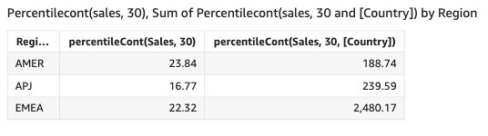

# percentileCont

The `percentileCont` function calculates percentile based on a continuous
distribution of the numbers in the measure. It uses the grouping and sorting that are
applied in the field wells. It answers questions like: What values are representative of
this percentile? To return an exact percentile value that might not be present in your
dataset, use `percentileCont`. To return the nearest percentile value that is
present in your dataset, use `percentileDisc` instead.

## Syntax

```
percentileCont(`expression`, `percentile`, [*group-by level*])
```

## Arguments

_measure_

Specifies a numeric value to use to compute the percentile. The
argument must be a measure or metric. Nulls are ignored in the
calculation.

_percentile_

The percentile value can be any numeric constant 0–100. A
percentile value of 50 computes the median value of the measure.

_group-by level_

(Optional) Specifies the level to group the aggregation by. The level
added can be any dimension or dimensions independent of the dimensions
added to the visual.

The argument must be a dimension field. The group-by level must be
enclosed in square brackets `[ ]`. For more information, see
[Level-aware calculation - aggregate (LAC-A)
functions](../../../quicksight/latest/user/level-aware-calculations-aggregate.md "../../../quicksight/latest/user/level-aware-calculations-aggregate.md").

## Returns

The result of the function is a number.

## Usage notes

The `percentileCont` function calculates a result based on a continuous
distribution of the values from a specified measure. The result is computed by
linear interpolation between the values after ordering them based on settings in the
visual. It's different from `percentileDisc`, which simply returns a
value from the set of values that are aggregated over. The result from
`percentileCont` might or might not exist in the values from the
specified measure.

## Examples of

percentileCont

The following examples help explain how percentileCont works.

###### Example Comparing median, `percentileCont`, and

`percentileDisc`

The following example shows the median for a dimension (category) by using the
`median`, `percentileCont`, and
`percentileDisc` functions. The median value is the same as the
percentileCont value. `percentileCont` interpolates a value, which
might or might not be in the data set. However, because
`percentileDisc` always displays a value that exists in the
dataset, the two results might not match. The last column in this example shows
the difference between the two values. The code for each calculated field is as
follows:

- `50%Cont = percentileCont(
`example` , 50 )`
- `median = median( `example`
)`
- `50%Disc = percentileDisc(
`example` , 50 )`
- `Cont-Disc = percentileCont(
`example`, 50 ) −
percentileDisc(`example` , 50
)`
- `example = left( `category`, 1 )`
  (To make a simpler example, we used this expression to shorten the names
  of categories down to their first letter.)

```
  example     median       50%Cont      50%Disc      Cont-Disc
 -------- ----------- ------------ -------------- ------------
 A          22.48          22.48          22.24          0.24
 B          20.96          20.96          20.95          0.01
 C          24.92          24.92          24.92          0
 D          24.935         24.935         24.92          0.015
 E          14.48          14.48          13.99          0.49
```

###### Example 100th percentile as maximum

The following example shows a variety of `percentileCont` values
for the `example` field. The calculated fields `*n*%Cont` are defined as
`percentileCont( {`example`} ,*n*)`. The interpolated values in each
column represent the numbers that fall into that percentile bucket. In some
cases, the actual data values match the interpolated values. For example, the
column `100%Cont` shows the same value for every row because 6783.02
is the highest number.

```
 example      50%Cont     75%Cont      99%Cont    100%Cont
 --------- ----------- ----------- ------------ -----------

 A             20.97       84.307      699.99      6783.02
 B             20.99       88.84       880.98      6783.02
 C             20.99       90.48       842.925     6783.02
 D             21.38       85.99       808.49      6783.02
```

You can also specify at what level to group the computation using one or more
dimensions in the view or in your dataset. This is called a LAC-A function. For more
information about LAC-A functions, see [Level-aware calculation - aggregate (LAC-A)
functions](../../../quicksight/latest/user/level-aware-calculations-aggregate.md "../../../quicksight/latest/user/level-aware-calculations-aggregate.md"). The following example calculates the 30th percentile based on
a continuous distribution of the numbers at the Country level, but not across other
dimensions (Region) in the visual.

```
percentileCont({Sales}, 30, [Country])
```


