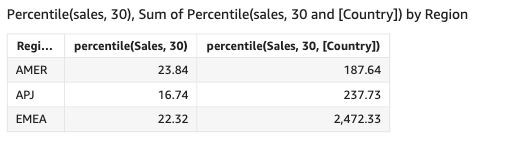

# percentileDisc

(percentile)

The `percentileDisc` function calculates the percentile based on the actual
numbers in `measure`. It uses the grouping and sorting that are applied in
the field wells. The `percentile` function is an alias of
`percentileDisc`.

Use this function to answer the following question: Which actual data points are
present in this percentile? To return the nearest percentile value that is present in
your dataset, use `percentileDisc`. To return an exact percentile value that
might not be present in your dataset, use `percentileCont` instead.

## Syntax

```
percentileDisc(`expression`, `percentile`, [*group-by level*])
```

## Arguments

_measure_

Specifies a numeric value to use to compute the percentile. The
argument must be a measure or metric. Nulls are ignored in the
calculation.

_percentile_

The percentile value can be any numeric constant 0–100. A
percentile value of 50 computes the median value of the measure.

_group-by level_

(Optional) Specifies the level to group the aggregation by. The level
added can be any dimension or dimensions independent of the dimensions
added to the visual.

The argument must be a dimension field. The group-by level must be
enclosed in square brackets `[ ]`. For more information, see
[Level-aware calculation - aggregate (LAC-A)
functions](../../../quicksight/latest/user/level-aware-calculations-aggregate.md "../../../quicksight/latest/user/level-aware-calculations-aggregate.md").

## Returns

The result of the function is a number.

## Usage

notes

`percentileDisc` is an inverse distribution function that assumes a
discrete distribution model. It takes a percentile value and a sort specification
and returns an element from the given set.

For a given percentile value `P`, `percentileDisc` uses the
sorted values in the visual and returns the value with the smallest cumulative
distribution value that is greater than or equal to `P`.

## Examples of

percentileDisc

The following examples help explain how percentileDisc works.

###### Example Comparing median, `percentileDisc`, and

`percentileCont`

The following example shows the median for a dimension (category) by using the
`percentileCont`, and `percentileDisc`, and
`median` functions. The median value is the same as the
percentileCont value. `percentileCont` interpolates a value, which
might or might not be in the data set. However, because
`percentileDisc` always displays the closest value that exists in
the dataset, the two results might not match. The last column in this example
shows the difference between the two values. The code for each calculated field
is as follows:

- `50%Cont = percentileCont(
`example` , 50 )`
- `median = median( `example`
)`
- `50%Disc = percentileDisc(
`example` , 50 )`
- `Cont-Disc = percentileCont(
`example`, 50 ) −
percentileDisc(`example` , 50
)`
- `example = left( `category`, 1 )`
  (To make a simpler example, we used this expression to shorten the names
  of categories down to their first letter.)

```
 example     median       50%Cont      50%Disc      Cont-Disc
 -------- ----------- ------------ -------------- ------------
 A          22.48          22.48          22.24          0.24
 B          20.96          20.96          20.95          0.01
 C          24.92          24.92          24.92          0
 D          24.935         24.935         24.92          0.015
 E          14.48          14.48          13.99          0.49
```

###### Example 100th percentile as maximum

The following example shows a variety of `percentileDisc` values
for the `example` field. The calculated fields `*n*%Disc` are defined as
`percentileDisc( {`example`} ,*n*)`. The values in each column are actual
numbers that come from the dataset.

```
 example     50%Disc      75%Disc        99%Disc      100%Disc
 -------- ----------- ------------ -------------- ------------
 A            20.97        73.98         699.99       6783.02
 B            42.19        88.84         820.08       6783.02
 C            30.52        90.48         733.44       6783.02
 D            41.38        85.99         901.29       6783.0
```

You can also specify at what level to group the computation using one or more
dimensions in the view or in your dataset. This is called a LAC-A function. For more
information about LAC-A functions, see [Level-aware calculation - aggregate (LAC-A)
functions](../../../quicksight/latest/user/level-aware-calculations-aggregate.md "../../../quicksight/latest/user/level-aware-calculations-aggregate.md"). The following example calculates the 30th percentile based on
a continuous distribution of the numbers at the Country level, but not across other
dimensions (Region) in the visual.

```
percentile({Sales}, 30, [Country])
```


