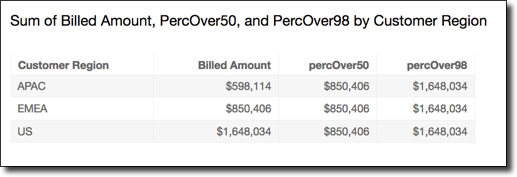

# percentileDiscOver

The `percentileDiscOver` function calculates the percentile based on the
actual numbers in `measure`. It uses the grouping and sorting that are
applied in the field wells. The result is partitioned by the specified dimension at the
specified calculation level. The `percentileOver` function is an alias of
`percentileDiscOver`.

Use this function to answer the following question: Which actual data points are
present in this percentile? To return the nearest percentile value that is present in
your dataset, use `percentileDiscOver`. To return an exact percentile value
that might not be present in your dataset, use `percentileContOver` instead.

## Syntax

```
percentileDiscOver (
     `measure`
   , `percentile-n`
   , [`partition-by, …`]
   , `calculation-level`
)
```

## Arguments

_measure_

Specifies a numeric value to use to compute the percentile. The
argument must be a measure or metric. Nulls are ignored in the
calculation.

_percentile-n_

The percentile value can be any numeric constant 0–100. A
percentile value of 50 computes the median value of the measure.

_partition-by_

(Optional) One or more dimensions that you want to partition by,
separated by commas. Each field in the list is enclosed in { } (curly
braces), if it is more than one word. The entire list is enclosed in [ ]
(square brackets).

_calculation-level_

Specifies where to perform the calculation in relation to the order
of evaluation. There are three supported calculation levels:

- PRE_FILTER
- PRE_AGG
- POST_AGG_FILTER (default) – To use this calculation
  level, you need to specify an aggregation on
  `measure`, for example
  `sum(measure)`.

PRE_FILTER and PRE_AGG are applied before the aggregation occurs in a
visualization. For these two calculation levels, you can't specify an
aggregation on `measure` in the calculated field expression.
To learn more about calculation levels and when they apply, see [Order of evaluation in Amazon Quick](../../../quicksight/latest/user/order-of-evaluation-quicksight.md "../../../quicksight/latest/user/order-of-evaluation-quicksight.md") and
[Using level-aware calculations in
Quick](../../../quicksight/latest/user/level-aware-calculations.md "../../../quicksight/latest/user/level-aware-calculations.md").

## Returns

The result of the function is a number.

## Example of

percentileDiscOver

The following example helps explain how percentileDiscOver works.

###### Example Comparing calculation levels for the median

The following example shows the median for a dimension (category) by using
different calculation levels with the `percentileDiscOver` function.
The percentile is 50. The dataset is filtered by a region field. The code for
each calculated field is as follows:

- `example = left( `category`, 1 )`
  (A simplified example.)
- `pre_agg = percentileDiscOver ( {Revenue} , 50 , [ example
] , PRE_AGG)`
- `pre_filter = percentileDiscOver ( {Revenue} , 50 , [
example ] , PRE_FILTER)`
- `post_agg_filter = percentileDiscOver ( sum ( {Revenue} )
, 50 , [ example ], POST_AGG_FILTER )`

```
example   pre_filter     pre_agg      post_agg_filter
------------------------------------------------------
0            106,728     119,667            4,117,579
1            102,898      95,946            2,307,547
2             97,629      92,046              554,570
3            100,867     112,585            2,709,057
4             96,416      96,649            3,598,358
5            106,293      97,296            1,875,648
6             97,118      64,395            1,320,672
7             99,915      90,557              969,807
```

###### Example The median

The following example calculates the median (the 50th percentile) of
`Sales` partitioned by `City` and `State`.

```
percentileDiscOver
(
  Sales,
  50,
  [City, State]
)
```

The following example calculates the 98th percentile of `sum({Billed
 Amount})` partitioned by `Customer Region`. The fields in
the table calculation are in the field wells of the visual.

```
percentileDiscOver
(
  sum({Billed Amount}),
  98,
  [{Customer Region}]
)
```

The following screenshot shows the how these two examples look on a chart.


