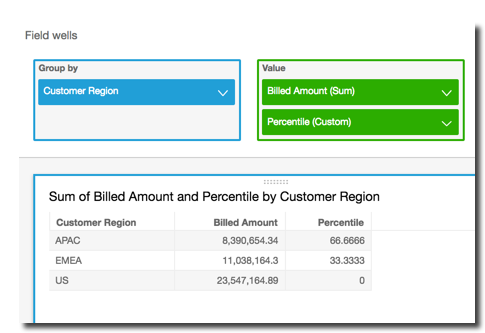

# percentileRank

The `percentileRank` function calculates the percentile rank of a measure
or a dimension in comparison to the specified partitions. The percentile rank
value(`x`) indicates that the current item is above
`x`% of values in the specified partition. The percentile
rank value ranges from 0 (inclusive) to 100 (exclusive).

## Syntax

The brackets are required. To see which arguments are optional, see the following
descriptions.

```
percentileRank
(
      `[ sort_order_field ASC_or_DESC, ... ]`
     `,[ {partition_field}, ... ]`
)
```

## Arguments

_sort order field_

One or more aggregated measures and dimensions that you want to sort
the data by, separated by commas. You can specify either ascending
(`ASC`) or descending
(`DESC`) sort order.

Each field in the list is enclosed in {} (curly braces), if it is more
than one word. The entire list is enclosed in [ ] (square
brackets).

_partition field_

(Optional) One or more dimensions that you want to partition by,
separated by commas.

Each field in the list is enclosed in {} (curly braces), if it is more
than one word. The entire list is enclosed in [ ] (square
brackets).

_calculation level_

(Optional) Specifies the calculation level to use:

- `PRE_FILTER`
  – Prefilter calculations are computed before the dataset
  filters.
- `PRE_AGG` –
  Preaggregate calculations are computed before applying
  aggregations and top and bottom _N_ filters to the visuals.
- `POST_AGG_FILTER`
  – (Default) Table calculations are computed when the
  visuals display.

This value defaults to `POST_AGG_FILTER` when blank. For
more information, see [Using level-aware calculations in
Quick](../../../quicksight/latest/user/level-aware-calculations.md "../../../quicksight/latest/user/level-aware-calculations.md").

## Example

The following example does a percentile ranking of `max(Sales)` in
descending order, by `State`.

```
percentileRank
(
     [max(Sales) DESC],
     [State]
)
```

The following example does a percentile ranking of `Customer Region` by
total `Billed Amount`. The fields in the table calculation are in the
field wells of the visual.

```
percentileRank(
     [sum({Billed Amount}) DESC],
     [{Customer Region}]
)
```

The following screenshot shows the results of the example, along with the total
`Billed Amount` so you can see how each region compares.


