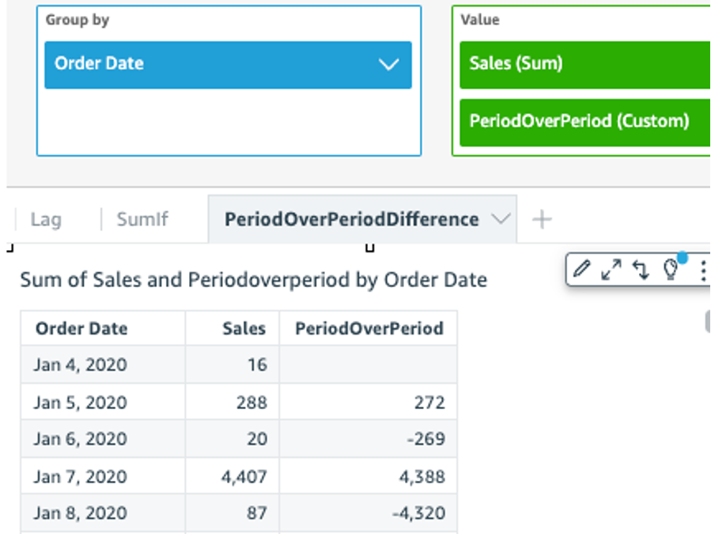
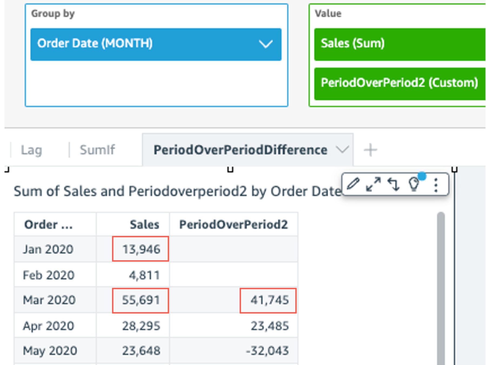

# periodOverPeriodDifference

The `periodOverPeriodDifference` function calculates the difference of a
measure over two different time periods as specified by period granularity and offset.
Unlike a difference calculation, this function uses a date-based offset instead of a
fixed sized offset. This ensures that only the correct dates are compared, even if data
points are missing in the dataset.

## Syntax

```
periodOverPeriodDifference(*measure,
 date,
 period,
 offset*)
```

## Arguments

_measure_

An aggregated measure that you want to perform the periodOverPeriod
calculation on.

_dateTime_

The Date dimension over which we are computing Period-Over-Period
calculations.

_period_

(Optional) The time period across which you're computing the
computation. Granularity of `YEAR` means
`YearToDate` computation, `Quarter` means
`QuarterToDate`, and so on. Valid granularities include
`YEAR`, `QUARTER`, `MONTH`,
`WEEK`, `DAY`, `HOUR`,
`MINUTE`, and `SECONDS`.

The defaults value is the visual date dimension granularity.

_offset_

(Optional) The offset can be a positive or negative integer
representing the prior time period (specified by period) that you want
to compare against. For instance, period of a quarter with offset 1
means comparing against the previous quarter.

The default value is 1.

## Example

The following example uses a calculated field `PeriodOverPeriod` to
display the sales amount difference of yesterday

```
periodOverPeriodDifference(sum(Sales), {Order Date})
```



The following example uses a calculated field `PeriodOverPeriod` to
display the sales amount difference of previous 2 months. Below example is comparing
sales of `Mar2020` with `Jan2020`.

```
periodOverPeriodDifference(sum(Sales),{Order Date}, MONTH, 1)
```


