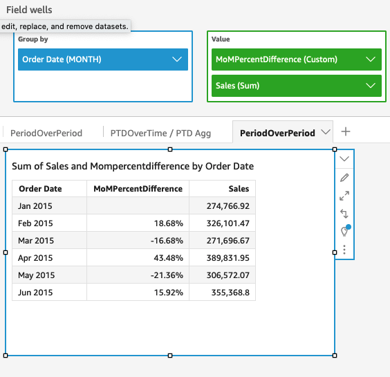

# periodOverPeriodPercentDifference

The `periodOverPeriodPercentDifference` function calculates the percent
difference of a measure over two different time periods as specified by the period
granularity and offset. Unlike percentDifference, this function uses a date-based offset
instead of a fixed sized offset. This ensures only the correct dates are compared, even
if data points are missing in the dataset.

## Syntax

```
periodOverPeriodPercentDifference(*measure,
 date,
 period,
 offset*)
```

## Arguments

_measure_

An aggregated measure that you want to see the difference for.

_date_

The date dimension over which you're computing periodOverPeriod
calculations.

_period_

(Optional) The time period across which you're computing the
computation. Granularity of `YEAR` means
`YearToDate` computation, `Quarter` means
`QuarterToDate`, and so on. Valid granularities include
`YEAR`, `QUARTER`, `MONTH`,
`WEEK`, `DAY`, `HOUR`,
`MINUTE`, and `SECONDS`.

This argument defaults to the granularity of the visual
aggregation

_offset_

(Optional) The offset can a positive or negative integer representing
the prior time period (specified by period) that you want to compare
against. For instance, period of a quarter with offset 1 means comparing
against the previous quarter.

This argument default value is 1.

## Example

The following example calculates the month over month percent difference in sales
with the visual dimension granularity and default offset of 1.

```
periodOverPeriodPercentDifference(sum(Sales),{Order Date})
```

The following example calculates the month over month percent difference in sales
with a fixed granularity of `MONTH` and fixed offset of 1.

```
periodOverPeriodPercentDifference(sum(Sales), {Order Date}, MONTH, 1)
```


