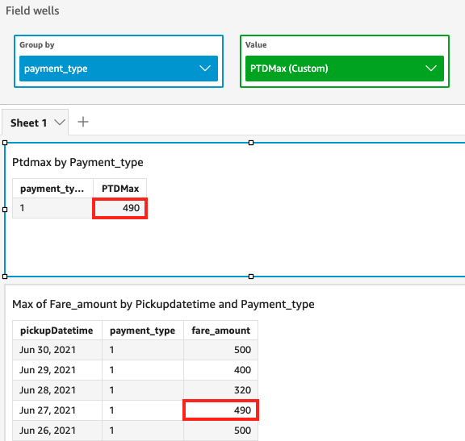

# periodToDateMax

The `periodToDateMax` function returns the maximum value of the specified
measure for a given time granularity (for instance, a quarter) up to a point in time,
relative to that point.

## Syntax

```
periodToDateMax(*measure,
 dateTime,
 period,
 endDate (optional)*)
```

## Arguments

_measure_

The argument must be a field. Null values are omitted from the
results. Literal values don't work.

_dateTime_

The Date dimension over which you're computing PeriodToDate
aggregations.

_period_

The time period across which you're computing the computation.
Granularity of `YEAR` means `YearToDate`
computation, `Quarter` means `QuarterToDate`, and
so on. Valid granularities include `YEAR`,
`QUARTER`, `MONTH`, `WEEK`,
`DAY`, `HOUR`, `MINUTE`, and
`SECONDS`.

_endDate_

(Optional) The date dimension that you're ending computing
periodToDate aggregations. It defaults to `now()` if
omitted.

## Example

The following example calculates the week-to-date minimum fare amount per payment
type, for the week of 06-30-21. For simplicity in the example, we filtered out only
a single payment. 06-30-21 is Wednesday. Quick begins the week on
Sundays. In our example, that is 06-27-21.

```
periodToDateMax(fare_amount, pickUpDatetime, WEEK, parseDate("06-30-2021", "MM-dd-yyyy"))
```


