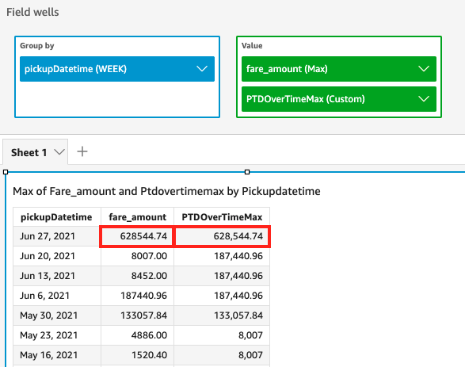

# periodToDateMaxOverTime

The `periodToDateMaxOverTime` function calculates the maximum of a measure
for a given time granularity (for instance, a quarter) up to a point in time.

## Syntax

```
periodToDateMaxOverTime(*measure,
 dateTime,
 period*)
```

## Arguments

_measure_

An aggregated measure that you want to do the calculation

_dateTime_

The date dimension over which you're computing PeriodOverTime
calculations.

_period_

(Optional) The time period across which you're computing the
computation. Granularity of `YEAR` means
`YearToDate` computation, `Quarter` means
`QuarterToDate`, and so on. Valid granularities include
`YEAR`, `QUARTER`, `MONTH`,
`WEEK`, `DAY`, `HOUR`,
`MINUTE`, and `SECONDS`.

The default value is the visual's date dimension granularity.

## Example

The following example calculates the maximum fare amount month over month.

```
periodToDatemaxOverTime(max({fare_amount}), pickupDatetime, MONTH)
```


