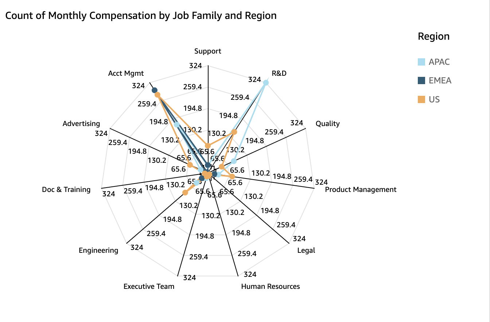

# Using radar charts

You can use radar charts, which are also known as spider charts, to visualize
multivariate data in Amazon Quick. In a radar chart, one or more groups of values are
plotted over multiple common variables. Each variable has its own axis, and each axis is
arranged radially around a central point. The data points from a single observation are
plotted on each axis and connected to each other to form a polygon. Multiple
observations can be plotted in a single radar chart to display multiple polygons, which
makes it easier to spot outlying values for multiple observations quickly.

In Quick, you can organize a radar chart along its category, value, or
color axes by dragging and dropping fields to the **Category**,
**Value**, and **Color** field wells. How you
choose to distribute fields among the field wells determines the axis that the data is
plotted on.

The following image shows an example of a radar chart.

## Radar chart features

To view the features supported by radar charts, use the following table.

| Feature                           | Supported?    | Comments                                                                                           | For more information                                                                                                                                                                          |
| --------------------------------- | ------------- | -------------------------------------------------------------------------------------------------- | --------------------------------------------------------------------------------------------------------------------------------------------------------------------------------------------- |
| Changing the legend display       | Yes           |                                                                                                    | [Legends on visual types in Quick](customizing-visual-legend.md "customizing-visual-legend.md")                                                                                            |
| Changing the title display        | Yes           |                                                                                                    | [Titles and subtitles on visual types in Quick](customizing-a-visual-title.md "customizing-a-visual-title.md")                                                                             |
| Changing the axis range           | Yes           |                                                                                                    | [Range and scale on visual types in Quick](changing-visual-scale-axis-range.md "changing-visual-scale-axis-range.md")                                                                      |
| Changing the visual colors        | Yes           |                                                                                                    | [Colors in visual types in Quick](changing-visual-colors.md "changing-visual-colors.md")                                                                                                   |
| Focusing on or excluding elements | Yes           |                                                                                                    | [Focusing on visual elements](focusing-on-visual-elements.md "focusing-on-visual-elements.md") [Excluding visual elements](excluding-visual-elements.md "excluding-visual-elements.md") |
| Sorting                           | Limited       | You can only sort data fields that are in the **Category\* • and **Color\*\* field wells. | [Sorting visual data in Amazon Quick](sorting-visual-data.md "sorting-visual-data.md")                                                                                                        |
| Performing field aggregation      | Yes           |                                                                                                    | [Changing field aggregation](changing-field-aggregation.md "changing-field-aggregation.md")                                                                                                   |
| Adding drill-downs                | Not supported |                                                                                                    | [Adding drill-downs to visual data in Quick Sight](adding-drill-downs.md "adding-drill-downs.md")                                                                                          |
| Choosing size                     | Yes           |                                                                                                    | [Formatting in Amazon Quick](formatting-a-visual.md "formatting-a-visual.md")                                                                                                                 |
| Showing totals                    | Not supported |                                                                                                    | [Formatting in Amazon Quick](formatting-a-visual.md "formatting-a-visual.md")                                                                                                                 |

## Creating a radar chart

Use the following procedure to create a radar chart.

###### To create a radar chart

1. On the analysis page, choose **Visualize** on the tool
   bar.
2. Choose **Add** on the application bar, and then choose
   **Add visual**.
3. On the **Visual types** pane, choose the radar chart
   icon.
4. From the **Fields list** pane, drag the fields that you
   want to use to the appropriate field wells. In most cases, you want to use
   dimension or measure fields as indicated by the target field well.

To create a radar chart, drag fields to the **Category**,
**Value**, and **Group/Color** field
wells. The axis that a radar chart is organized around is determined by the
way that you organize fields into their respective field wells:

    * In a radar chart that uses a **value
     axis**, dimension values are shown as lines and axes
     represent value fields. To create a radar chart that uses a value
     axis, add one category field to the **Color** field
     well and one or more values to the **Value** field
     well.
    * In a radar chart that uses a **dimension
     axis**, group dimension values are shown as axes and
     value fields are shown as lines. All axes share a range and scale.To
     create a radar chart that uses a dimension axis, add one dimension
     to the **Group** field well and one or more values
     to the **Value** field well.
    * In a radar chart that uses a **dimension-color
     axis**, group dimension values are shown as axes and
     color dimension values are shown as lines. All axes share a range
     and scale. To create a radar chart that uses a dimension-color axis,
     add one dimension to the **Category** field well,
     one value to the **Value** field well, and one
     dimension to the **Color** field well.
