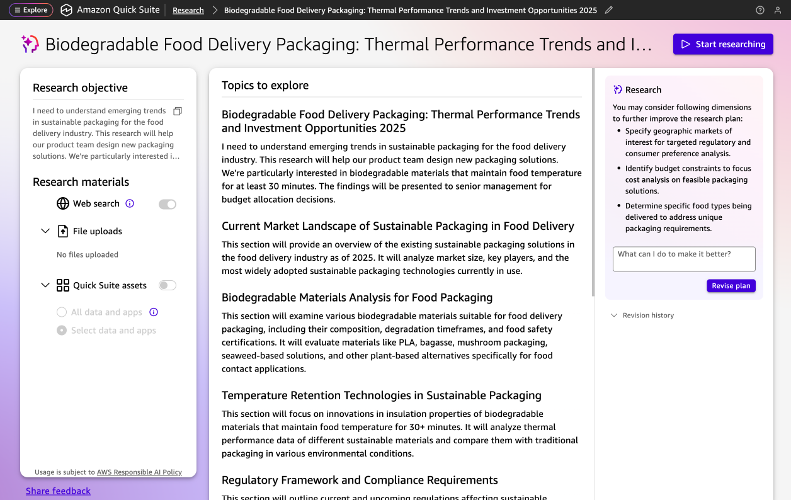

# Review and finalize research plan

Before Quick Research begins gathering and analyzing information, you have the opportunity to review and refine your research plan. This step helps ensure that the research will meet your specific needs and expectations.

###### To review and finalize your research plan

1. Review the AI-generated suggestions in the **Revise Plan** pane on the right for improving your research plan.
2. (Optional) To make revisions, enter your changes in the **How should I change the plan?** field. You can add comments and notes to provide additional context or specific instructions for the AI, such as clarifying particular aspects you want emphasized, specifying exclusions, or providing domain-specific guidance that will help generate more relevant results.
3. Choose **Revise plan** to update the plan with your revisions.
4. Choose **Start Research** to begin the analysis process.

## Research suggestions

Quick Research analyzes your research objective and selected materials to provide intelligent suggestions for improving your research plan. These suggestions appear in the **Revise Plan** pane and might include additional data sources, refined search terms, or alternative approaches to your research question.

For example, if your research objective is about sustainable packaging for the food industry, suggestions might include specifying geographic regions for regulatory analysis, identifying specific food types requiring temperature maintenance, or providing budget constraints for cost comparison analysis.

## Revision history

The revision history section tracks all changes made to your research plan during the review process. This allows you to see what modifications have been applied and provides a record of how your research plan has evolved.
