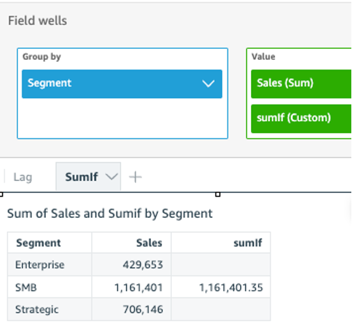

# sumIf

Based on a conditional statement, the `sumIf` function adds the set of
numbers in the specified measure, grouped by the chosen dimension or dimensions. For
example, `sumIf(ProdRev,CalendarDay >= ${BasePeriodStartDate} AND CalendarDay <=
 ${BasePeriodEndDate} AND SourcingType <> 'Indirect')` returns the total
profit amount grouped by the (optional) chosen dimension, if the condition evaluates to
true.

## Syntax

```
sumIf(*measure, conditions*)
```

## Arguments

_measure_

The argument must be a measure. Null values are omitted from the
results. Literal values don't work. The argument must be a field.

_condition_

One or more conditions in a single statement.

## Examples

The following example uses a calculated field with `sumIf` to display
the sales amount if `Segment` is equal to `SMB`.

```
sumIf(Sales, Segment=’SMB’)
```



The following example uses a calculated field with `sumIf` to display
the sales amount if `Segment` is equal to `SMB` and
`Order Date` greater than year 2022.

```
sumIf(Sales, Segment=’SMB’ AND {Order Date} >=’2022-01-01’)
```
