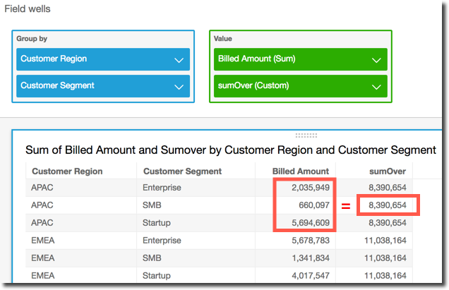

# sumOver

The `sumOver` function calculates the sum of a measure partitioned by a
list of dimensions.

## Syntax

The brackets are required. To see which arguments are optional, see the following
descriptions.

```
sumOver
(
     `measure`
     ,`[ partition_field, ... ]`
     ,`calculation level`
)
```

## Arguments

_measure_

The measure that you want to do the calculation for, for example
`sum({Sales Amt})`. Use an aggregation if the calculation
level is set to `NULL` or `POST_AGG_FILTER`. Don't
use an aggregation if the calculation level is set to
`PRE_FILTER` or `PRE_AGG`.

_partition field_

(Optional) One or more dimensions that you want to partition by,
separated by commas.

Each field in the list is enclosed in {} (curly braces), if it is more
than one word. The entire list is enclosed in [ ] (square
brackets).

_calculation level_

(Optional) Specifies the calculation level to use:

- `PRE_FILTER`
  – Prefilter calculations are computed before the dataset
  filters.
- `PRE_AGG` –
  Preaggregate calculations are computed before applying
  aggregations and top and bottom _N_ filters to the visuals.
- `POST_AGG_FILTER`
  – (default) table calculations are computed when the
  visuals display.

This value defaults to `POST_AGG_FILTER` when blank. For
more information, see [Using level-aware calculations in
Quick](../../../quicksight/latest/user/level-aware-calculations.md "../../../quicksight/latest/user/level-aware-calculations.md").

## Example

The following example calculates the sum of `sum(Sales)`, partitioned
by `City` and `State`.

```
sumOver
(
     sum(Sales),
     [City, State]
)
```

The following example sums `Billed Amount` over `Customer
 Region`. The fields in the table calculation are in the field wells of the
visual.

```
sumOver
(
     sum({Billed Amount}),
     [{Customer Region}]
)
```

The following screenshot shows the results of the example. With the addition of
`Customer Segment`, the total amount billed for each is summed for
the `Customer Region`, and displays in the calculated field.


