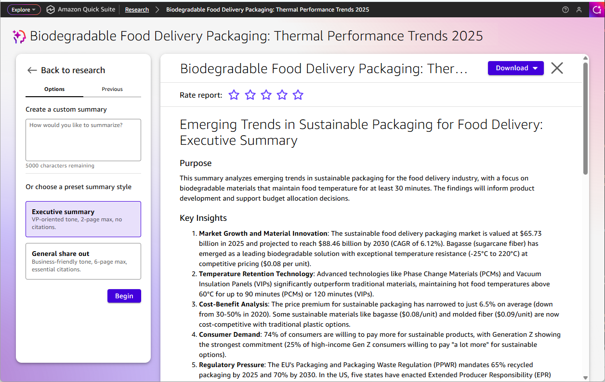

# Summarizing the research

After completing your research report, you can create focused summaries for different audiences. To access the summarizing feature, choose the **Summarize** button in the upper right of your research report.

Quick Research provides multiple summary formats to help you present your findings in different contexts and for various audiences. Choose the summary type that best fits your intended use and audience needs.

In the **Options** tab, you can choose to create a custom summary by entering up to 5,000 characters about how you would like to summarize, or select one of two preset summary styles:

- _Executive summary_ - VP-oriented tone, 2-page maximum, no citations
- _General share out_ - Business-friendly tone, 6-page maximum, essential citations
  Once you choose a summary style, you can choose **Begin** to start producing the summary. The **Previous** tab shows previous summary reports. You can download the summary as PDF or Word using the **Download** button at the top.

## Custom summary

Create a tailored summary by entering up to 5,000 characters about how you would like to summarize your research. Custom summaries allow you to specify the key points, length, and focus areas you want emphasized for your particular use case.

## Executive summary

Generate a concise executive summary with a VP-oriented tone, limited to 2 pages maximum with no citations. This format presents the most important findings and recommendations suitable for senior leadership and decision-makers.

## General share out

Create a comprehensive summary document with a business-friendly tone, up to 6 pages maximum with essential citations included. This format balances depth with accessibility for team presentations and stakeholder briefings.
