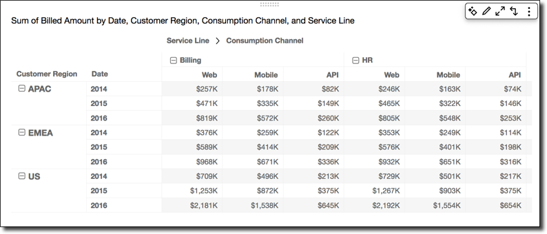
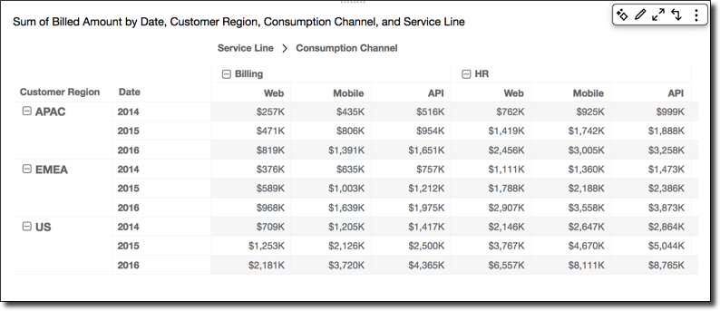
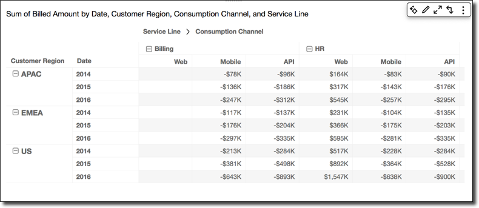
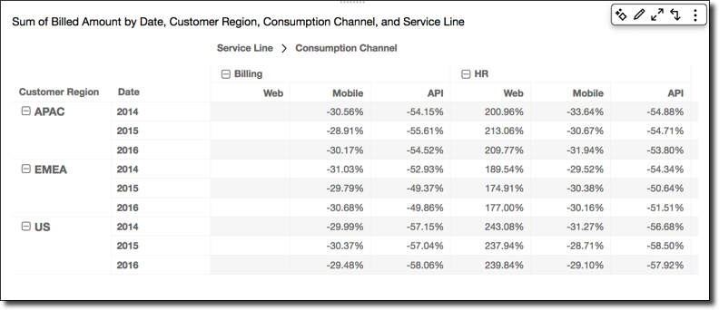
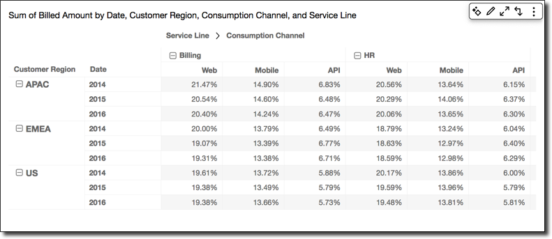
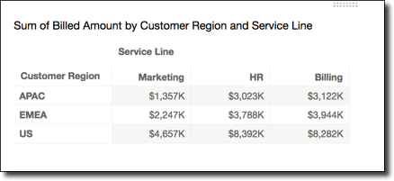
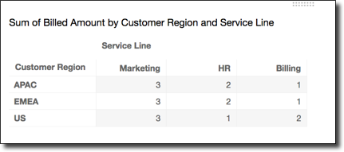
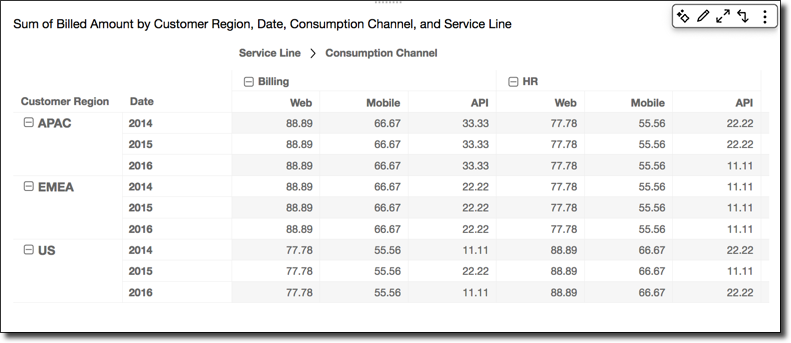

# Functions for pivot table

calculations

You can use the following functions in pivot table calculations.

###### Topics

- [Running total](#running-total "#running-total")
- [Difference](#difference "#difference")
- [Percentage difference](#percent-difference "#percent-difference")
- [Percent of total](#percent-of-total "#percent-of-total")
- [Rank](#rank "#rank")
- [Percentile](#percentile "#percentile")
  You can apply functions listed to the following data:




## Running total

The **Running total** function calculates the sum of a
given cell value and the values of all cells prior to it. This sum is
calculated as `Cell1=Cell1, Cell2=Cell1+Cell2,
 Cell3=Cell1+Cell2+Cell3`, and so on.

Applying the **Running total** function across the table
rows, using **Table across** for **Calculate
as**, gives you the following results.



## Difference

The **Difference** function calculates the difference
between a cell value and value of the cell prior to it. This difference is
calculated as `Cell1=Cell1-null, Cell2=Cell2-Cell1,
 Cell3=Cell3-Cell2,` and so on. Because `Cell1-null =
 null`, the Cell1 value is always empty.

Applying the **Difference** function across the table
rows, using **Table across** for **Calculate
as**, gives you the following results.



## Percentage difference

The **Percentage Difference** function calculates the
percent difference between a cell value and the value of the cell prior to
it, divided by the value of the cell prior to it. This value is calculated
as `Cell1=(Cell1-null)/null, Cell2=(Cell2-Cell1)/Cell1,
 Cell3=(Cell3-Cell2)/Cell2,` and so on. Because
`(Cell1-null)/null = null`, the Cell1 value is always
empty.

Applying the **Percentage Difference** function across
the table rows, using **Table across** for
**Calculate as**, gives you the following
results.



## Percent of total

The **Percent of Total** function calculates the
percentage the given cell represents of the sum of all of the cells included
in the calculation. This percentage is calculated as `Cell1=Cell1/(sum
 of all cells), Cell2=Cell2/(sum of all cells),` and so on.

Applying the **Percent of Total** function across the
table rows, using **Table across** for **Calculate
as**, gives you the following results.



## Rank

The **Rank** function calculates the rank of the cell
value compared to the values of the other cells included in the calculation.
Rank always shows the highest value equal to 1 and lowest value equal to the
count of cells included in the calculation. If there are two or more cells
with equal values, they receive the same rank but are considered to take up
their own spots in the ranking. Thus, the next highest value is pushed down
in rank by the number of cells at the rank above it, minus one. For example,
if you rank the values 5,3,3,4,3,2, their ranks are 1,3,3,2,3,6.

For example, suppose that you have the following data.



Applying the **Rank** function across the table rows,
using **Table across** for **Calculate
as**, gives you the following results.



## Percentile

The **Percentile** function calculates the percent of the
values of the cells included in the calculation that are at or below the
value for the given cell.

This percent is calculated as follows.

```
percentile rank(x) = 100 * B / N

Where:
   B = number of scores below x
   N = number of scores
```

Applying the **Percentile** function across the table
rows, using **Table across** for **Calculate
as**, gives you the following results.


