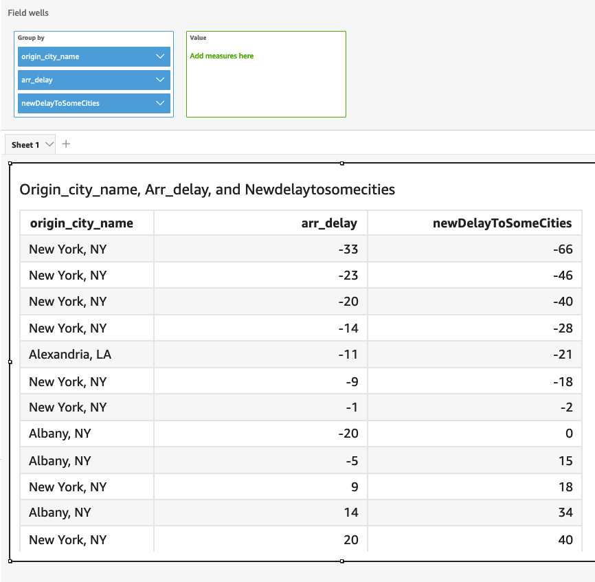

# switch

`switch` compares a _condition-expression_ with the
literal labels, within a set of literal label and
_return-expression_ pairings. It then returns the
_return-expression_ corresponding to the first literal label
that's equal to the _condition-expression_. If no label equals to
the _condition-expression_, `switch` returns the
_default-expression_. Every
_return-expression_ and
_default-expression_ must have the same datatype.

## Syntax

```
switch(`condition-expression`, `label-1`, `return-expression-1` [, `label-n`, `return-expression-n` ...],
        `default-expression`)
```

## Arguments

`switch` requires one or more
_if_,_then_ expression pairings, and
requires exactly one expression for the _else_ argument.

_condition-expression_

The expression to be compared with the label-literals. It can be a
field name like `address`, a literal value like
'`Unknown`', or another scalar function like
`toString(salesAmount)`.

_label_

The literal to be compared with the
_condition-expression_ argument, all of the
literals must have the same data type as
_condition-expression_ argument.
`switch` accepts up to 5000 labels.

_return-expression_

The expression to return if the value of its label equals to the
value of the _condition-expression_. It can be a
field name like `address`, a literal value like
'`Unknown`', or another scalar function like
`toString(salesAmount)`. All of the
_return-expression_ arguments must have the
same data type as the
_default-expression_.

_default-expression_

The expression to return if no value of any label arguments equals
to the value of _condition-expression_. It can be
a field name like `address`, a literal value like
'`Unknown`', or another scalar function like
`toString(salesAmount)`. The
_default-expression_ must have the same data
type as all of the _return-expression_
arguments.

## Return type

`switch` returns a value of the same data type as the values in
_return-expression_. All data returned
_return-expression_ and
_default-expression_ must be of the same data type or be
converted to the same data type.

## General Examples

The following example returns the AWS Region code of input region name.

```
switch(region_name,
               "US East (N. Virginia)", "us-east-1",
               "Europe (Ireland)", "eu-west-1",
               "US West (N. California)", "us-west-1",
               "other regions")
```

The following are the given field values.

```
"US East (N. Virginia)"
        "US West (N. California)"
        "Asia Pacific (Tokyo)"
```

For these field values the following values are returned.

```
"us-east-1"
        "us-west-1"
        "other regions"
```

## Use switch to replace

`ifelse`

The following `ifelse` use case is an equivalent of the previous
example, for `ifelse` evaluating whether values of one field equals
to different literal values, using `switch` instead is a better
choice.

```
ifelse(region_name = "US East (N. Virginia)", "us-east-1",
               region_name = "Europe (Ireland)", "eu-west-1",
               region_name = "US West (N. California)", "us-west-1",
               "other regions")
```

## Expression as return

value

The following example uses expressions in
_return-expressions_:

```
switch({origin_city_name},
               "Albany, NY", {arr_delay} + 20,
               "Alexandria, LA", {arr_delay} - 10,
               "New York, NY", {arr_delay} * 2,
               {arr_delay})
```

The preceding example changes the expected delay time for each flight from a
particular city.


