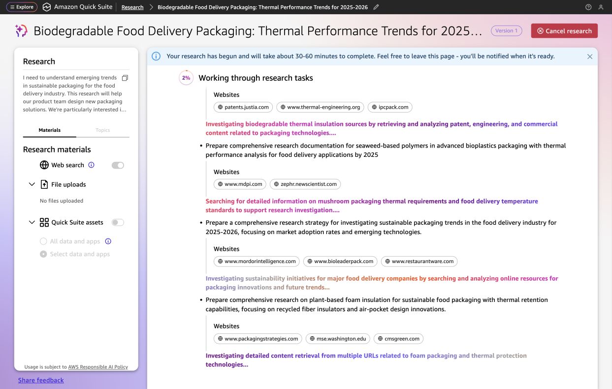
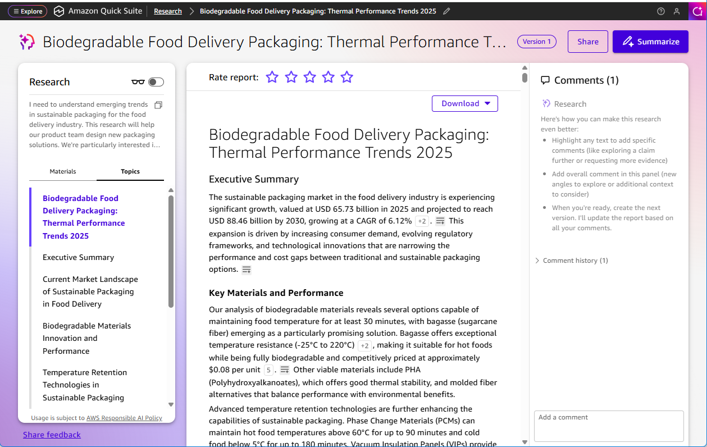
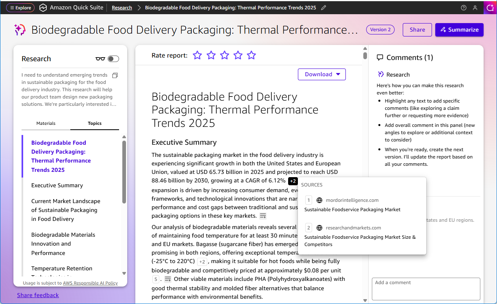
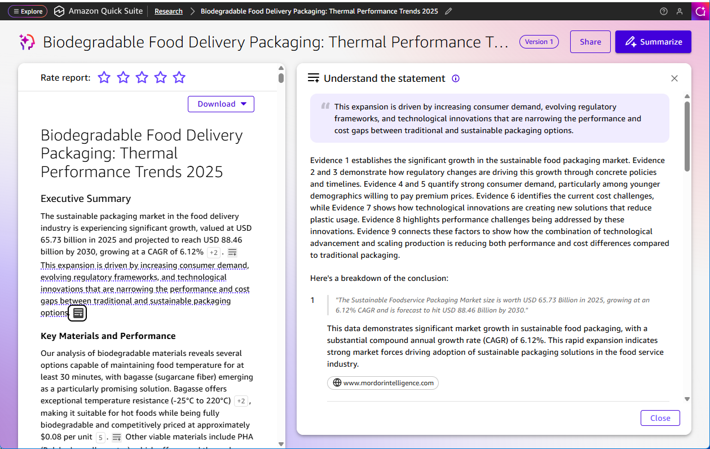

# View research report

Once you select to create the research, Quick Research will work through a series of research tasks. Research typically takes 20-40 minutes to complete. The window displays the percentage complete along with the specific tasks Quick Research is working on and which sources are being used for each research task.

After Quick Research completes its analysis, you can view the comprehensive research report that synthesizes information from all selected sources. The report presents findings in a structured format with supporting evidence and source references.

You can use the **Download** button at the top to download the report as a PDF or Word document. There is also a **Summarize** button in the upper right. For more information, see [Summarizing the research](summarizing-research.md "summarizing-research.md"). You can also select **Reading mode** to hide sidebars and focus on the report content.

When you're ready to share your research with others, use the **Share** button. For more information, see [Sharing the research](download-share-research.md "download-share-research.md"). If you want to refine the research further before sharing, you can make updates and iterate on the report. For more information, see [Updating research](updating-research.md "updating-research.md").

In the left pane, under your research objective you can see a **Topics** tab which lists and allows you to navigate through the major sections of the report.

The **Research** pane on the right of the window accepts comments up to 400 characters. You can now add comments that will be queued for revision, as they require deeper investigation by Quick Research.

## Viewing citations

Throughout the report, numbered citations are present. Clicking on a citation shows you a popup window with the source article and a hyperlink to the source page.

## Understanding statements

You can also click the **Understand the statement** icon (three horizontal lines and a plus) to launch an explanation window that shows how a statement in the report was determined, including a summary of the evidence and a breakdown of the conclusion.

