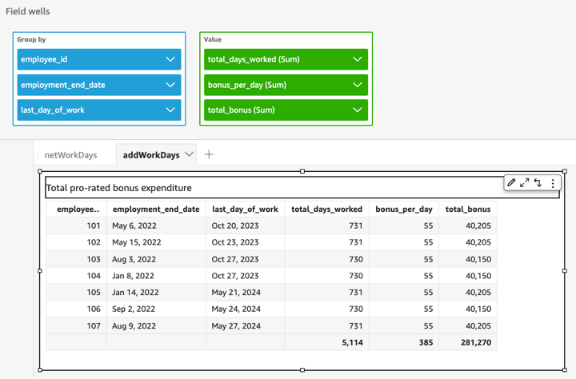

# addWorkDays

`addWorkDays` Adds or subtracts a designated number of work days to a
given date value. The function returns a date for a work day, that falls a
designated work days after or before a given input date value.

## Syntax

```
addWorkDays(`initDate`, `numWorkDays`)
```

## Arguments

_initDate_

A valid non-NULL date that acts as the start date for the
calculation.

- Dataset field – Any
  `date` field from the dataset that you are
  adding this function to.
- Date function – Any
  date output from another `date` function, for
  example `parseDate`, `epochDate`,
  `addDateTime`., and so on.

###### Example

```
addWorkDays(`epochDate(1659484800)`, `numWorkDays`)
```

- Calculated fields –
  Any Quick Suite calculated field that returns a
  `date` value.

###### Example

```
calcFieldStartDate = addDateTime(`10`, “`DD`”, `startDate`)
addWorkDays(`calcFieldStartDate`, `numWorkDays`)
```

- Parameters – Any
  Quick Suite `datetime` parameter.

###### Example

```
addWorkDays($`paramStartDate`, `numWorkDays`)
```

- Any combination of the above stated argument
  values.

_numWorkDays_

A non-NULL integer that acts as the end date for the calculation.

- Literal – An integer
  literal directly typed in the expression editor.

###### Example

- Dataset field – Any
  date field from the dataset

###### Example

- Scalar function or
  calculation – Any scalar
  Quick Suite function that returns an integer output
  from another, for example `decimalToInt`,
  `abs`, and so on.

###### Example

```
addWorkDays(`initDate`, `decimalToInt(sqrt (abs(numWorkDays)) )` )
```

- Calculated field –
  Any Quick Suite calculated field that returns a
  `date` value.

###### Example

```
someOtherIntegerCalcField = `(num_days * 2) + 12`
addWorkDays(`initDate`, `someOtherIntegerCalcField`)
```

- Parameter – Any
  Quick Suite `datetime` parameter.

###### Example

```
addWorkDays(`initDate`, $`param_numWorkDays`)
```

- Any combination of the above stated argument
  values.

## Return type

Integer

## Ouptut values

Expected output values include:

- Positive integer (when start_date < end_date)
- Negative integer (when start_date > end_date)
- NULL when one or both of the arguments get a null value from the
  `dataset field`.

## Input errors

Disallowed argument values cause errors, as shown in the following
examples.

- Using a literal NULL as an argument in the expression is
  disallowed.

###### Example

```
addWorkDays(`NULL`, `numWorkDays`)
```

###### Example

```
`Error`
At least one of the arguments in this function does not have correct type.
Correct the expression and choose Create again.
```

- Using a string literal as an argument, or any other data type other
  than a date, in the expression is disallowed. In the following example,
  the string `"2022-08-10"` looks like a date, but it
  is actually a string. To use it, you would have to use a function that
  converts to a date data type.

###### Example

```
addWorkDays(`"2022-08-10"`, `10`)
```

###### Example

```
`Error`
Expression addWorkDays("2022-08-10", numWorkDays) for function addWorkDays has
incorrect argument type addWorkDays(String, Number).
Function syntax expects Date, Integer.
```

## Example

A positive integer as `numWorkDays` argument will yield a date in
the future of the input date. A negative integer as `numWorkDays`
argument will yield a resultant date in the past of the input date. A zero value
for the `numWorkDays` argument yields the same value as input date
whether or not it falls on a work day or a weekend.

The `addWorkDays` function operates at the granularity:
`DAY`. Accuracy cannot be preserved at any granularity which is
lower or higher than `DAY` level.

```
addWorkDays(startDate, endDate)
```

Let’s assume there is a field named `employmentStartDate` with the
following values:

```
2022-08-10 2022-08-06 2022-08-07
```

Using the above field and following calculations, `addWorkDays`
returns the modified values as shown below:

```
addWorkDays(`employmentStartDate`, `7`)

2022-08-19
2022-08-16
2022-08-16

addWorkDays(`employmentStartDate`, `-5`)

2022-08-02
2022-08-01
2022-08-03

addWorkDays(`employmentStartDate`, `0`)

2022-08-10
2022-08-06
2022-08-07
```

The following example calculates the total pro-rated bonus to be paid to each
employee for 2 years based on how many days each employee has actually
worked.

```
last_day_of_work = addWorkDays(`employment_start_date`, `730`)
total_days_worked = netWorkDays(`employment_start_date`, `last_day_of_work`)
total_bonus = `total_days_worked` * `bonus_per_day`

```


