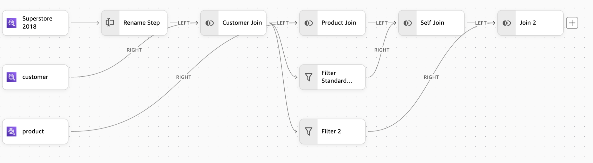

# Advanced workflow capabilities

Amazon Quick Sight's data preparation experience offers sophisticated features that enhance your ability to create complex,
reusable data transformations. This section covers two powerful capabilities that extend your workflow potential.

Divergence enables you to create multiple transformation paths from a single step, allowing parallel processing
streams that can be recombined later. This capability is particularly valuable for complex scenarios like self-joins
and parallel transformations.

Composite Datasets allow you to build hierarchical data structures by using existing datasets as building blocks.
This feature promotes collaboration across teams and ensures consistent business logic through reusable, layered
transformations.

These capabilities work together to provide flexible workflow designs, enhanced team collaboration, and reusable
data transformations. They ensure clear data lineage and enable scalable data preparation solutions, empowering your
organization to handle increasingly complex data scenarios with efficiency and clarity.

## Divergence

Divergence enables you to create multiple parallel transformation paths from a single step in your workflow.
These paths can be transformed independently and later recombined, enabling complex data preparation scenarios such
as self-joins.

**Creating divergent paths**

To initiate a Divergence, in your workflow:

1. Select the step where you want to create divergence.
2. Choose the **+** icon that appears.
3. Configure the new branch that appears.
4. Apply your desired transformations to each path.
5. Use Join or Append steps to recombine paths into a single output.

**Key features**

- Creates up to five divergent paths from a single step.
- Applies different transformations to each path.
- Recombines paths using Join or Append steps.
- Previews changes in each path independently.

**Best practices**

- Use divergence for implementing self-joins.
- Create data copies for parallel transformations.
- Plan your recombination strategy (Join or Append).
- Maintain clear path naming for better workflow visibility.

## Composite Datasets

Composite Datasets enable you to build upon existing datasets, creating hierarchical data transformation
structures that can be shared and reused across your organization. Quick Sight supports up to 10 levels of
composite datasets in both SPICE and Direct Query modes.

**Creating a composite dataset**

To create a composite dataset, in your workflow:

1. Select the Input step when creating a new dataset.
2. Choose **Dataset** as your source under **Add Data**.
3. Select an existing dataset to build upon.
4. Apply additional transformations as needed.
5. Save as a new dataset.

**Key features**

- Builds hierarchical data transformation structures.
- Supports for up to 10 levels of dataset nesting.
- Compatible with both SPICE and Direct Query.
- Maintains clear data lineage.
- Enables team-specific transformations.

This feature enhances collaboration across different teams. For example,

| Role             | Action                                     | Output    |
| ---------------- | ------------------------------------------ | --------- | --------------------------------------------------------------------------------------------------------------------------------------------------------------------------------------------------------------------------------------------------------------------------------------------------------------------------------------------------------------------------------------------------------------------------------------------------------------------------------------------------------------------------------------------------------------------------------------------------------- |
| Global Analyst   | Creates dataset with global business logic | Dataset A |
| Americas Analyst | Uses Dataset A, adds regional logic        | Dataset B |
| US-West Analyst  | Uses Dataset B, adds local logic           | Dataset C | This hierarchical approach promotes consistent business logic across your organization by assigning clear ownership of transformation layers. It creates a traceable data lineage while supporting up to 10 levels of dataset nesting, enabling controlled and systematic data transformation management. **Best practices**  • Establish clear ownership for each transformation layer.  • Document dataset relationships and dependencies.  • Plan hierarchy depth based on business needs.  • Maintain consistent naming conventions.  • Review and update upstream datasets carefully. |
