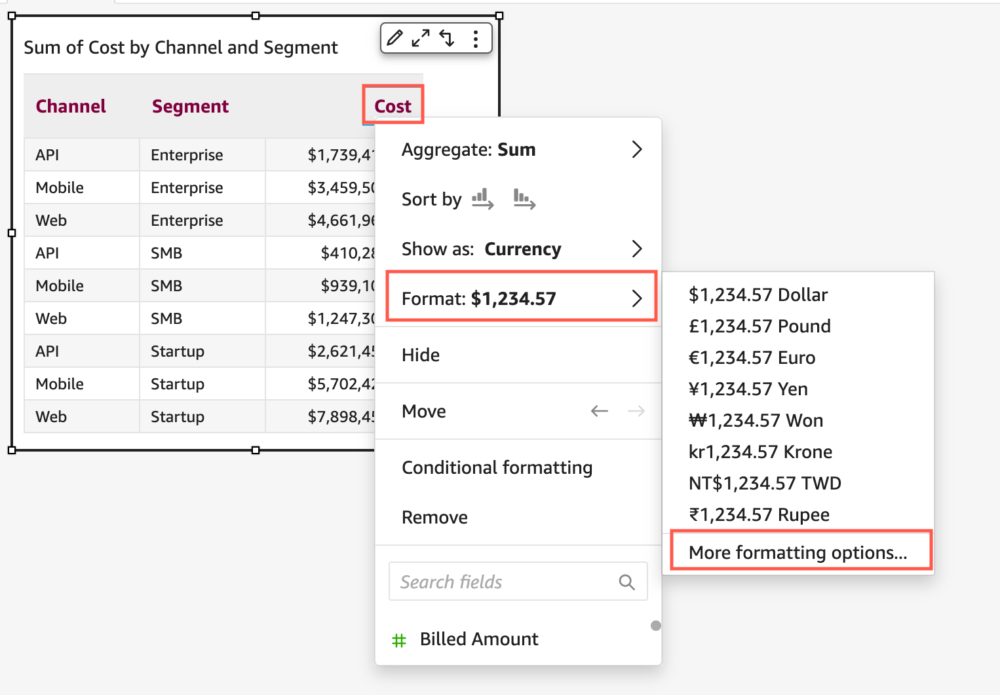
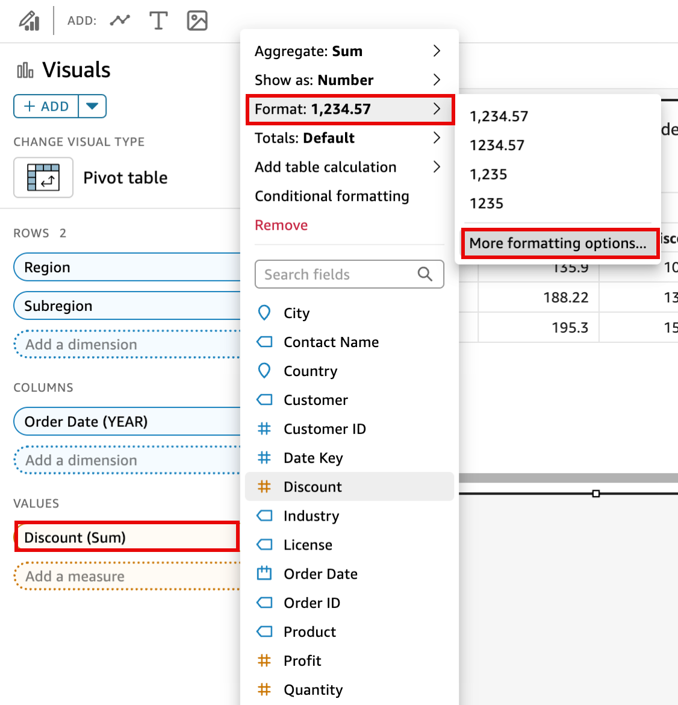

# Formatting visual numeric data

based on language settings in Quick Suite

In Amazon Quick Suite, you can choose how your numeric data values appear in visuals so that
they align with the regional language that you have chosen.

As a Quick Suite author, you can choose the language formatting that best fits
your audience. Amazon Quick Suite configures numeric data languages at the analysis level
based on the language that you have chosen to view Quick Suite in. You can change
the format of numbers, currencies, and dates. You can change your Quick Suite
language settings in the **Language** dropdown list of the
Quick Suite **User** menu in the top-right corner. You can change
the language formatting for a field across every visual in a sheet, or you can change
the language formatting at the individual visual level.

###### To change the numeric language formatting of all visuals in an analysis

1. On the **Visuals** pane of the analysis that you want to
   change, choose the more actions (three dots) icon next to the field that you
   want to change. From the menu that appears, open the **Format**
   dropdown list, and then choose **More formatting
   options**.
2. In the **Format data** pane that appears on the left, choose
   **Apply language format**.

You can reset the default language format of the field by reopening the
**Format data** menu and choosing **Reset to
defaults**. The default language format is American English.

###### To change the numeric language formatting of a single visual in an

analysis

1. On the analysis page, choose the visual that you want to modify.
2. Navigate to the **Format data** pane using one of the
   following options:
   - On the visual that contains the data that you want to change, select
     the field that you want to change, open the **Format**
     dropdown list, and then choose **More formatting
     options**.

   
   - In the **Field wells** section of the analysis, open
     the dropdown next to the field that you want to change. Open the
     **Format** menu, and choose **More
     formatting options**.

   

3. In the **Format data** pane that appears, choose
   **Apply language format**.

You can reset the default language format of the visual by reopening the
**Format data** menu and choosing **Reset to
defaults**. The default language format is American English.
