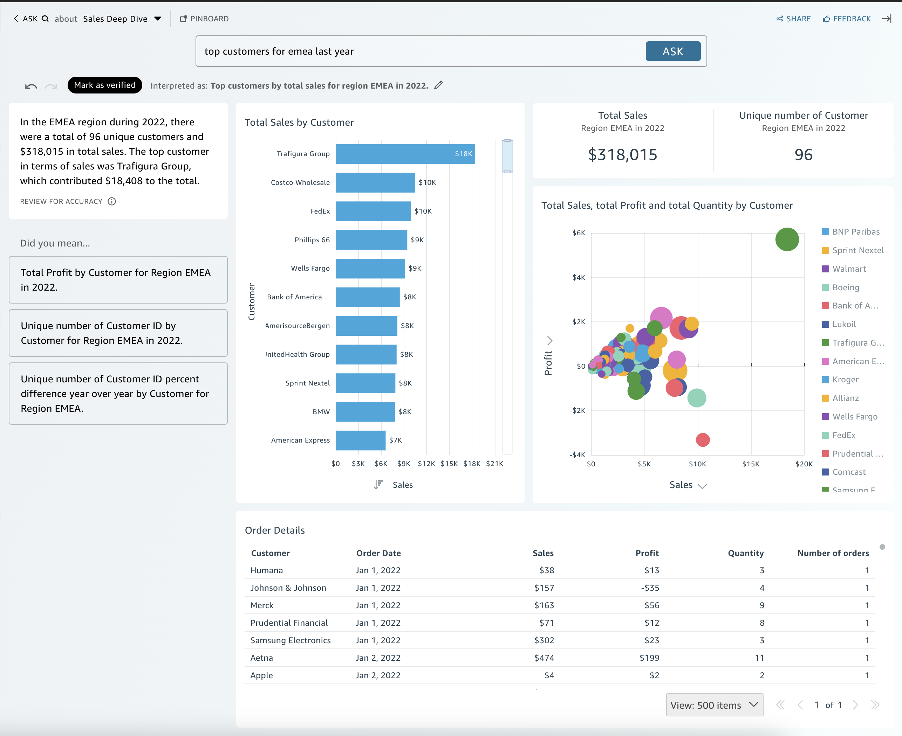

# Asking and answering questions of data with

Generative BI

###### Note

To view the multi-visual experience, the topic author must do the following: add
named entities, and convert an existing topic to use generative capabilities or
create a new generative topic. For more information, see [Authoring
Q&A](gen-bi-author-q-and-a.md "gen-bi-author-q-and-a.md").

Accelerate data-driven decisions with humanistic Q&A that includes:

- AI-generated narrative that highlights key insights
- Multi-visual answer that provides the answer to your question along with
  supporting visuals to add valuable context
- Home page for every topic with AI-generated and author-reviewed suggested
  questions and automated data previews to see what data you can ask about
  Choose the sparkle icon at the top right. Once you open your topic, there is a home
  page with a list of suggested questions and **What’s in your topic** to
  see what data you can ask about.

When there are multiple dates available, choose **more...** to view
them. For example, in this Student Enrollment Trends topic, there is data available for
enrollment data spanning from 2018 to 2023, but there is also student Date of Birth
(DOB) data ranging from 1973 to 2005.

Choose a suggested question or type your own question to get started. By hovering over
a sentence in the AI-generated narrative, you can clearly identify the source
visualization and verify the values. Each visualization is interactive and can be added
to your pinboard.

You can get answers to a variety of questions from vague to precise.

If you don’t have a precise question in mind, you can ask a vague question that is
only one word or a short phrase, like _“sales”_ or _“top
students."_ You can include additional filter criteria with these vague
questions like _“top students last semester."_

Question examples include:

- Entity name: _“Order Details"_

      + ###### Note

      You can find the entities from the topic home page and in the
       **What’s in `topic`**
       tab at the top of the list.
      + Field name: “Segment”
      + Field values: “Acme Inc.,” “Washington DC”
      + Vague (or implicit) filters: “best account managers," “bottom
       products”

  For precise questions that are supported, see this table of question types: [Types of
  questions supported by Q](../../../quicksight/latest/user/quicksight-q-ask.md#quicksight-q-ask-types "../../../quicksight/latest/user/quicksight-q-ask.md#quicksight-q-ask-types"). Examples include “product with largest WoW growth
  %” or “forecast sales for APAC customers by quarter.” It covers a range of filters, like
  top/bottom, relative and absolute date filters, period-to-date and period-over-period,
  and more. It also supports analytical questions, like percent of total, or “why did
  sales drop in October 2023?"

###### Tip

To help you form questions, think _Who_,
_What_, _Where_, _When_
and _Why_.

Unpacking your answer:

- **Interpreted as:** – This is how Amazon Q
  interpreted your question. It will map your words to the underlying data so you
  can verify that you were correctly understood. If not, adjust your question or
  leave feedback for your author.
- **AI-generated narrative:** – A summary of
  the visuals that highlights key insights. If your Quick Suite account is
  connected to an Amazon Q application, you may receive additional insights from
  unstructured data sources under **Insights from Q Business**.
  You can see the unstructured sources that are used in the
  **Sources** collabsible. For more information about
  connecting a Quick Suite account to a Amazon Q Business application, see [Augmenting Amazon Quick Sight insights with
  Amazon Q Business](generative-bi-q-business.md "generative-bi-q-business.md").
- **Visuals:** – Visuals consist of: center
  visual that directly answers the question, supporting visual on the right that
  provides context, relevant KPIs, and a details table at the bottom.

###### Note

If the field is not included in a named entity, then it will display as a
single visual.

- **Did you mean:** – When there are
  multiple interpretations to your question, it will display a list of alternate
  answers that you can select to align with your intended question.

      + In the following example, the question "top customers” can be
       interpreted in several ways, including by “Total Sales,” “Total Profit,”
       or “number of customers."

      

  Other tips

- To re-size the panel, drag the left side.
- Add important visuals to your pinboard for quick access. View your pinboard
  from the top of the Amazon Q pane.
- Provide feedback for your topic author to see and make improvements.
