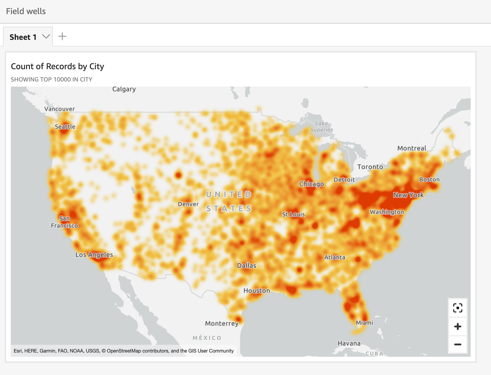

# Geospatial heatmaps in Amazon Quick Suite

Use geospatial heatmaps to reveal patterns of marker concentration in your
geospatial visuals. Heat maps display concentrations of data points using a colored
overlay that highlights the intensity or concentration of the visual's
markers.

###### To turn a geospatial map into a heat map

1. Open your analysis and choose the geospatial map that you want to format.
   When you select a visual, it displays with a highlight around it.
2. To open the formatting pane, select the **Format visual** icon
   from the on-visual menu.
3. On the formatting pane at left, choose **Points**.
4. Choose **Heatmap**.
5. (Optional) For **Heatmap gradient**, choose a color that
   you want for the **High density** and **Low
   density** values.
