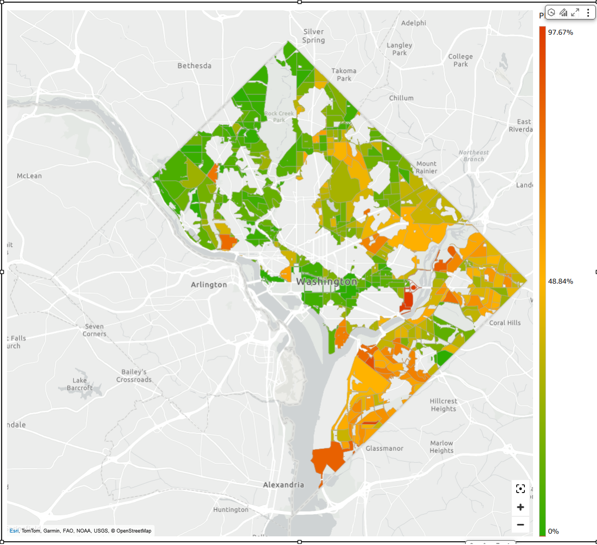

# Using layer maps

Use layer maps to visualize data with custom geographic boundaries, such as
congressional districts, sales territories, or user-defined regions. With layer maps,
Quick Suite authors upload GeoJSON files to Amazon Quick Suite that shape layers over a
base map and join with Quick Suite data to visualize associated metrics and
dimensions. Shape layers can be styled by color, border, and opacity. Quick Suite
authors can also add interactivity to layer maps through tooltips and custom
actions.

###### Note

Amazon Quick Suite layer map visuals only support polygon shapes. Line and point
geometries are not supported.

The following image shows a layer map visual in Amazon Quick Suite.

## Creating a shape layer with layered

maps

Use the procedure below to create a shape layer with layer map visuals in
Amazon Quick Suite.

1. Open the [Quick Suite console](https://quicksight.aws.amazon.com/ "https://quicksight.aws.amazon.com/").
2. Open the Quick Suite analysis that you want to add a layer map
   to.
3. Choose **Add** on the application bar, and then choose
   **Add visual**.
4. On the **Visual types** pane, choose one of the layer map
   icon.
5. An empty map visual appears in the analysis and prompts you to continue
   configuring the layer. Choose **CONFIGURE LAYER** to
   continue configuring the layer map.
6. The **Layer properties** pane opens to the right.
   Navigate to the **Shape file** section, and then choose
   **UPLOAD SHAPE FILE**.
7. Choose the GeoJSON file that you want to visualize. The file must be in
   `.geojson` format and must not exceed 100 MB.
8. Navigate to the **Data** section.
9. For **Shape file key field**, choose the field that you
   want the shape to visualize.
10. (Optional) For **Dataset key field**, choose the dataset
    field that you want the shape to visualize. To assign color to the shapes,
    add a color field. If the color field is a measure, the shape uses gradient
    coloring. If the color field is a dimension, the shape uses categorical
    coloring. If a color field is not assigned to the shape, use the fill color
    option in the **Styling** section of the **Layer
    properties** pane to set a common color for all shapes.
11. (Optional) To change the layer name, navigate to the **Layer
    options** section and enter a name in the **Layer
    name** input.
12. (Optional) To change the fill or border colors, navigate to the
    **Styling** section and choose the color switch next to
    the object that you want to change. To adjust the opacity of the color,
    enter a percentage amount in the input located next to the eye icon. If you
    do not assign a color field to the **Dataset key field**,
    the fill color can be used to set a common color for all shapes.
