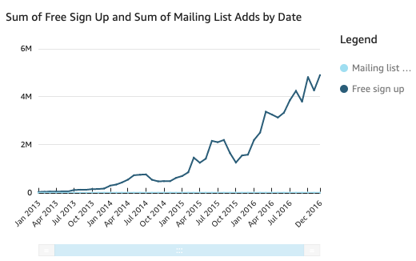
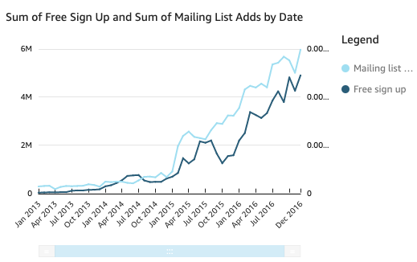
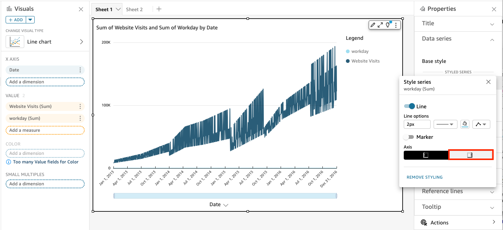

# Using line charts

Use line charts to compare changes in measure values over period of time, for the
following scenarios:

- One measure over a period of time, for example gross sales by month.
- Multiple measures over a period of time, for example gross sales and net sales
  by month.
- One measure for a dimension over a period of time, for example number of
  flight delays per day by airline.
  Line charts show the individual values of a set of measures or dimensions against the
  range displayed by the Y axis. Area line charts differ from regular line charts in that
  each value is represented by a colored area of the chart instead of just a line, to make
  it easier to evaluate item values relative to each other.

Because a stacked area line chart works differently than other line charts, simplify
it if you can. Then the audience won't try to interpret the numbers. Instead, they
can focus on the relationships of each set of values to the whole. One way to simplify
is to remove the numbers down the left side of the screen by reducing the step size for
the axis. To do this, choose the **Options** icon from the on-visual
menu. In **Format Options** under **Y-axis,** enter
`2` as the **Step size**.

Each line on the chart represents a measure value over a period of time. You can
interactively view the values on the chart. Hover over any line to see a pop-up legend that shows the values for
each line on the **X axis**. If you hover over a data point, you
can see the **Value** for that specific point on the **X
axis**.

Use line charts to compare changes in values for one or more measures or dimensions
over a period of time.

In regular line charts, each value is represented by a line, and in area line charts
each value is represented by a colored area of the chart.

Use stacked area line charts to compare changes in values for one or more groups of
measures or dimensions over a period of time. Stacked area line charts show the total
value for each group on the x-axis. They use color segments to show the values of each
measure or dimension in the group.

Line charts show up to 10,000 data points on the x-axis when no color field is
selected. When color is populated, line charts show up to 400 data points on the x-axis
and up to 25 data points for color. For more information about data that falls outside
the display limit for this visual type, see [Display limits](working-with-visual-types.md#display-limits "working-with-visual-types.md#display-limits").

## Line chart features

To understand the features supported by line charts, use the following
table.

| Feature                                                                       | Supported?           | Comments                                                                                                                                                                                                                                                                                                                                                                          | For more information                                                                                                                                                                          |
| ----------------------------------------------------------------------------- | -------------------- | --------------------------------------------------------------------------------------------------------------------------------------------------------------------------------------------------------------------------------------------------------------------------------------------------------------------------------------------------------------------------------- | --------------------------------------------------------------------------------------------------------------------------------------------------------------------------------------------- |
| Changing the legend display                                                   | Yes                  |                                                                                                                                                                                                                                                                                                                                                                                   | [Legends on visual types in Quick Suite](customizing-visual-legend.md "customizing-visual-legend.md")                                                                                      |
| Changing the title display                                                    | Yes                  |                                                                                                                                                                                                                                                                                                                                                                                   | [Titles and subtitles on visual types in Quick Suite](customizing-a-visual-title.md "customizing-a-visual-title.md")                                                                       |
| Changing the axis range                                                       | Yes                  | You can set the range for the Y axis.                                                                                                                                                                                                                                                                                                                                             | [Range and scale on visual types in Quick Suite](changing-visual-scale-axis-range.md "changing-visual-scale-axis-range.md")                                                                |
| Showing or hiding axis lines, grid lines, axis labels, and axis sort icons | Yes                  |                                                                                                                                                                                                                                                                                                                                                                                   | [Axes and grid lines on visual types in Quick Suite](showing-hiding-axis-grid-tick.md "showing-hiding-axis-grid-tick.md")                                                                  |
| Adding a second Y-axis                                                        | Yes                  |                                                                                                                                                                                                                                                                                                                                                                                   | [Creating a dual-axis line chart](#dual-axis-chart "#dual-axis-chart")                                                                                                                        |
| Changing the visual colors                                                    | Yes                  |                                                                                                                                                                                                                                                                                                                                                                                   | [Colors in visual types in Quick Suite](changing-visual-colors.md "changing-visual-colors.md")                                                                                             |
| Focusing on or excluding elements                                             | Yes, with exceptions | You can focus on or exclude any line on the chart, except in the following cases: • You create a multi-dimension line chart and use a date field as the dimension for the line color. • You create a measure or multi-measure line chart and use a date field as the dimension for the X axis. In these cases, you can only focus on a line, not exclude it. | [Focusing on visual elements](focusing-on-visual-elements.md "focusing-on-visual-elements.md") [Excluding visual elements](excluding-visual-elements.md "excluding-visual-elements.md") |
| Sorting                                                                       | Yes, with exceptions | You can sort data for numeric measures in the **X axis\* • and **Value\* • field wells. Other data is automatically sorted in ascending order.                                                                                                                                                                                                                        | [Sorting visual data in Amazon Quick Suite](sorting-visual-data.md "sorting-visual-data.md")                                                                                                  |
| Performing field aggregation                                                  | Yes                  | You must apply aggregation to the field that you choose for the value, and can't apply aggregation to the fields you choose for the X axis and color.                                                                                                                                                                                                                       | [Changing field aggregation](changing-field-aggregation.md "changing-field-aggregation.md")                                                                                                   |
| Adding drill-downs                                                            | Yes                  | You can add drill-down levels to the **X axis** and \*_Color_ • field wells.                                                                                                                                                                                                                                                                                                | [Adding drill-downs to visual data in Quick Sight](adding-drill-downs.md "adding-drill-downs.md")                                                                                          |

## Creating a line chart

Use the following procedure to create a line chart.

###### To create a line chart

1. On the analysis page, choose **Visualize** on the tool
   bar.
2. Choose **Add** on the application bar, and then choose
   **Add visual**.
3. On the **Visual types** pane, choose one of the line
   chart icons.
4. From the **Fields list** pane, drag the fields that you
   want to use to the appropriate field wells. Typically, you want to use
   dimension or measure fields as indicated by the target field well. If you
   choose to use a dimension field as a measure, the **Count**
   aggregate function is automatically applied to it to create a numeric
   value.
   - To create a single-measure line chart, drag a dimension to the
     **X axis** field well and one measure to the
     **Value** field well.
   - To create a multi-measure line chart, drag a dimension to the
     **X axis** field well and two or more measures
     to the **Value** field well. Leave the
     **Color** field well empty.
   - To create a multi-dimension line chart, drag a dimension to the
     **X axis** field well, one measure to the
     **Value** field well, and one dimension to the
     **Color** field well.

5. (Optional) Add drill-down layers by dragging one or more additional fields
   to the **X axis** or **Color** field
   wells. For more information about adding drill-downs, see [Adding drill-downs to visual data in
   Quick Sight](adding-drill-downs.md "adding-drill-downs.md").

## Creating a dual-axis line chart

If you have two or more metrics that you want to display in the same line chart,
you can create a dual-axis line chart.

A _dual-axis chart_ is a chart with two Y-axes
(one axis at the left of the chart, and one axis at the right of the chart). For
example, let's say you create a line chart. It shows the number of visitors who
signed up for a mailing list and for a free service over a period of time. If the
scale between those two measures varies widely over time, your chart might look
something like the following line chart. Because the scale between measures varies
so greatly, the measure with the smaller scale appears nearly flat at zero.

If you want to show these measures in the same chart, you can create a dual-axis
line chart. The following is an example of the same line chart with two
Y-axes.

###### To create a dual-axis line chart

1. In your analysis, create a line chart. For more information about creating
   line charts, see [Creating a line chart](#create-measure-line-chart "#create-measure-line-chart").
2. In the **Value field well**, choose a field drop-down
   menu, choose **Show on: Left Y-axis**, and then choose
   **Right Y-axis**.

Or you can create a dual-axis line chart using the
**Properties** pane:

    1. On the menu in the upper-right corner of the line chart, choose
     the **Format visual** icon.
    2. In the **Properties** pane that opens, choose
     **Data series**.
    3. In the **Data series** section, choose the
     **Show on right axis** icon for the value that
     you want to place on a separate axis. Use the search bar to quickly
     find a value if you need to.

    The icon updates to indicate that the value is being shown on the right

axis. The chart updates with two axes.

The **Properties** pane updates with the following
options:

    * To synchronize the Y-axes for both lines back into a single axis,
     choose **Single Y-axis** at the top of the
     **Properties** pane.
    * To format the axis at the left of the chart, choose **Left
     Y-axis**.
    * To format the axis at the right of the chart, choose
     **Right Y-axis**.

For more information about formatting axis lines, see [Axes and grid
lines](showing-hiding-axis-grid-tick.md "showing-hiding-axis-grid-tick.md"). For more
information about adjusting the range and scale of an axis, see [Range and
scale](changing-visual-scale-axis-range.md "changing-visual-scale-axis-range.md").
