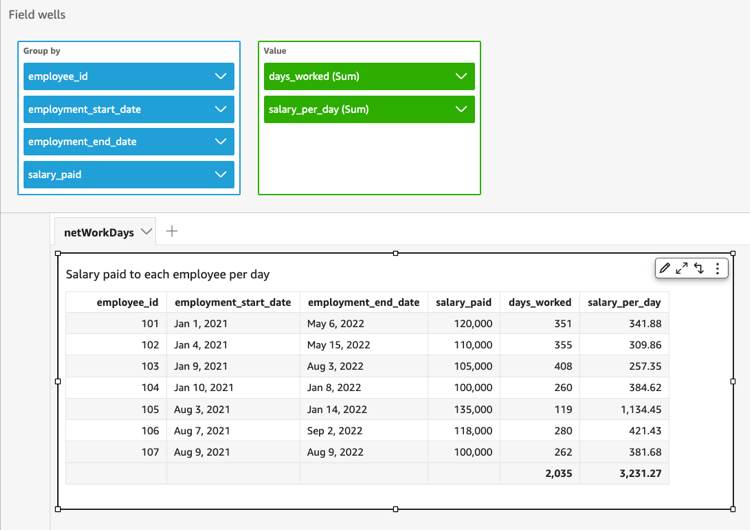

# netWorkDays

`netWorkDays` returns the number of working days between the provided
two date fields or even custom date values generated using other Quick Suite
date functions such as `parseDate` or `epochDate` as an
integer.

`netWorkDays` assumes a standard 5-day work week starting from Monday
and ending on Friday. Saturday and Sunday are assumed to be weekends. The
calculation is inclusive of both `startDate` and `endDate`.
The function operates on and shows results for DAY granularity.

## Syntax

```
netWorkDays(`startDate`, `endDate`)
```

## Arguments

_startDate_

A valid non-NULL date that acts as the start date for the
calculation.

- Dataset fields: Any `date` field from the
  dataset that you are adding this function to.
- Date Functions: Any date output from another
  `date` function, for example,
  `parseDate`.
- Calculated fields: Any Quick Suite calculated field
  that returns a `date` value.
- Parameters: Any Quick Suite `DateTime`
  parameter.
- Any combination of the above stated argument
  values.

_endDate_

A valid non-NULL date that acts as the end date for the
calculation.

- Dataset fields: Any `date` field from the
  dataset that you are adding this function to.
- Date Functions: Any date output from another
  `date` function, for example,
  `parseDate`.
- Calculated fields: Any Quick Suite calculated field
  that returns a `date` value.
- Parameters: Any Quick Suite `DateTime`
  parameter.
- Any combination of the above stated argument
  values.

## Return type

Integer

## Ouptut values

Expected output values include:

- Positive integer (when start_date < end_date)
- Negative integer (when start_date > end_date)
- NULL when one or both of the arguments get a null value from the
  `dataset field`.

## Example

The following example returns the number of work days falling between two
dates.

Let's assume that there's a field named
`application_date` with the following values:

```
netWorkDays({startDate}, {endDate})
```

The following are the given field values.

```
startDate	endDate	netWorkDays
        9/4/2022	9/11/2022	5
        9/9/2022	9/2/2022	-6
        9/10/2022	9/11/2022	0
        9/12/2022	9/12/2022	1
```

The following example calculates the number of days worked by each employee
and the salary expended per day for each employee:

```
days_worked = netWorkDays({employment_start_date}, {employment_end_date})
        salary_per_day = {salary}/{days_worked}

```

The following example filters employees whose employment ends on a work day
and determines whether their employment began on work day or a weekend using
conditional formatting:

```
is_start_date_work_day = netWorkDays(employment_start_date)
        is_end_date_work_day = netWorkDays(employment_end_date)
```


