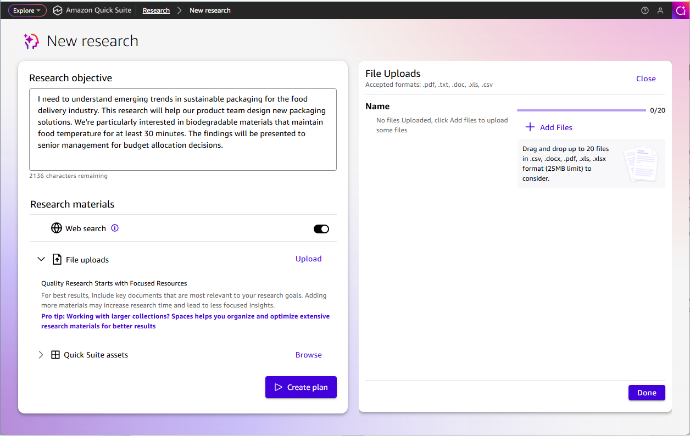
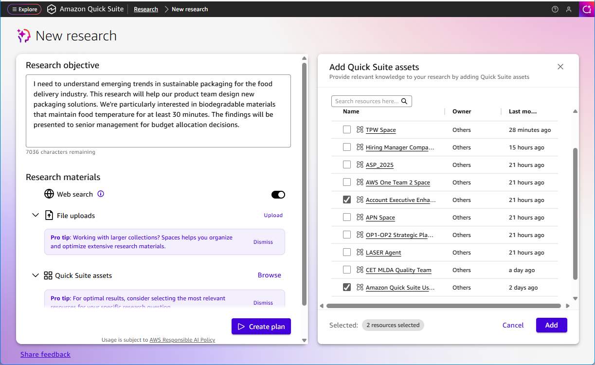

# Select research materials

After defining your research objective, you can select the data sources that Quick Research will use to gather information. You can choose from multiple types of research materials to ensure comprehensive coverage of your topic.

###### To select research materials

1. In the material selection interface, review the available data source options.
2. Select the types of materials you want to include:
   1. Toggle **Web search** to include online sources
   2. Choose **File upload** to add specific documents

   For best results, include key documents that are most relevant to your research goals. Adding more materials may increase research time and lead to less focused insights.

   If you're working with larger collections, consider using Spaces to organize and optimize extensive research materials for better results. 3. Select **Quick Suite assets** to include data spaces, dashboards, and knowledge bases. These are collections of files, documents, and analytics that you've organized in Quick Suite for easy access and analysis. For more information about creating and managing data spaces, see [Organize, collaborate, and share
   resources with spaces in Amazon Quick Suite](working-with-spaces.md "working-with-spaces.md").

3. Choose **Create plan** to proceed to research plan review.

## Web search

Enable web search to allow Quick Research to gather information from publicly available online sources. This includes academic papers, industry reports, news articles, and other relevant web content related to your research objective.

Amazon Quick Suite uses the internet to enhance your results. Web search queries will be processed securely in an AWS Region located in the US. For more information, see [Amazon Quick Suite User Guide](what-is.md "what-is.md").

To prioritize or avoid certain websites, you can expand the web search section to enter a list of preferred websites and a list of websites to avoid. Both fields are optional and can take a maximum of 3,500 characters.

We recommend providing a list of web domains (such as `example.com`), but you can also include types of websites such as `government websites` or `blogs`. If you enter a website address like `example.com/path/to/specific/page`, it will be shortened to `example.com`, so you don't need to enter multiple websites for a single domain.

###### Note

Adding a domain to the list of preferred websites doesn't guarantee that the website will be used in research. A website might not be used include: the site is behind a paywall, the site doesn't allow agents to access it, or the site's content is found to be less relevant than other sites.

## Uploaded files

Upload specific documents, PDFs, spreadsheets, or other files that you want Quick Research to analyze as part of your research. This is useful when you have particular sources or documents that are directly relevant to your research objective.

###### To upload files

1. Choose **Upload** to open the **File Uploads** window.
2. Add files using one of the following methods:
   1. Choose **Add Files** to navigate to your files in File Explorer
   2. Drag and drop up to 20 files into the upload areaIf you need to include more than 20 files in your research, consider organizing them in Spaces instead.

3. When you're finished selecting files, choose **Done**.

Accepted file formats include .pdf, .txt, .doc, .xls, and .csv files. The file size limit is 25MB per file.

## Quick Suite assets

Connect Quick Research to your existing data spaces to include internal documents, reports, and knowledge bases in your research. This allows you to combine external web sources with your organization's proprietary information.

For optimal results, consider selecting the most relevant assets for your specific research question. Choose **Browse** to add assets from Quick Suite.

###### To add Quick Suite assets

1. Choose **Browse** to open the **Add assets** window in the right pane.
2. Select from the available resource type tabs:
   1. **Recent** - Recently accessed assets
   2. **Space** - Available data spaces (maximum of 2 selections)
   3. **Dashboard** - Dashboard resources (maximum of 2 selections)
   4. **Topic** - Topic resources (maximum of 2 selections)
   5. **Knowledgebase** - Knowledge base resources

3. Review the available assets, which display the Name, Owner, and Last Modified date and time for each asset.
4. Select the assets you want to include in your research.
5. When you're finished specifying all assets, choose **Add**.
