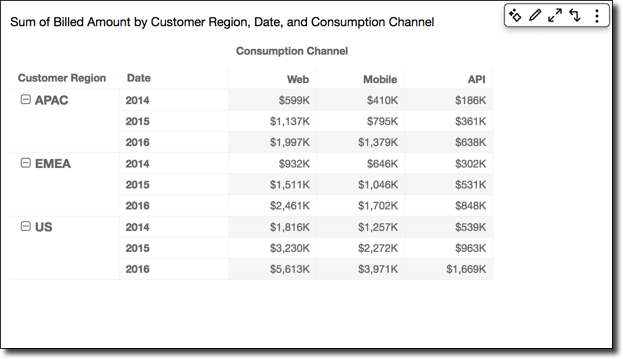
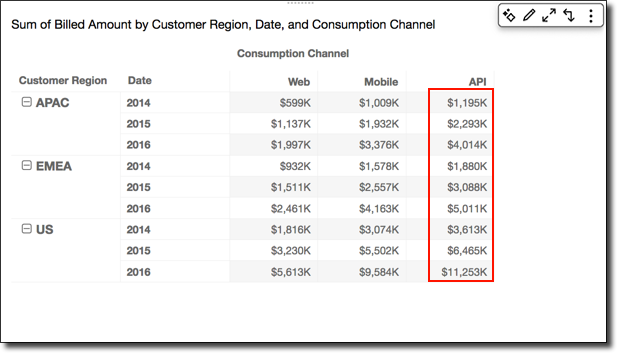
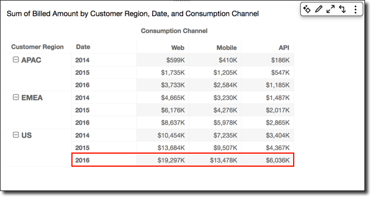
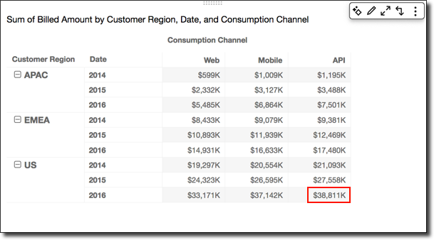
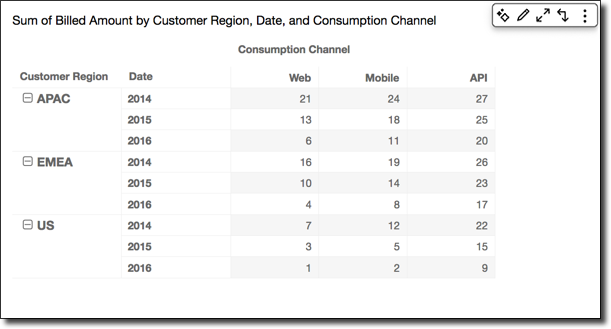
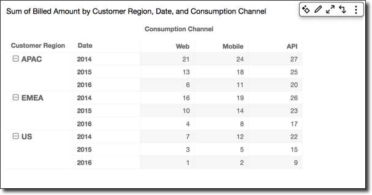
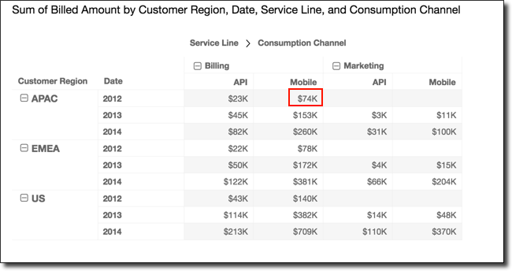
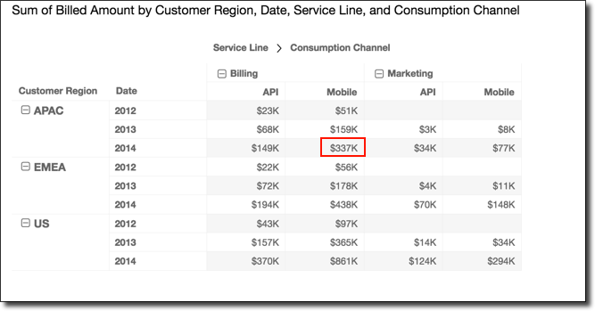
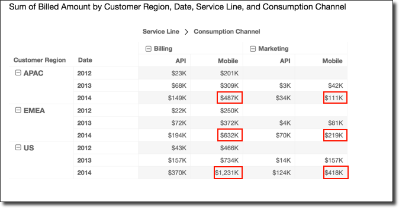
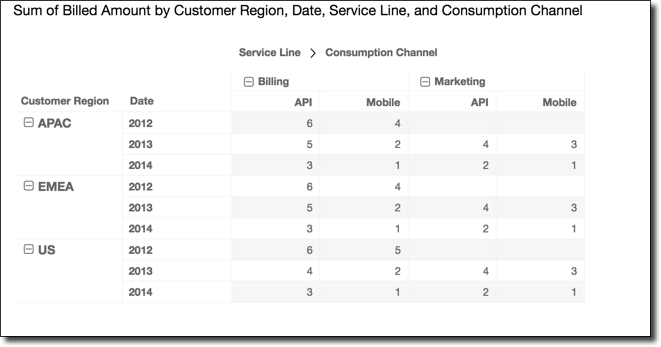

# Ways to apply pivot table

calculations

You can apply table calculations in the ways described following. Table
calculations are applied to only one field at a time. Thus, if you have a pivot
table with multiple values, calculations are only applied to the cells
representing the field that you applied the calculation to.

###### Topics

- [Table across](#table-across "#table-across")
- [Table down](#table-down "#table-down")
- [Table across down](#table-across-down "#table-across-down")
- [Table down across](#table-down-across "#table-down-across")
- [Group across](#group-across "#group-across")
- [Group down](#group-down "#group-down")
- [Group across down](#group-across-down "#group-across-down")
- [Group down across](#group-down-across "#group-down-across")

## Table across

Using **Table across** applies the calculation across the
rows of the pivot table, regardless of any grouping. This application is the
default. For example, take the following pivot table.

Applying the **Running total** function using
**Table across** gives you the following results, with
row totals in the last column.

## Table down

Using **Table down** applies the calculation down the
columns of the pivot table, regardless of any grouping.

Applying the **Running total** function using
**Table down** gives you the following results, with
column totals in the last row.

## Table across down

Using **Table across down** applies the calculation
across the rows of the pivot table, and then takes the results and reapplies
the calculation down the columns of the pivot table.

Applying the **Running total** function using
**Table across down** gives you the following results.
In this case, totals are summed both down and across, with the grand total
in the lower-right cell.

In this case, suppose that you apply the **Rank**
function using **Table across down**. Doing so means that
the initial ranks are determined across the table rows and then those ranks
are in turn ranked down the columns. This approach gives you the following
results.

## Table down across

Using **Table down across** applies the calculation down
the columns of the pivot table. It then takes the results and reapplies the
calculation across the rows of the pivot table.

You can apply the **Running total** function using
**Table down across** to get the following results. In
this case, totals are summed both down and across, with the grand total in
the lower-right cell.

You can apply the **Rank** function using **Table
down across** to get the following results. In this case, the
initial ranks are determined down the table columns. Then those ranks are in
turn ranked across the rows.

## Group across

Using **Group across** applies the calculation across the
rows of the pivot table within group boundaries, as determined by the second
level of grouping applied to the columns. For example, if you group by
field-2 and then by field-1, grouping is applied at the field-2 level. If
you group by field-3, field-2, and field-1, grouping is again applied at the
field-2 level. When there is no grouping, **Group across**
returns the same results as **Table across**.

For example, take the following pivot table where columns are grouped by
`Service Line` and then by `Consumption
 Channel`.

You can apply the **Running total** function using
**Group across** to get the following results. In this
case, the function is applied across the rows, bounded by the columns for
each service category group. The `Mobile` columns display the
total for both `Consumption Channel` values for the given
`Service Line`, for the `Customer Region` and
`Date` (year) represented by the given row. For example, the
highlighted cell represents the total for the `APAC` region for
`2012`, for all `Consumption Channel` values in
the `Service Line` named `Billing`.

## Group down

Using **Group down** applies the calculation down the
columns of the pivot table within group boundaries, as determined by the
second level of grouping applied to the rows. For example, if you group by
field-2 and then by field-1, grouping is applied at the field-2 level. If
you group by field-3, field-2, and field-1, grouping is again applied at the
field-2 level. When there is no grouping, **Group down**
returns the same results as **Table down**.

For example, take the following pivot table where rows are grouped by
`Customer Region` and then by `Date`
(year).

You can apply the **Running total** function using
**Group down** to get the following results. In this
case, the function is applied down the columns, bounded by the rows for each
`Customer Region` group. The `2014` rows display
the total for all years for the given `Customer Region`, for the
`Service Line` and `Consumption Channel`
represented by the given column. For example, the highlighted cell
represents the total the `APAC` region, for the
`Billing` service for the `Mobile` channel, for
all the `Date` values (years) that display in the report.

## Group across down

Using **Group across down** applies the calculation
across the rows within group boundaries, as determined by the second level
of grouping applied to the columns. Then the function takes the results and
reapplies the calculation down the columns of the pivot table. It does so
within group boundaries as determined by the second level of grouping
applied to the rows.

For example, if you group a row or column by field-2 and then by field-1,
grouping is applied at the field-2 level. If you group by field-3, field-2,
and field-1, grouping is again applied at the field-2 level. When there is
no grouping, **Group across down** returns the same results
as **Table across down**.

For example, take the following pivot table where columns are grouped by
`Service Line` and then by `Consumption Channel`.
Rows are grouped by `Customer Region` and then by
`Date` (year).

You can apply the **Running total** function using
**Group across down** to get the following results. In
this case, totals are summed both down and across within the group
boundaries. Here, these boundaries are `Service Line` for the
columns and `Customer Region` for the rows. The grand total
appears in the lower-right cell for the group.

You can apply the **Rank** function using **Group
across down** to get the following results. In this case, the
function is first applied across the rows bounded by each `Service
 Line` group. The function is then applied again to the results of
that first calculation, this time applied down the columns bounded by each
`Customer Region` group.

## Group down across

Using **Group down across** applies a calculation down
the columns within group boundaries, as determined by the second level of
grouping applied to the rows. Then Amazon Quick Suite takes the results and
reapplies the calculation across the rows of the pivot table. Again, it
reapplies the calculation within group boundaries as determined by the
second level of grouping applied to the columns.

For example, if you group a row or column by field-2 and then by field-1,
grouping is applied at the field-2 level. If you group by field-3, field-2,
and field-1, grouping is again applied at the field-2 level. When there is
no grouping, **Group down across** returns the same results
as **Table down across**.

For example, take the following pivot table. Columns are grouped by
`Service Line` and then by `Consumption Channel`.
Rows are grouped by `Customer Region` and then by
`Date` (year).

You can apply the **Running total** function using
**Group down across** to get the following results. In
this case, totals are summed both down and across within the group
boundaries. In this case, these are `Service Category` for the
columns and `Customer Region` for the rows. The grand total is in
the lower-right cell for the group.

You can apply the **Rank** function using **Group
down across** to get the following results. In this case, the
function is first applied down the columns bounded by each `Customer
 Region` group. The function is then applied again to the results
of that first calculation, this time applied across the rows bounded by each
`Service Line` group.

