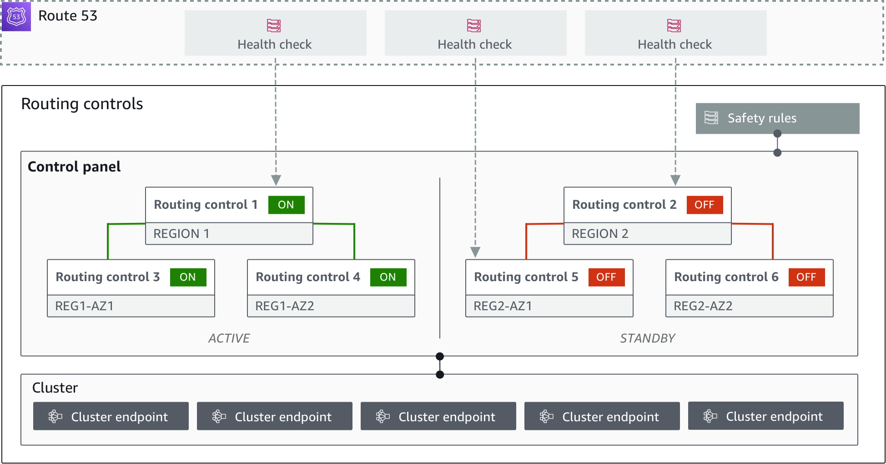

# Routing control components

The following diagram illustrates an example of components that support
the routing control feature in ARC. The routing controls shown here
(grouped into one control panel) let you manage traffic to two Availability Zones
in each of two Regions. When you update routing control
states, ARC changes health checks in Amazon Route 53, which redirect DNS traffic to
different cells.
Safety rules that you configure for routing controls help avoid fail-open scenarios
and other unintentional consequences.

The following are components of the routing control feature in ARC.

**Cluster**

A cluster is a set of five redundant Regional endpoints against which you initiate API calls to update or get routing control states. A cluster
includes a default control panel, and you can host multiple control panels and routing controls on one cluster.

**Routing controls**

A routing control is a simple on/off switch, hosted on a cluster, that you use to control routing of client traffic in and out of cells. When you
create a routing control, you add a ARC health check in Route 53. This enables you to reroute traffic (using the health checks, configured
with DNS records for your applications) when you update the routing control state in ARC.

**Routing control health check**

Routing controls are integrated with health checks in Route 53. The health checks are associated with DNS records that front each application replica,
for example, failover records. When you change routing control states, ARC updates the corresponding health checks, which redirect
traffic—for example, to failover to your standby replica.

**Control panel**

A control panel groups together a set of related routing controls. You
can associate multiple routing controls with one control panel, and then
create safety rules for the control panel to ensure that the traffic
redirection updates that you make are safe. For example, you can
configure a routing control for each of your load balancers in each
Availability Zone, and then group them in the same control panel. Then
you can add a safety rule (an "assertion rule") that makes sure that at least one zone
(represented by a routing control) is active at any one time, to avoid
unintended "fail-open" scenarios.

**Default control panel**

When you create a cluster, ARC creates a default control panel. By
default, all routing controls that you create on the cluster are added
to the default control panel. Or, you can create your own control
panels to group related routing controls.

**Safety rule**

Safety rules are rules that you add to routing control to ensure that recovery
actions don't accidentally impair your application's availability. For
example, you can create a safety rule that creates a routing
control that acts as an overall "on/off" switch so that you can
enable or disable a set of other routing controls.

\***\*Endpoint (cluster endpoint)\*\***

Each cluster in ARC has five Regional endpoints that you can use
for setting and retrieving routing control states. Your process for
accessing the endpoints should assume that ARC regularly brings the
endpoints up and down for maintenance, so you should try each endpoint
in succession until you connect to one. You access the endpoints to get
the current state of routing controls (On or Off) and to trigger
failovers for your applications by changing routing control
states.
