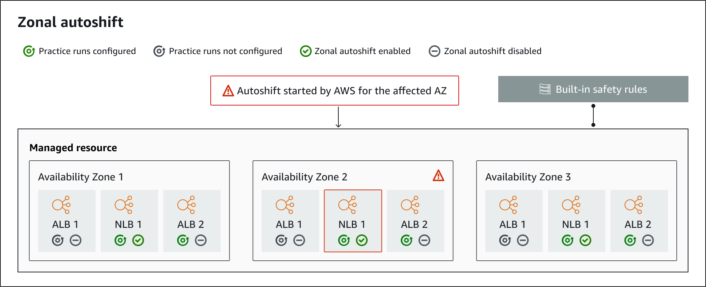

# Zonal autoshift components

The following diagram illustrates an example of an autoshift shifting traffic away from an Availability Zone.
AWS starts an autoshift when internal telemetry indicates that there is an Availability Zone impairment that could potentially
impact customers.

The following are components of the zonal autoshift capabilities in ARC.

**Zonal autoshifts**

Zonal autoshift shifts traffic away for a resource, without requiring you to take any action. Zonal
autoshift is a capability in ARC where AWS starts an autoshift when internal telemetry
indicates that there is an Availability Zone impairment that could potentially impact customers.
Be aware that, in some cases, resources might be shifted away that are not experiencing impact.

**Practice runs**

When you enable zonal autoshift for a resource, you must also configure zonal autoshift
_practice runs_ for the resource. AWS performs a zonal shift for practice runs about weekly,
for about 30 minutes. You can also schedule practice runs on-demand.

Practice runs make sure that your application can run normally with the
loss of one Availability Zone. In a practice run, AWS shifts traffic for a resource
away from one Availability Zone with a zonal shift, and then shifts traffic back when the practice run ends.

**Practice run configurations**

With a practice run configuration, you can define the time frames (blocked or allowed windows)for
when ARC can start a practice run for a resource with zonal autoshift. You also define the CloudWatch
alarms for an AWS practice run. You can edit a practice run configuration at any time, to add or
change blocked or allowed windows, or to update the alarms for the practice run.

To enable zonal autoshift, you must have a practice run configuration in
place for a resource.

You can delete a practice run, but first, you must disable zonal autoshift.

**Practice run alarms**

When you configure practice runs, you specify CloudWatch alarms (that you first create in CloudWatch), based on your
resource and application requirements. The alarms that you specify
can block a practice run from starting, or can stop a practice run in progress, if your application is adversely
affected by the practice run.

If an alarm that you specify goes into an `ALARM` state, ARC ends the zonal
shift for the practice run, so that traffic for the resource is no longer shifted away from the Availability Zone.

There are two types of alarms that you specify for practice runs: _outcome_ alarms, to
monitor the health of your resource and application during the practice run, and _blocking_
alarms, which you can configure to prevent practice runs from starting, or to stop an in-progress practice run.
At least one outcome alarm is required; blocking alarms are optional.

**Practice run outcomes**
ARC reports an outcome for each practice run. The following are the possible practice run outcomes:

- **PENDING:** The zonal shift for the practice run is active (in progress).
  There's no outcome to return yet.
- **SUCCEEDED:** The outcome alarm did not enter an `ALARM` state
  during the practice run, and the practice run completed the full 30 minute test period.
- **INTERRUPTED:** The practice run ended for a reason that was not
  the outcome alarm entering an `ALARM` state. A practice run can be interrupted for a variety of
  reasons. For example, a practice run that ends because the blocking alarm specified for the practice run
  entered an `ALARM` state has an outcome of `INTERRUPTED`. For more information about
  reasons for an `INTERRUPTED` outcome, see [Outcomes for
  practice runs](arc-zonal-autoshift.md#ZAConsiderationsPracticeRunOutcomes "arc-zonal-autoshift.md#ZAConsiderationsPracticeRunOutcomes").
- **FAILED:** The outcome alarm entered an `ALARM` state during
  the practice run.
- **CAPACITY_CHECK_FAILED:** The check for balanced capacity across Availability Zones for your load balancing
  and Auto Scaling group resources failed.

**Built-in safety rules**
Safety rules built into ARC prevent more than one traffic shift for a resource from being
in effect at a time. That is, only one customer-initiated zonal shift, practice run zonal shift (initiated by AWS
or by a customer), or autoshift for the resource can be actively shifting traffic away
from an Availability Zone. For example, if you start a zonal shift for a resource when it is currently shifted away with
autoshift, your zonal shift takes precedence. For more information, see [Precedence
for zonal shifts](arc-zonal-autoshift.how-it-works.md#ZAShiftPrecedence "arc-zonal-autoshift.how-it-works.md#ZAShiftPrecedence").

**Resource identifier**

The identifier for a resource to enable zonal autoshift for, which is the Amazon Resource Name (ARN) for the resource.
You can only enable zonal autoshift for resources in your account that are in an AWS
service that is supported by ARC.

**Managed resource**

Application Load Balancers register resources automatically with ARC for zonal autoshift. You must manually opt-in other resources for zonal autoshift.

**Resource name**
The name of a managed resource in ARC.

**Applied status**

An applied status indicates whether a traffic shift is in effect for a resource. When you configure zonal
autoshift, a resource can have more than one active traffic shift—that is, a practice run zonal shift,
customer-initiated zonal shift, or autoshift. However, only one is _applied_, that is, is in effect for the
resource at a time. The shift that has the status `APPLIED` determines the Availability Zone where
application traffic has been shifted away for a resource, and when that traffic shift ends.

**Shift type**
Defines the zonal shift type. Zonal shifts can have one of the following types:

- **ZONAL_SHIFT**
- **ZONAL_AUTOSHIFT**
- **PRACTICE_RUN**
- **FIS_EXPERIMENT**
