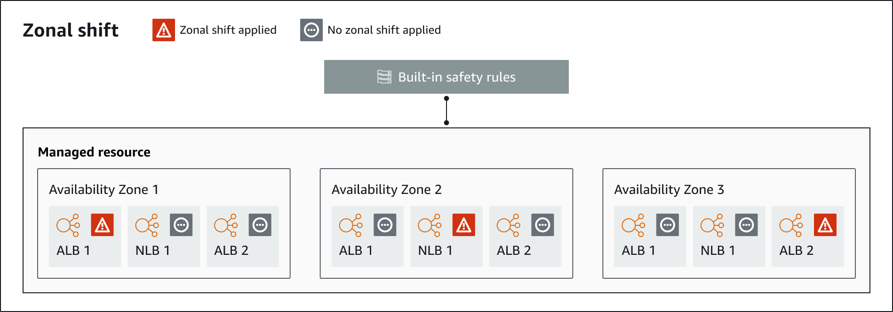

# Zonal shift components

The following diagram illustrates an example of a zonal shift shifting traffic away from an Availability Zone
in an AWS Region. Checks that are built into zonal shift prevent you from starting another zonal shift
for a resource when it already has an active shift.

The following are components of the zonal shift capability in ARC.

**Zonal shift**

You start a zonal shift for a managed resource in your AWS account to temporarily move
traffic away from an Availability Zone in an AWS Region, to healthy AZs in
the Region, to quickly recover from an issue in one AZ. For more information
on supported resources for zonal shift, refer to [Supported resources](arc-zonal-shift.md "arc-zonal-shift.md").

**Built-in safety checks**
Checks that are built into ARC prevent more than one traffic shift for a resource from
being in effect at a time. That is, only one customer-initiated zonal shift,
practice run, or autoshift for the resource can be actively shifting traffic
away from an Availability Zone. For example, if you start a zonal shift for
a resource when it is currently shifted away with autoshift, your zonal
shift takes precedence. For more information, see [Zonal autoshift in ARC](arc-zonal-autoshift.md "arc-zonal-autoshift.md") and
[Outcomes for practice
runs](arc-zonal-autoshift.how-it-works.md#ZAShiftPrecedence "arc-zonal-autoshift.how-it-works.md#ZAShiftPrecedence").

**Resource identifier**

The identifier for a resource to include in a zonal shift. The identifier is the Amazon Resource Name (ARN) for the resource.

For a zonal shift, you can only choose resources in your account for an AWS service
that is supported by ARC. For more information on supported resources
for zonal shift, refer to [Supported resources](arc-zonal-shift.md "arc-zonal-shift.md").

**Managed resource**

Some AWS resources must manually opt-in to zonal shift, and others are automatically enabled. For more information on
supported resources for zonal shift, refer to [Supported resources](arc-zonal-shift.md "arc-zonal-shift.md").

**Resource name**
The name of a resource in ARC that you can specify for a zonal shift.

**Status (zonal shift status)**

A status for a zonal shift. The `Status` for a zonal shift can have one of the following values:

- **ACTIVE**: The zonal shift is started and active.
- **EXPIRED**: The zonal shift has expired (the expiry time was exceeded).
- **CANCELED**: The zonal shift was canceled.

**Applied status**

An applied status indicates whether a shift is in effect for a resource. The shift that has the
status `APPLIED` determines the Availability Zone where application traffic has been shifted away
for a resource, and when that shift ends.

**Shift type**
Defines the zonal shift type. The `shiftType` can have the following values:

- **ZONAL_SHIFT**
- **ZONAL_AUTOSHIFT**
- **PRACTICE_RUN**
- **FIS_EXPERIMENT**

**Expiry time (expiration time)**

The expiry time (expiration time) for a zonal shift. Zonal shifts are temporary. For a
zonal shift, you can initially set a zonal shift to be active for up to
three days (72 hours).

When you start a zonal shift, you specify how long you want it to be active, which
ARC converts to an expiry time (expiration time). You can cancel a
zonal shift, for example, if you're ready to restore traffic to the
Availability Zone. Or you can extend a customer-initiated zonal shift by
updating it to specify another length of time to expire in.

You can cancel zonal shift practice runs that are part of zonal autoshift.
