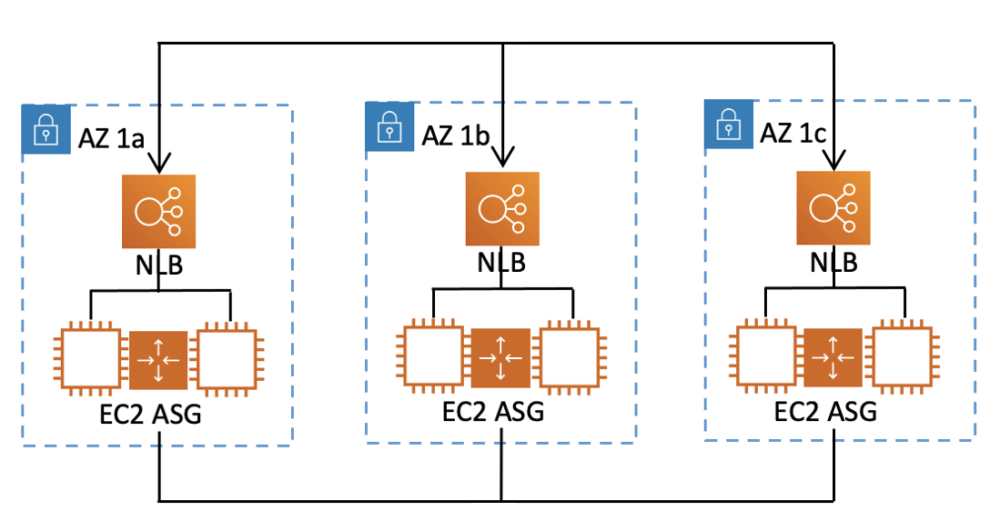

#

How readiness checks, resource sets, and readiness scopes work together

Readiness checks always audit groups of resources in _resource sets_. You create resource sets (separately, or while you're creating
a readiness check) to group the resources that are in the cells (Availability Zones or AWS Regions) in your ARC recovery group, so that you can
define readiness checks. A resource set is typically a group of same type of resources (like Network Load Balancers) but can also be DNS target resources, for
architectural readiness checks.

You typically create one resource set and readiness check for each type of resource in your application. For an architectural
readiness check, you create a top level DNS target resource and a global (recovery group level) resource set for it, and then
create cell level DNS target resources, for a separate resource set.

The following diagram shows an example of a recovery group with three cells (Availability Zones), each with a Network Load Balancer (NLB) and Amazon EC2 Auto Scaling group (ASG).

In this scenario, you would create a resource set and readiness check for the three Network Load Balancers, and a resource set and readiness check for the three Amazon EC2 Auto Scaling
groups. Now you have a readiness check for each set of resources for your recovery group, by resource type.

By creating _readiness scopes_ for resources, you can add readiness check summaries for cells or recovery
groups. To specify a readiness scope for a resource, you associate the ARN of the cell or recovery group with each resource
in a resource set. You can do this when you're creating a readiness check for a resource set.

For example, when you add a readiness check for a resource set for the Network Load Balancers for this recovery group, you can add
readiness scopes to each NLB at the same time. In this case, you would associate the ARN of AZ 1a to the NLB in AZ 1a, the ARN of `AZ 1b`
to the NLB `AZ 1b`, and the ARN of `AZ 1c` to the NLB in `AZ 1c`. When you create a readiness check for
the Amazon EC2 Auto Scaling groups, you would do the same, assigning readiness scopes to each of them when you create the readiness check for the Amazon EC2 Auto Scaling
group resource set.

It’s optional to associate readiness scopes when you create a readiness check, however, we strongly recommend that you set them.
Readiness scopes enable ARC to show the correct `READY` or `NOT READY` readiness status for recovery group
summary readiness checks and cell level summary readiness checks. Unless you set readiness scopes, ARC can't provide these summaries.

Note that when you add an application-level or a global resource, such as a DNS routing policy, you don't choose a recovery group or cell for the
readiness scope. Instead, you choose **global resource (no cell)**.
