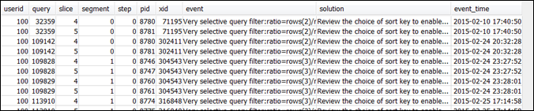

Amazon Redshift will no longer support the creation of new Python UDFs starting November 1, 2025.
If you would like to use Python UDFs, create the UDFs prior to that date.
Existing Python UDFs will continue to function as normal. For more information, see the
[blog post](https://aws.amazon.com/blogs/big-data/amazon-redshift-python-user-defined-functions-will-reach-end-of-support-after-june-30-2026/ "https://aws.amazon.com/blogs/big-data/amazon-redshift-python-user-defined-functions-will-reach-end-of-support-after-june-30-2026/") .

# Reviewing query alerts

To use the [STL_ALERT_EVENT_LOG](r_STL_ALERT_EVENT_LOG.md "r_STL_ALERT_EVENT_LOG.md") system table to identify and correct
potential performance issues with your query, follow these steps:

1. Run the following to determine your query ID:

```
select query, elapsed, substring
from svl_qlog
order by query
desc limit 5;
```

Examine the truncated query text in the `substring` field to
determine which `query` value to select. If you have run the query more
than once, use the `query` value from the row with the lower
`elapsed` value. That is the row for the compiled version. If you
have been running many queries, you can raise the value used by the LIMIT clause
used to make sure that your query is included. 2. Select rows from STL_ALERT_EVENT_LOG for your query:

```
Select * from stl_alert_event_log where query = *MyQueryID*;
```

 3. Evaluate the results for your query. Use the following table to locate
potential solutions for any issues that you have identified.

###### Note

Not all queries have rows in STL_ALERT_EVENT_LOG, only those with identified
issues.

| Issue                                                                                                                                                                            | Event value                                                                                                                    | Solution value                                                                                       | Recommended solution                                                                                                                                                                                                               |
| -------------------------------------------------------------------------------------------------------------------------------------------------------------------------------- | ------------------------------------------------------------------------------------------------------------------------------ | ---------------------------------------------------------------------------------------------------- | ---------------------------------------------------------------------------------------------------------------------------------------------------------------------------------------------------------------------------------- |
| Statistics for the tables in the query are missing<br>or out of date.                                                                                                            | Missing query planner statistics                                                                                               | Run the ANALYZE command                                                                              | See [Table statistics missing or out of<br>date](query-performance-improvement-opportunities.md#table-statistics-missing-or-out-of-date "query-performance-improvement-opportunities.md#table-statistics-missing-or-out-of-date"). |
| There is a nested loop join (the least optimal<br>join) in the query plan.                                                                                                       | Nested Loop Join in the query plan                                                                                             | Review the join predicates to avoid Cartesian<br>products                                            | See [Nested loop](query-performance-improvement-opportunities.md#nested-loop "query-performance-improvement-opportunities.md#nested-loop").                                                                                        |
| The scan skipped a relatively large number of rows<br>that are marked as deleted but not vacuumed, or rows that have been<br>inserted but not committed.                         | Scanned a large number of deleted rows                                                                                         | Run the VACUUM command to reclaim deleted space                                                      | See [Ghost rows or uncommitted rows](query-performance-improvement-opportunities.md#ghost-rows-or-uncommitted-rows "query-performance-improvement-opportunities.md#ghost-rows-or-uncommitted-rows").                               |
| More than 1,000,000 rows were redistributed for a<br>hash join or aggregation.                                                                                                   | Distributed a large number of rows across the<br>network:RowCount rows were distributed in order to process the<br>aggregation | Review the choice of distribution key to collocate<br>the join or aggregation                        | See [Suboptimal data distribution](query-performance-improvement-opportunities.md#suboptimal-data-distribution "query-performance-improvement-opportunities.md#suboptimal-data-distribution").                                     |
| More than 1,000,000 rows were broadcast for a hash<br>join.                                                                                                                      | Broadcasted a large number of rows across the<br>network                                                                       | Review the choice of distribution key to collocate<br>the join and consider using distributed tables | See [Suboptimal data distribution](query-performance-improvement-opportunities.md#suboptimal-data-distribution "query-performance-improvement-opportunities.md#suboptimal-data-distribution").                                     |
| A DS_DIST_ALL_INNER redistribution style was<br>indicated in the query plan, which forces serial execution because the<br>entire inner table was redistributed to a single node. | DS_DIST_ALL_INNER for Hash Join in the query<br>plan                                                                           | Review the choice of distribution strategy to<br>distribute the inner, rather than outer, table      | See [Suboptimal data distribution](query-performance-improvement-opportunities.md#suboptimal-data-distribution "query-performance-improvement-opportunities.md#suboptimal-data-distribution").                                     |
