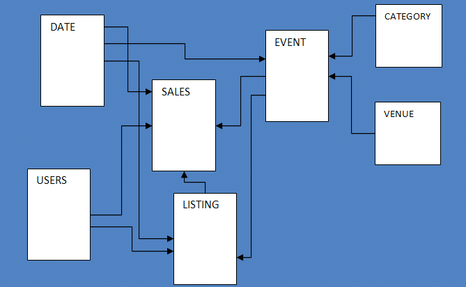

Amazon Redshift will no longer support the creation of new Python UDFs starting Patch 198.
Existing Python UDFs will continue to function until June 30, 2026. For more information, see the
[blog post](https://aws.amazon.com/blogs/big-data/amazon-redshift-python-user-defined-functions-will-reach-end-of-support-after-june-30-2026/ "https://aws.amazon.com/blogs/big-data/amazon-redshift-python-user-defined-functions-will-reach-end-of-support-after-june-30-2026/") .

# Sample database

This section describes TICKIT, a sample database that Amazon Redshift documentation examples use.

This small database consists of seven tables: two fact tables and five dimensions. You can
load the TICKIT dataset by following the steps in [Step 4: Load data from Amazon S3 to Amazon Redshift](../gsg/rs-gsg-create-sample-db.md "../gsg/rs-gsg-create-sample-db.md") in the Amazon Redshift Getting Started Guide.


This sample database application helps analysts track sales activity for the fictional TICKIT web
site, where users buy and sell tickets online for sporting events, shows,
and concerts. In particular, analysts can identify ticket movement over
time, success rates for sellers, and the best-selling events, venues, and
seasons. Analysts can use this information to provide incentives to buyers
and sellers who frequent the site, to attract new users, and to drive
advertising and promotions.

For example, the following query finds the top five sellers in San Diego, based on the number of
tickets sold in 2008:

```
select sellerid, username, (firstname ||' '|| lastname) as name,
city, sum(qtysold)
from sales, date, users
where sales.sellerid = users.userid
and sales.dateid = date.dateid
and year = 2008
and city = 'San Diego'
group by sellerid, username, name, city
order by 5 desc
limit 5;

sellerid | username |       name        |   city    | sum
----------+----------+-------------------+-----------+-----
49977 | JJK84WTE | Julie Hanson      | San Diego |  22
19750 | AAS23BDR | Charity Zimmerman | San Diego |  21
29069 | SVL81MEQ | Axel Grant        | San Diego |  17
43632 | VAG08HKW | Griffin Dodson    | San Diego |  16
36712 | RXT40MKU | Hiram Turner      | San Diego |  14
(5 rows)
```

The database used for the examples in this guide contains a small data set; the two fact tables
each contain less than 200,000 rows, and the dimensions range from 11 rows in the
CATEGORY table up to about 50,000 rows in the USERS table.

In particular, the database examples in this guide demonstrate the key features of Amazon Redshift table
design:

- Data distribution
- Data sort
- Columnar compression
  For information about the schemas of the tables in the TICKIT database, choose the following tabs:

CATEGORY table

| Column name | Data type   | Description                                                                                                                            |
| ----------- | ----------- | -------------------------------------------------------------------------------------------------------------------------------------- |
| CATID       | SMALLINT    | Primary key, a unique ID value for each row.<br>Each row represents a specific type of event for which tickets are bought and<br>sold. |
| CATGROUP    | VARCHAR(10) | Descriptive name for a group of events, such<br>as<br>`Shows` and<br>`Sports`.                                                         |
| CATNAME     | VARCHAR(10) | Short descriptive name for a type of event<br>within a group, such as<br>`Opera` and<br>`Musicals`.                                    |
| CATDESC     | VARCHAR(50) | Longer descriptive name for the type of<br>event, such as<br>`Musical theatre`.                                                        |

DATE table

| Column name | Data type | Description                                                                                     |
| ----------- | --------- | ----------------------------------------------------------------------------------------------- |
| DATEID      | SMALLINT  | Primary key, a unique ID value for each row.<br>Each row represents a day in the calendar year. |
| CALDATE     | DATE      | Calendar date, such as<br>`2008-06-24`.                                                         |
| DAY         | CHAR(3)   | Day of week (short form), such as<br>`SA`.                                                      |
| WEEK        | SMALLINT  | Week number, such as<br>`26`.                                                                   |
| MONTH       | CHAR(5)   | Month name (short form), such as<br>`JUN`.                                                      |
| QTR         | CHAR(5)   | Quarter number (`1`<br>through<br>`4`).                                                         |
| YEAR        | SMALLINT  | Four-digit year<br>(`2008`).                                                                    |
| HOLIDAY     | BOOLEAN   | Flag that denotes whether the day is a public<br>holiday (U.S.).                                |

EVENT table

| Column name | Data type    | Description                                                                                                                                      |
| ----------- | ------------ | ------------------------------------------------------------------------------------------------------------------------------------------------ |
| EVENTID     | INTEGER      | Primary key, a unique ID value for each row.<br>Each row represents a separate event that takes place at a specific venue at a<br>specific time. |
| VENUEID     | SMALLINT     | Foreign-key reference to the VENUE table.                                                                                                        |
| CATID       | SMALLINT     | Foreign-key reference to the CATEGORY table.                                                                                                     |
| DATEID      | SMALLINT     | Foreign-key reference to the DATE table.                                                                                                         |
| EVENTNAME   | VARCHAR(200) | Name of the event, such as<br>`Hamlet` or<br>`La Traviata`.                                                                                      |
| STARTTIME   | TIMESTAMP    | Full date and start time for the event, such<br>as<br>`2008-10-10 19:30:00`.                                                                     |

VENUE table

| Column name | Data type    | Description                                                                                                                                                       |
| ----------- | ------------ | ----------------------------------------------------------------------------------------------------------------------------------------------------------------- |
| VENUEID     | SMALLINT     | Primary key, a unique ID value for each row.<br>Each row represents a specific venue where events take place.                                                     |
| VENUENAME   | VARCHAR(100) | Exact name of the venue, such as<br>`Cleveland Browns Stadium`.                                                                                                   |
| VENUECITY   | VARCHAR(30)  | City name, such as<br>`Cleveland`.                                                                                                                                |
| VENUESTATE  | CHAR(2)      | Two-letter state or province abbreviation<br>(United States and Canada), such as<br>`OH`.                                                                         |
| VENUESEATS  | INTEGER      | Maximum number of seats available at the<br>venue, if known, such as<br>`73200`. For demonstration purposes, this<br>column contains some null values and zeroes. |

USERS table

| Column name     | Data type    | Description                                                                                                                                                                   |
| --------------- | ------------ | ----------------------------------------------------------------------------------------------------------------------------------------------------------------------------- |
| USERID          | INTEGER      | Primary key, a unique ID value for each row.<br>Each row represents a registered user (a buyer or seller or both) who has<br>listed or bought tickets for at least one event. |
| USERNAME        | CHAR(8)      | An 8-character alphanumeric username, such as<br>`PGL08LJI`.                                                                                                                  |
| FIRSTNAME       | VARCHAR(30)  | The user's first name, such as<br>`Victor`.                                                                                                                                   |
| LASTNAME        | VARCHAR(30)  | The user's last name, such as<br>`Hernandez`.                                                                                                                                 |
| CITY            | VARCHAR(30)  | The user's home city, such as<br>`Naperville`.                                                                                                                                |
| STATE           | CHAR(2)      | The user's home state, such as<br>`GA`.                                                                                                                                       |
| EMAIL           | VARCHAR(100) | The user's email address; this column<br>contains random Latin values, such as<br>`turpis@accumsanlaoreet.org`.                                                               |
| PHONE           | CHAR(14)     | The user's 14-character phone number, such as<br>`(818) 765-4255`.                                                                                                            |
| LIKESPORTS, ... | BOOLEAN      | A series of 10 different columns that<br>identify the user's likes and dislikes with<br>`true` and<br>`false` values.                                                         |

LISTING table

| Column name    | Data type    | Description                                                                                                               |
| -------------- | ------------ | ------------------------------------------------------------------------------------------------------------------------- |
| LISTID         | INTEGER      | Primary key, a unique ID value for each row.<br>Each row represents a listing of a batch of tickets for a specific event. |
| SELLERID       | INTEGER      | Foreign-key reference to the USERS table,<br>identifying the user who is selling the tickets.                             |
| EVENTID        | INTEGER      | Foreign-key reference to the EVENT table.                                                                                 |
| DATEID         | SMALLINT     | Foreign-key reference to the DATE table.                                                                                  |
| NUMTICKETS     | SMALLINT     | The number of tickets available for sale,<br>such as<br>`2` or<br>`20`.                                                   |
| PRICEPERTICKET | DECIMAL(8,2) | The fixed price of an individual ticket, such<br>as<br>`27.00` or<br>`206.00`.                                            |
| TOTALPRICE     | DECIMAL(8,2) | The total price for this listing<br>(NUMTICKETS\*PRICEPERTICKET).                                                         |
| LISTTIME       | TIMESTAMP    | The full date and time when the listing was<br>posted, such as<br>`2008-03-18 07:19:35`.                                  |

SALES table

| Column name | Data type    | Description                                                                                                                                                  |
| ----------- | ------------ | ------------------------------------------------------------------------------------------------------------------------------------------------------------ |
| SALESID     | INTEGER      | Primary key, a unique ID value for each row.<br>Each row represents a sale of one or more tickets for a specific event, as<br>offered in a specific listing. |
| LISTID      | INTEGER      | Foreign-key reference to the LISTING table.                                                                                                                  |
| SELLERID    | INTEGER      | Foreign-key reference to the USERS table (the<br>user who sold the tickets).                                                                                 |
| BUYERID     | INTEGER      | Foreign-key reference to the USERS table (the<br>user who bought the tickets).                                                                               |
| EVENTID     | INTEGER      | Foreign-key reference to the EVENT table.                                                                                                                    |
| DATEID      | SMALLINT     | Foreign-key reference to the DATE table.                                                                                                                     |
| QTYSOLD     | SMALLINT     | The number of tickets that were sold, from<br>`1` to<br>`8`. (A maximum of 8 tickets can be sold in<br>a single transaction.)                                |
| PRICEPAID   | DECIMAL(8,2) | The total price paid for the tickets, such as<br>`75.00` or<br>`488.00`. The individual price of a ticket<br>is PRICEPAID/QTYSOLD.                           |
| COMMISSION  | DECIMAL(8,2) | The 15% commission that the business collects<br>from the sale, such as<br>`11.25` or<br>`73.20`. The seller receives 85% of the<br>PRICEPAID value.         |
| SALETIME    | TIMESTAMP    | The full date and time when the sale was<br>completed, such as<br>`2008-05-24 06:21:47`.                                                                     |
