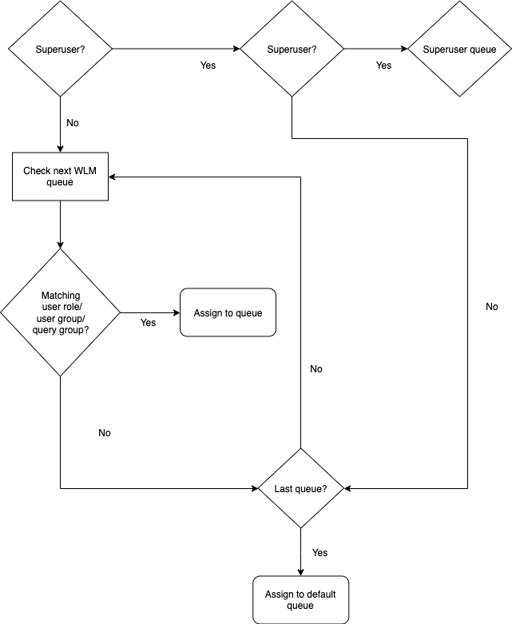
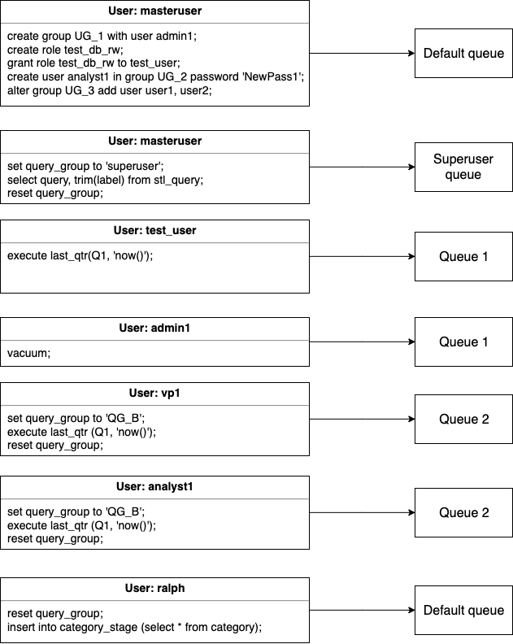

Amazon Redshift will no longer support the creation of new Python UDFs starting November 1, 2025.
If you would like to use Python UDFs, create the UDFs prior to that date.
Existing Python UDFs will continue to function as normal. For more information, see the
[blog post](https://aws.amazon.com/blogs/big-data/amazon-redshift-python-user-defined-functions-will-reach-end-of-support-after-june-30-2026/ "https://aws.amazon.com/blogs/big-data/amazon-redshift-python-user-defined-functions-will-reach-end-of-support-after-june-30-2026/") .

# WLM queue assignment rules

With Amazon Redshift, you can control the allocation of memory and CPU resources to user queries
by defining queue assignment rules in a workload management (WLM) configuration.
The following section describes creating and managing WLM queue assignment rules to
achieve efficient resource allocation and meet service-level agreements for diverse
workloads in Amazon Redshift.

When a user runs a query, WLM assigns the query to the first matching queue, based on
the WLM queue assignment rules:

1. If a user is logged in as a superuser and runs a query in the query group
   labeled superuser, the query is assigned to the superuser queue.
2. If a user is part of a role, belongs to a listed user group, or runs a query within a listed query
   group, the query is assigned to the first matching queue.
3. If a query doesn't meet any criteria, the query is assigned to the default queue,
   which is the last queue defined in the WLM configuration.
   The following diagram illustrates how these rules work.

## Queue

assignments example

The following table shows a WLM configuration with the superuser queue and four
user-defined queues.

| Queue     | Concurrency | User Roles | User Groups | Query Groups |
| --------- | ----------- | ---------- | ----------- | ------------ |
| Superuser | 1           |            |             | superuser    |
| 1         | 5           | test_db_rw | UG_1        |              |
| 2         | 5           |            |             | QG_B         |
| 3         | 5           |            | UG_2        | QG_C         |
| Default   | 5           |            |             |              |

The following illustration shows how queries are assigned to the queues in the
previous table according to user groups and query groups. For information about how
to assign queries to user groups and query groups at runtime, see [Assigning queries to queues](cm-c-executing-queries.md "cm-c-executing-queries.md") later in
this section.

In this example, WLM makes the following assignments:

1. The first set of statements shows three ways to assign users to user groups.
   The statements are run by the user `adminuser`, which is not a
   member of a user group listed in any WLM queue. No query group is set, so the
   statements are routed to the default queue.
2. The user `adminuser` is a superuser and the query group is set to
   `'superuser'`, so the query is assigned to the superuser
   queue.
3. The user `test_user` is assigned the role `test_db_rw` listed
   in queue 1, so the query is assigned to queue 1.
4. The user `admin1` is a member of the user group listed in queue 1,
   so the query is assigned to queue 1.
5. The user `vp1` is not a member of any listed user group. The query
   group is set to `'QG_B'`, so the query is assigned to queue 2.
6. The user `analyst1` is a member of the user group listed in queue 3,
   but `'QG_B'` matches queue 2, so the query is assigned to queue 2.
7. The user `ralph` is not a member of any listed user group and the
   query group was reset, so there is no matching queue. The query is assigned to the
   default queue.
