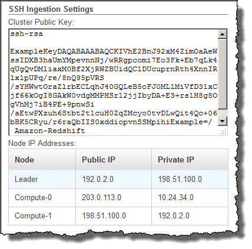

Amazon Redshift will no longer support the creation of new Python UDFs starting November 1, 2025.
If you would like to use Python UDFs, create the UDFs prior to that date.
Existing Python UDFs will continue to function as normal. For more information, see the
[blog post](https://aws.amazon.com/blogs/big-data/amazon-redshift-python-user-defined-functions-will-reach-end-of-support-after-june-30-2026/ "https://aws.amazon.com/blogs/big-data/amazon-redshift-python-user-defined-functions-will-reach-end-of-support-after-june-30-2026/") .

# Loading data from remote hosts

You can use the COPY command to load data in parallel from one or more remote hosts,
such as Amazon EC2 instances or other computers. COPY connects to the remote hosts using SSH and
runs commands on the remote hosts to generate text output.

The remote host can be an Amazon EC2 Linux instance or another Unix or Linux computer
configured to accept SSH connections. This guide assumes your remote host is an Amazon EC2
instance. Where the procedure is different for another computer, the guide will point
out the difference.

Amazon Redshift can connect to multiple hosts, and can open multiple SSH connections to each
host. Amazon Redshifts sends a unique command through each connection to generate text output
to the host's standard output, which Amazon Redshift then reads as it would a text file.

## Before you begin

Before you begin, you should have the following in place:

- One or more host machines, such as Amazon EC2 instances, that you can connect to
  using SSH.
- Data sources on the hosts.

You will provide commands that the Amazon Redshift cluster will run on the hosts to
generate the text output. After the cluster connects to a host, the COPY
command runs the commands, reads the text from the hosts' standard output, and
loads the data in parallel into an Amazon Redshift table. The text output must be in a
form that the COPY command can ingest. For more information, see [Preparing your input data](t_preparing-input-data.md "t_preparing-input-data.md")

- Access to the hosts from your computer.

For an Amazon EC2 instance, you will use an SSH connection to access the host.
You must access the host to add the Amazon Redshift cluster's public key to the host's
authorized keys file.

- A running Amazon Redshift cluster.

For information about how to launch a cluster, see [Amazon Redshift Getting Started Guide](../gsg.md "../gsg.md").

## Loading data process

This section walks you through the process of loading data from remote hosts. The
following sections provide the details that that you must accomplish in each
step.

- **[Step 1: Retrieve the
  cluster public key and cluster node IP addresses](#load-from-host-steps-retrieve-key-and-ips "#load-from-host-steps-retrieve-key-and-ips")**

The public key enables the Amazon Redshift cluster nodes to establish SSH
connections to the remote hosts. You will use the IP address for each cluster
node to configure the host security groups or firewall to permit access from
your Amazon Redshift cluster using these IP addresses.

- **[Step 2: Add the Amazon Redshift
  cluster public key to the host's authorized keys file](#load-from-host-steps-add-key-to-host "#load-from-host-steps-add-key-to-host")**

You add the Amazon Redshift cluster public key to the host's authorized keys file
so that the host will recognize the Amazon Redshift cluster and accept the SSH
connection.

- **[Step 3: Configure
  the host to accept all of the Amazon Redshift cluster's IP addresses](#load-from-host-steps-configure-security-groups "#load-from-host-steps-configure-security-groups")**

For Amazon EC2, modify the instance's security groups to add input rules to
accept the Amazon Redshift IP addresses. For other hosts, modify the firewall so that
your Amazon Redshift nodes are able to establish SSH connections to the remote host.

- **[Step 4: Get the public key
  for the host](#load-from-host-steps-get-the-host-key "#load-from-host-steps-get-the-host-key")**

You can optionally specify that Amazon Redshift should use the public key to
identify the host. You must locate the public key and copy the text into your
manifest file.

- **[Step 5: Create a manifest
  file](#load-from-host-steps-create-manifest "#load-from-host-steps-create-manifest")**

The manifest is a JSON-formatted text file with the details Amazon Redshift needs
to connect to the hosts and fetch the data.

- **[Step 6: Upload the manifest
  file to an Amazon S3 bucket](#load-from-host-steps-upload-manifest "#load-from-host-steps-upload-manifest")**

Amazon Redshift reads the manifest and uses that information to connect to the
remote host. If the Amazon S3 bucket does not reside in the same Region as your
Amazon Redshift cluster, you must use the [REGION](copy-parameters-data-source-s3.md#copy-region "copy-parameters-data-source-s3.md#copy-region") option to
specify the Region in which the data is located.

- **[Step 7: Run the COPY command to load
  the data](#load-from-host-steps-run-copy "#load-from-host-steps-run-copy")**

From an Amazon Redshift database, run the COPY command to load the data into an
Amazon Redshift table.

## Step 1: Retrieve the

cluster public key and cluster node IP addresses

You will use the IP address for each cluster node to configure the host security groups to permit access from your Amazon Redshift cluster using these IP addresses.

###### To retrieve the cluster public key and cluster node IP addresses for your

cluster using the console

1. Access the Amazon Redshift Management Console.
2. Choose the **Clusters** link in the navigation pane.
3. Select your cluster from the list.
4. Locate the **SSH Ingestion Settings** group.

Note the **Cluster Public Key** and **Node IP
addresses**. You will use them in later steps.



You will use the IP addresses in Step 3 to configure the host to accept the
connection from Amazon Redshift. Depending on what type of host you connect to and
whether it is in a VPC, you will use either the public IP addresses or the
private IP addresses.

To retrieve the cluster public key and cluster node IP addresses for your cluster
using the Amazon Redshift CLI, run the describe-clusters command.

For example:

```
aws redshift describe-clusters --cluster-identifier <cluster-identifier>
```

The response will include the ClusterPublicKey and the list of private and public
IP addresses, similar to the following:

```
{
    "Clusters": [
        {
            "VpcSecurityGroups": [],
            "ClusterStatus": "available",
            "ClusterNodes": [
                {
                    "PrivateIPAddress": "10.nnn.nnn.nnn",
                    "NodeRole": "LEADER",
                    "PublicIPAddress": "10.nnn.nnn.nnn"
                },
                {
                    "PrivateIPAddress": "10.nnn.nnn.nnn",
                    "NodeRole": "COMPUTE-0",
                    "PublicIPAddress": "10.nnn.nnn.nnn"
                },
                {
                    "PrivateIPAddress": "10.nnn.nnn.nnn",
                    "NodeRole": "COMPUTE-1",
                    "PublicIPAddress": "10.nnn.nnn.nnn"
                }
            ],
            "AutomatedSnapshotRetentionPeriod": 1,
            "PreferredMaintenanceWindow": "wed:05:30-wed:06:00",
            "AvailabilityZone": "us-east-1a",
            "NodeType": "dc2.large",
            "ClusterPublicKey": "ssh-rsa AAAABexamplepublickey...Y3TAl Amazon-Redshift",
             ...
             ...
}
```

To retrieve the cluster public key and cluster node IP addresses for your cluster
using the Amazon Redshift API, use the DescribeClusters action. For more information, see
[describe-clusters](../../../cli/latest/reference/redshift/describe-clusters.md "../../../cli/latest/reference/redshift/describe-clusters.md") in the
_Amazon Redshift CLI Guide_ or [DescribeClusters](../APIReference/API_DescribeClusters.md "../APIReference/API_DescribeClusters.md") in the
Amazon Redshift API Guide.

## Step 2: Add the Amazon Redshift

cluster public key to the host's authorized keys file

You add the cluster public key to each host's authorized keys file so that the
host will recognize Amazon Redshift and accept the SSH connection.

###### To add the Amazon Redshift cluster public key to the host's authorized keys

file

1. Access the host using an SSH connection.

For information about connecting to an instance using SSH, see [Connect to Your
Instance](../../../AWSEC2/latest/UserGuide/ec2-connect-to-instance-linux.md "../../../AWSEC2/latest/UserGuide/ec2-connect-to-instance-linux.md") in the _Amazon EC2 User Guide_. 2. Copy the Amazon Redshift public key from the console or from the CLI response text. 3. Copy and paste the contents of the public key into the
`/home/<ssh_username>/.ssh/authorized_keys` file on the
remote host. The `<ssh_username>` must match the value for the
"username" field in the manifest file. Include the complete string, including
the prefix "`ssh-rsa` " and suffix "`Amazon-Redshift`".
For example:

```
ssh-rsa AAAACTP3isxgGzVWoIWpbVvRCOzYdVifMrh… uA70BnMHCaMiRdmvsDOedZDOedZ Amazon-Redshift
```

## Step 3: Configure

the host to accept all of the Amazon Redshift cluster's IP addresses

If you are working with an Amazon EC2 instance or an Amazon EMR cluster, add Inbound rules
to the host's security group to allow traffic from each Amazon Redshift cluster node. For
**Type**, select SSH with TCP protocol on Port 22.
For **Source**, enter the Amazon Redshift cluster node IP
addresses you retrieved in [Step 1: Retrieve the
cluster public key and cluster node IP addresses](#load-from-host-steps-retrieve-key-and-ips "#load-from-host-steps-retrieve-key-and-ips"). For information about
adding rules to an Amazon EC2 security group, see [Authorizing Inbound
Traffic for Your Instances](../../../AWSEC2/latest/UserGuide/authorizing-access-to-an-instance.md "../../../AWSEC2/latest/UserGuide/authorizing-access-to-an-instance.md") in the _Amazon EC2 User Guide_.

Use the private IP addresses when:

- You have an Amazon Redshift cluster that is not in a Virtual Private Cloud (VPC),
  and an Amazon EC2 -Classic instance, both of which are in the same AWS Region.
- You have an Amazon Redshift cluster that is in a VPC, and an Amazon EC2 -VPC instance,
  both of which are in the same AWS Region and in the same VPC.

Otherwise, use the public IP addresses.

For more information about using Amazon Redshift in a VPC, see [Managing Clusters in Virtual Private
Cloud (VPC)](../mgmt/managing-clusters-vpc.md "../mgmt/managing-clusters-vpc.md") in the _Amazon Redshift Management Guide_.

## Step 4: Get the public key

for the host

You can optionally provide the host's public key in the manifest file so that
Amazon Redshift can identify the host. The COPY command does not require the host public key
but, for security reasons, we strongly recommend using a public key to help prevent
'man-in-the-middle' attacks.

You can find the host's public key in the following location, where
`<ssh_host_rsa_key_name>` is the unique name for the host's
public key:

```
:  /etc/ssh/<ssh_host_rsa_key_name>.pub
```

###### Note

Amazon Redshift only supports RSA keys. We do not support DSA keys.

When you create your manifest file in Step 5, you will paste the text of the
public key into the "Public Key" field in the manifest file entry.

## Step 5: Create a manifest

file

The COPY command can connect to multiple hosts using SSH, and can create multiple
SSH connections to each host. COPY runs a command through each host connection,
and then loads the output from the commands in parallel into the table. The manifest
file is a text file in JSON format that Amazon Redshift uses to connect to the host. The
manifest file specifies the SSH host endpoints and the commands that are run
on the hosts to return data to Amazon Redshift. Optionally, you can include the host public
key, the login user name, and a mandatory flag for each entry.

Create the manifest file on your local computer. In a later step, you upload the file to Amazon S3.

The manifest file is in the following format:

```
{
   "entries": [
     {"endpoint":"<ssh_endpoint_or_IP>",
       "command": "<remote_command>",
       "mandatory":true,
       "publickey": "<public_key>",
       "username": "<host_user_name>"},
     {"endpoint":"<ssh_endpoint_or_IP>",
       "command": "<remote_command>",
       "mandatory":true,
       "publickey": "<public_key>",
       "username": "host_user_name"}
    ]
}
```

The manifest file contains one "entries" construct for each SSH connection. Each
entry represents a single SSH connection. You can have multiple connections to a
single host or multiple connections to multiple hosts. The double quotation marks are required
as shown, both for the field names and the values. The only value that does not need
double quotation marks is the Boolean value `true` or
`false` for the mandatory field.

The following describes the fields in the manifest file.

endpoint

The URL address or IP address of the host. For example,
"`ec2-111-222-333.compute-1.amazonaws.com`" or
"`22.33.44.56`"

command

The command that will be run by the host to generate text or binary
(gzip, lzop, or bzip2) output. The command can be any command that the user
_"host_user_name"_ has permission to run. The command
can be as simple as printing a file, or it could query a database or launch
a script. The output (text file, gzip binary file, lzop binary file, or
bzip2 binary file) must be in a form the Amazon Redshift COPY command can ingest.
For more information, see [Preparing your input data](t_preparing-input-data.md "t_preparing-input-data.md").

publickey

(Optional) The public key of the host. If provided, Amazon Redshift will use the
public key to identify the host. If the public key is not provided, Amazon Redshift
will not attempt host identification. For example, if the remote host's
public key is: `ssh-rsa AbcCbaxxx…xxxDHKJ root@amazon.com`, enter
the following text in the public key field: `AbcCbaxxx…xxxDHKJ`.

mandatory

(Optional) Indicates whether the COPY command should fail if the
connection fails. The default is `false`. If Amazon Redshift does not
successfully make at least one connection, the COPY command fails.

username

(Optional) The username that will be used to log on to the host system
and run the remote command. The user login name must be the same as the
login that was used to add the public key to the host's authorized keys file
in Step 2. The default username is "redshift".

The following example shows a completed manifest to open four connections to the
same host and run a different command through each connection:

```
{
  "entries": [
       {"endpoint":"ec2-184-72-204-112.compute-1.amazonaws.com",
          "command": "cat loaddata1.txt",
          "mandatory":true,
          "publickey": "ec2publickeyportionoftheec2keypair",
          "username": "ec2-user"},
       {"endpoint":"ec2-184-72-204-112.compute-1.amazonaws.com",
          "command": "cat loaddata2.txt",
          "mandatory":true,
          "publickey": "ec2publickeyportionoftheec2keypair",
          "username": "ec2-user"},
       {"endpoint":"ec2-184-72-204-112.compute-1.amazonaws.com",
          "command": "cat loaddata3.txt",
          "mandatory":true,
          "publickey": "ec2publickeyportionoftheec2keypair",
          "username": "ec2-user"},
       {"endpoint":"ec2-184-72-204-112.compute-1.amazonaws.com",
          "command": "cat loaddata4.txt",
          "mandatory":true,
          "publickey": "ec2publickeyportionoftheec2keypair",
          "username": "ec2-user"}
     ]
}
```

## Step 6: Upload the manifest

file to an Amazon S3 bucket

Upload the manifest file to an Amazon S3 bucket. If the Amazon S3 bucket does not reside in
the same AWS Region as your Amazon Redshift cluster, you must use the [REGION](copy-parameters-data-source-s3.md#copy-region "copy-parameters-data-source-s3.md#copy-region") option to specify the AWS Region in which the manifest is
located. For information about creating an Amazon S3 bucket and uploading a file, see
[Amazon Simple Storage Service User Guide](../../../AmazonS3/latest/userguide.md "../../../AmazonS3/latest/userguide.md").

## Step 7: Run the COPY command to load

the data

Run a [COPY](r_COPY.md "r_COPY.md") command to connect to the
host and load the data into an Amazon Redshift table. In the COPY command, specify the
explicit Amazon S3 object path for the manifest file and include the SSH option. For
example,

```
COPY sales
FROM 's3://amzn-s3-demo-bucket/ssh_manifest'
IAM_ROLE 'arn:aws:iam::0123456789012:role/MyRedshiftRole'
DELIMITER '|'
SSH;
```

###### Note

If you use automatic compression, the COPY command performs two data reads,
which means it runs the remote command twice. The first read is to provide a
sample for compression analysis, then the second read actually loads the data. If
running the remote command twice might cause a problem because of potential side
effects, you should turn off automatic compression. To turn off automatic
compression, run the COPY command with the COMPUPDATE option set to OFF. For more
information, see [Loading tables with automatic
compression](c_Loading_tables_auto_compress.md "c_Loading_tables_auto_compress.md").
