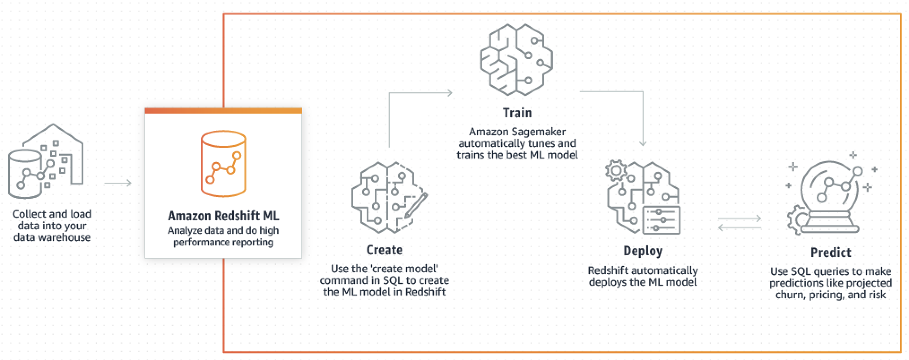

Amazon Redshift will no longer support the creation of new Python UDFs starting Patch 198.
Existing Python UDFs will continue to function until June 30, 2026. For more information, see the
[blog post](https://aws.amazon.com/blogs/big-data/amazon-redshift-python-user-defined-functions-will-reach-end-of-support-after-june-30-2026/ "https://aws.amazon.com/blogs/big-data/amazon-redshift-python-user-defined-functions-will-reach-end-of-support-after-june-30-2026/") .

# Machine learning

Amazon Redshift machine learning (Amazon Redshift ML) is a robust, cloud-based service that makes it
easier for analysts and data scientists of all skill levels to use machine learning
technology. Amazon Redshift ML uses a model to generate results. You can use models in the following
ways:

- You can provide the data that you want to train a model, and metadata associated with
  data inputs to Amazon Redshift. Then Amazon Redshift ML creates models in Amazon SageMaker AI that capture patterns in the input
  data. By using your own data for the model, you can use Amazon Redshift ML to identify trends in the data,
  such as churn prediction, customer lifetime value, or revenue prediction. You can use these models
  to generate predictions for new input data without incurring additional costs.
- You can use one of the Foundation Models (FM) provided by Amazon Bedrock, such as Claude or Amazon Titan.
  Using Amazon Bedrock, you can combine the power of large language models (LLMs) with your analytics data
  in Amazon Redshift in a few steps. By using an external Large Language Model (LLM), you can use Amazon Redshift to perform Natural
  Language Processing (NLP) on your data. You can use NLP for such applications as text generation, sentiment analysis,
  or translation. For information about using Amazon Bedrock with Amazon Redshift see
  [Amazon Redshift ML integration with Amazon Bedrock](machine-learning-br.md "machine-learning-br.md").

###### Note

**Opting out of using your data for service improvement**

If you are using Amazon Bedrock models, we encourage you to read the AWS policies about how the Amazon Bedrock service handles your data. You should determine
if you need to use an opt-out policy to prevent the service from using your data for model or service improvements, should Amazon Bedrock implement such
functionality in the future. To ensure that the service doesn't use your data for such purposes, use the general AWS opt-out policy.

For more information, see the following:

- [AI services opt-out policies](../../../organizations/latest/userguide/orgs_manage_policies_ai-opt-out.md "../../../organizations/latest/userguide/orgs_manage_policies_ai-opt-out.md")
- [Amazon Bedrock FAQs](https://aws.amazon.com/bedrock/faqs/ "https://aws.amazon.com/bedrock/faqs/")

###### Note

LLMs can generate inaccurate
or incomplete information. We recommend verifying the information that LLMs produce to ensure that it is accurate and complete.

**How Amazon Redshift ML works with Amazon SageMaker AI**

Amazon Redshift works with Amazon SageMaker AI Autopilot to automatically obtain the best model and make the
prediction function available in Amazon Redshift.

The following diagram illustrates how Amazon Redshift ML works.

The general workflow is as follows:

1. Amazon Redshift exports the training data into Amazon S3.
2. Amazon SageMaker AI Autopilot preprocesses the training data. _Preprocessing_ performs important functions, such as imputing missing
   values. It recognizes that certain columns are categorical (such as the postal code),
   properly formats them for training, and performs numerous other tasks. Choosing the best
   preprocessors to apply on the training dataset is a problem in itself, and Amazon SageMaker AI
   Autopilot automates its solution.
3. Amazon SageMaker AI Autopilot finds the algorithm and algorithm hyperparameters that deliver the
   model with the most accurate predictions.
4. Amazon Redshift registers the prediction function as a SQL function in your Amazon Redshift
   cluster.
5. When you run CREATE MODEL statements, Amazon Redshift uses Amazon SageMaker AI for training. Therefore,
   there is an associated cost for training your model. This is a separate line item for
   Amazon SageMaker AI in your AWS bill. You also pay for the storage used in Amazon S3 for storing your
   training data. Inference using models created with CREATE MODEL that you can compile and
   run on your Redshift cluster aren't charged. There are no additional Amazon Redshift charges
   for using Amazon Redshift ML.

###### Topics

- [Machine learning overview](machine_learning_overview.md "machine_learning_overview.md")
- [Machine learning for novices and experts](novice_expert.md "novice_expert.md")
- [Costs for using Amazon Redshift ML](cost.md "cost.md")
- [Getting started with Amazon Redshift ML](getting-started-machine-learning.md "getting-started-machine-learning.md")
- [Tutorials for Amazon Redshift ML](tutorials_for_amazon_redshift_ml.md "tutorials_for_amazon_redshift_ml.md")
- [Amazon Redshift ML integration with Amazon Bedrock](machine-learning-br.md "machine-learning-br.md")
