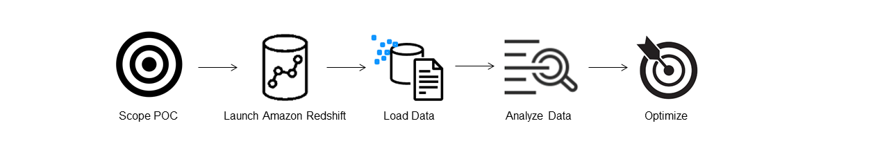
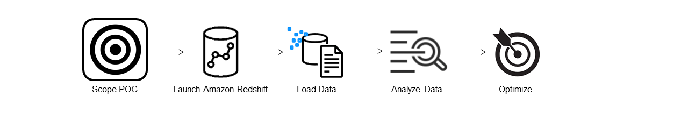
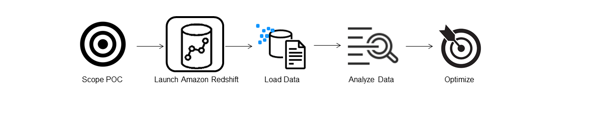
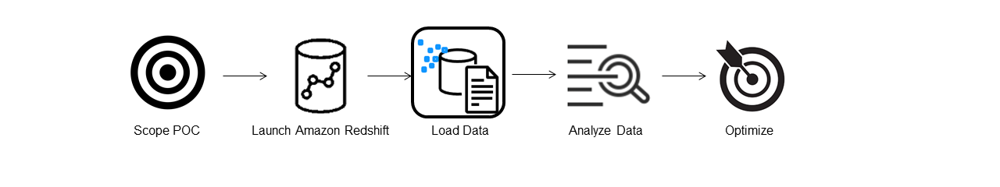
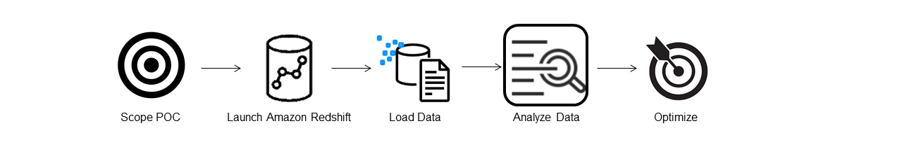
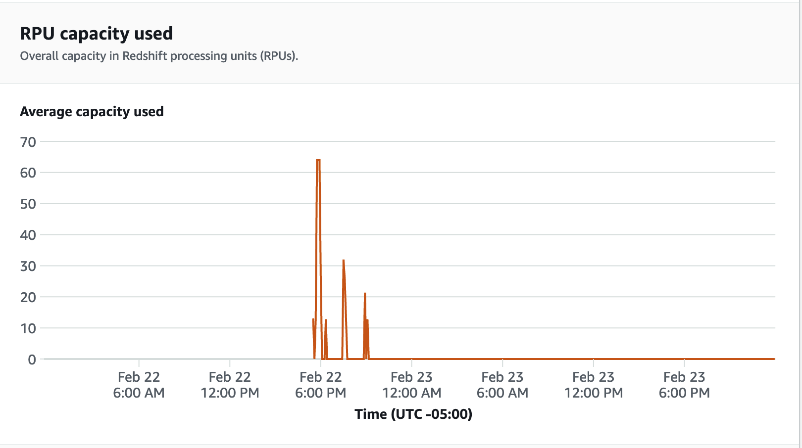
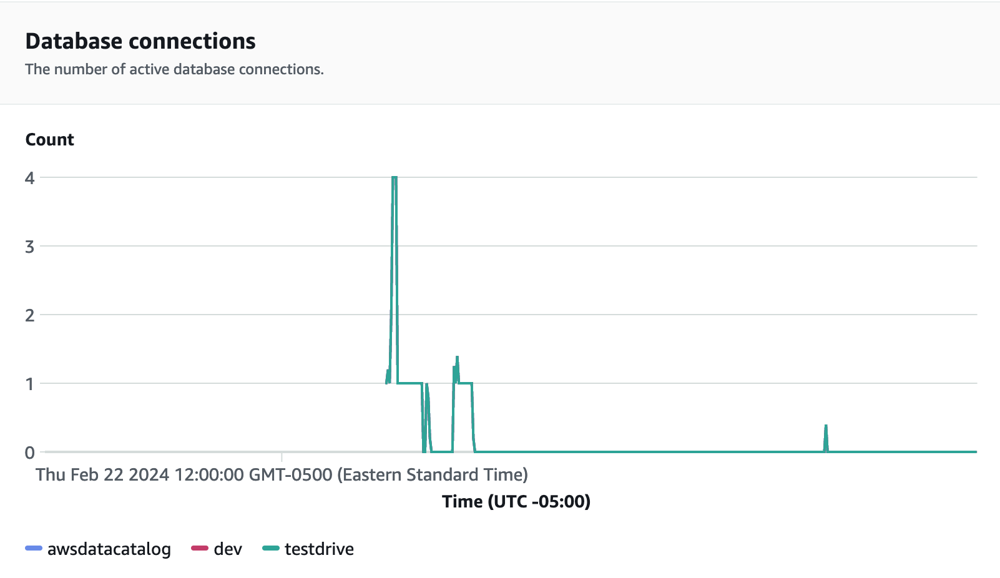
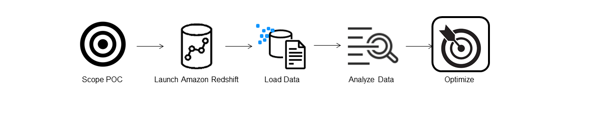

Amazon Redshift will no longer support the creation of new Python UDFs starting November 1, 2025.
If you would like to use Python UDFs, create the UDFs prior to that date.
Existing Python UDFs will continue to function as normal. For more information, see the
[blog post](https://aws.amazon.com/blogs/big-data/amazon-redshift-python-user-defined-functions-will-reach-end-of-support-after-june-30-2026/ "https://aws.amazon.com/blogs/big-data/amazon-redshift-python-user-defined-functions-will-reach-end-of-support-after-june-30-2026/") .

# Conduct a proof of concept (POC) for Amazon Redshift

Amazon Redshift is a popular cloud data warehouse, which offers a fully managed cloud-based service that integrates with an organization’s
Amazon Simple Storage Service data lake, real-time streams, machine learning (ML) workflows, transactional workflows, and much more.
The following sections guide you through the process of doing a proof of concept (POC) on Amazon Redshift.
The information here helps you set goals for your POC, and takes advantage of tools that can automate the provisioning and configuration of services for your POC.

###### Note

For a copy of this information as a PDF, choose the link **Run your own Redshift POC** on the
[Amazon Redshift resources](https://aws.amazon.com/redshift/resources/ "https://aws.amazon.com/redshift/resources/") page.

When doing a POC of Amazon Redshift, you test, prove out, and adopt features ranging from best-in-class security capabilities, elastic scaling, easy integration and ingestion,
and flexible decentralized data architecture options.

Follow the these steps to conduct a successful POC.

## Step 1: Scope your POC

When conducting a POC, you can either choose to use your own data, or you can choose to use benchmarking datasets.
When you choose your own data you run your own queries against the data. With benchmarking data, sample queries are provided with the benchmark.
See [Use sample datasets](#use-sample-datasets "#use-sample-datasets")
for more details if you are not ready to conduct a POC with your own data just yet.

In general, we recommend using two weeks of data for an Amazon Redshift POC.

Start by doing the following:

1. **Identify your business and functional requirements,** then work backwards.
   Common examples are: faster performance, lower costs, test a new workload or feature, or comparison between Amazon Redshift and another data warehouse.
2. **Set specific targets** which become the success criteria for the POC.
   For example, from _faster performance_, come up with a list of the top five processes you wish to accelerate, and include the current run times along with your required run time.
   These can be reports, queries, ETL processes, data ingestion, or whatever your current pain points are.
3. **Identify the specific scope and artifacts** needed to run the tests.
   What datasets do you need to migrate or continuously ingest into Amazon Redshift, and what queries and processes are needed to run the tests to measure against the success criteria?
   There are two ways to do this:

###### Bring your own data

    * To test your own data, come up with the minimum viable list of data artifacts which is required to test for your success criteria.
     For example, if your current data warehouse has 200 tables, but the reports you want to test only need 20, your POC can be run faster by using only the smaller subset of tables.

###### Use sample datasets

    * If you don’t have your own datasets ready, you can still get started doing a POC on Amazon Redshift by using the industry-standard benchmark datasets such as
     [TPC-DS](https://github.com/awslabs/amazon-redshift-utils/tree/master/src/CloudDataWarehouseBenchmark/Cloud-DWB-Derived-from-TPCDS "https://github.com/awslabs/amazon-redshift-utils/tree/master/src/CloudDataWarehouseBenchmark/Cloud-DWB-Derived-from-TPCDS")
     or [TPC-H](https://github.com/awslabs/amazon-redshift-utils/tree/master/src/CloudDataWarehouseBenchmark/Cloud-DWB-Derived-from-TPCH "https://github.com/awslabs/amazon-redshift-utils/tree/master/src/CloudDataWarehouseBenchmark/Cloud-DWB-Derived-from-TPCH")
     and run sample benchmarking queries to harness the power of Amazon Redshift.
     These datasets can be accessed from within your Amazon Redshift data warehouse after it is created.
     For detailed instructions on how to access these datasets and sample queries, see
     [Step 2: Launch Amazon Redshift](#proof-of-concept-launch "#proof-of-concept-launch").

## Step 2: Launch Amazon Redshift

Amazon Redshift accelerates your time to insights with fast, easy, and secure cloud data warehousing at scale.
You can start quickly by launching your warehouse on the [Redshift Serverless console](https://console.aws.amazon.com//redshiftv2/home?#serverless-dashboard "https://console.aws.amazon.com//redshiftv2/home?#serverless-dashboard")
and get from data to insights in seconds.
With Redshift Serverless, you can focus on delivering on your business outcomes without worrying about managing your data warehouse.

### Set up Amazon Redshift Serverless

The first time you use Redshift Serverless, the console leads you through the steps required to launch your warehouse.
You might also be eligible for a credit towards your Redshift Serverless usage in your account.
For more information about choosing a free trial, see [Amazon Redshift free trial](https://aws.amazon.com/redshift/free-trial/ "https://aws.amazon.com/redshift/free-trial/").
Follow the steps in the [Creating a data warehouse with Redshift Serverless](../gsg/new-user-serverless.md#serverless-console-resource-creation "../gsg/new-user-serverless.md#serverless-console-resource-creation")
in the _Amazon Redshift Getting Started Guide_ to create a data warehouse with Redshift Serverless.
If you do not have a dataset that you would like to load, the guide also contains steps on how to load a sample data set.

If you have previously launched Redshift Serverless in your account, follow the steps in
[Creating a workgroup with a namespace](../mgmt/serverless-console-workgroups-create-workgroup-wizard.md "../mgmt/serverless-console-workgroups-create-workgroup-wizard.md")
in the _Amazon Redshift Management Guide_.
After your warehouse is available, you can opt to load the sample data available in Amazon Redshift.
For information about using Amazon Redshift query editor v2 to load data, see [Loading sample data](../mgmt/query-editor-v2-loading.md#query-editor-v2-loading-sample-data "../mgmt/query-editor-v2-loading.md#query-editor-v2-loading-sample-data")
in the _Amazon Redshift Management Guide_.

If you are bringing your own data instead of loading the sample data set, see
[Step 3: Load your data](#proof-of-concept-load-data "#proof-of-concept-load-data").

## Step 3: Load your data

After launching Redshift Serverless, the next step is to load your data for the POC.
Whether you are uploading a simple CSV file, ingesting semi-structured data from S3,
or streaming data directly, Amazon Redshift provides the flexibility to quickly and easily move the data into Amazon Redshift tables from the source.

Choose one of the following methods to load your data.

### Upload a local file

For quick ingestion and analysis, you can use
[Amazon Redshift query editor v2](../mgmt/query-editor-v2.md "../mgmt/query-editor-v2.md")
to easily load data files from your local desktop.
It has the capability to process files in various formats such as CSV, JSON, AVRO, PARQUET, ORC, and more.
To enable your users, as an administrator, to load data from a local desktop using query editor v2 you have to specify a common Amazon S3 bucket,
and the user account must be
[configured with the proper permissions](../mgmt/query-editor-v2-loading.md#query-editor-v2-loading-data-local "../mgmt/query-editor-v2-loading.md#query-editor-v2-loading-data-local").
You can follow [Data load made easy and secure in Amazon Redshift using Query Editor V2](https://aws.amazon.com/blogs//big-data/data-load-made-easy-and-secure-in-amazon-redshift-using-query-editor-v2/ "https://aws.amazon.com/blogs//big-data/data-load-made-easy-and-secure-in-amazon-redshift-using-query-editor-v2/")
for step-by-step guidance.

### Load an Amazon S3 file

To load data from an Amazon S3 bucket into Amazon Redshift, begin by using the
[COPY command](t_loading-tables-from-s3.md "t_loading-tables-from-s3.md"),
specifying the source Amazon S3 location and target Amazon Redshift table.
Ensure that the IAM roles and permissions are properly configured to allow Amazon Redshift access to the designated Amazon S3 bucket.
Follow [Tutorial: Loading data from Amazon S3](tutorial-loading-data.md "tutorial-loading-data.md")
for step-by-step guidance. You can also choose the **Load data** option in query editor v2 to directly load data from your S3 bucket.

### Continuous data ingestion

[Autocopy (in preview)](loading-data-copy-job.md "loading-data-copy-job.md") is an extension of the [COPY command](t_loading-tables-from-s3.md "t_loading-tables-from-s3.md") and automates continuous data loading from Amazon S3 buckets.
When you create a copy job, Amazon Redshift detects when new Amazon S3 files are created in a specified path, and then loads them automatically without your intervention.
Amazon Redshift keeps track of the loaded files to verify that they are loaded only one time.
For instructions on how to create copy jobs, see
[COPY JOB](r_COPY-JOB.md "r_COPY-JOB.md")

###### Note

Autocopy is currently in preview and supported only in provisioned clusters in specific AWS Regions. To create a preview cluster for autocopy, see
[Create an S3 event integration to automatically copy files from Amazon S3 buckets](loading-data-copy-job.md "loading-data-copy-job.md").

### Load your streaming data

Streaming ingestion provides low-latency, high-speed ingestion of stream data from
[Amazon Kinesis Data Streams](https://aws.amazon.com/kinesis/data-streams/ "https://aws.amazon.com/kinesis/data-streams/") and
[Amazon Managed Streaming for Apache Kafka](https://aws.amazon.com/msk/ "https://aws.amazon.com/msk/")
into Amazon Redshift. Amazon Redshift streaming ingestion uses a materialized view, which is updated directly from the stream utilizing
[auto refresh](materialized-view-refresh.md#materialized-view-auto-refresh "materialized-view-refresh.md#materialized-view-auto-refresh").
The materialized view maps to the stream data source.
You can perform filtering and aggregations on the stream data as part of the materialized view definition.
For step-by-step guidance to load data from a stream, see
[Getting started with Amazon Kinesis Data Streams](materialized-view-streaming-ingestion-getting-started.md "materialized-view-streaming-ingestion-getting-started.md")
or an [Getting started with Amazon Managed Streaming for Apache Kafka](materialized-view-streaming-ingestion-getting-started-MSK.md "materialized-view-streaming-ingestion-getting-started-MSK.md").

## Step 4: Analyze your data

After creating your Redshift Serverless workgroup and namespace, and loading your data, you can immediately run queries by opening the **Query editor v2** from the
navigation panel of the [Redshift Serverless console](https://console.aws.amazon.com//redshiftv2/home?#serverless-dashboard "https://console.aws.amazon.com//redshiftv2/home?#serverless-dashboard").
You can use query editor v2 to test query functionality or query performance against your own datasets.

### Query using Amazon Redshift query editor v2

You can access query editor v2 from the Amazon Redshift console.
See [Simplify your data analysis with Amazon Redshift query editor v2](https://aws.amazon.com/blogs//big-data/simplify-your-data-analysis-with-amazon-redshift-query-editor-v2/ "https://aws.amazon.com/blogs//big-data/simplify-your-data-analysis-with-amazon-redshift-query-editor-v2/")
for a complete guide on how to configure, connect, and run queries with query editor v2.

Alternatively, if you want to run a load test as part of your POC, you can do this by the following steps to install and run Apache JMeter.

### Run a load test using Apache JMeter

To perform a load test to simulate “N” users submitting queries concurrently to Amazon Redshift, you can use
[Apache JMeter](https://jmeter.apache.org/ "https://jmeter.apache.org/"),
an open-source Java based tool.

To install and configure Apache JMeter to run against your Redshift Serverless workgroup, follow the instructions in
[Automate Amazon Redshift load testing with the AWS Analytics Automation Toolkit](https://aws.amazon.com/blogs//big-data/automate-amazon-redshift-load-testing-with-the-aws-analytics-automation-toolkit/ "https://aws.amazon.com/blogs//big-data/automate-amazon-redshift-load-testing-with-the-aws-analytics-automation-toolkit/").
It uses the
[AWS Analytics Automation toolkit (AAA)](https://github.com/aws-samples/amazon-redshift-infrastructure-automation/tree/main "https://github.com/aws-samples/amazon-redshift-infrastructure-automation/tree/main"),
an open source utility for dynamically deploying Redshift solutions, to automatically launch these resources.
If you have loaded your own data into Amazon Redshift, be sure to perform the Step #5 – Customize SQL option, to make sure you supply the appropriate
SQL statements you would like to test against your tables.
Test each of these SQL statements one time using query editor v2 to make sure they run without errors.

After you complete customizing your SQL statements and finalizing your test plan,
save and run your test plan against your Redshift Serverless workgroup.
To monitor the progress of your test, open the [Redshift Serverless console](https://console.aws.amazon.com/redshiftv2/home?#serverless-query-and-database-monitoring "https://console.aws.amazon.com/redshiftv2/home?#serverless-query-and-database-monitoring"),
navigate to **Query and database monitoring**, choose the **Query history** tab and view information about your queries.

For performance metrics, choose the **Database performance** tab on the Redshift Serverless console, to monitor metrics such as **Database Connections**
and **CPU utilization**.
Here you can view a graph to monitor the RPU capacity
used and observe how Redshift Serverless automatically scales to meet concurrent workload demands while the load test is running on your workgroup.

Database connections is another useful metric to monitor while running the load test to see how your workgroup is handling
numerous concurrent connections at a given time to meet the increasing workload demands.

## Step 5: Optimize

Amazon Redshift empowers tens of thousands of users to process exabytes of data every day and power their analytics workloads by offering a variety of configurations and
features to support individual use cases. When choosing between these options,
customers are looking for tools that help them determine the most optimal data warehouse configuration to support their Amazon Redshift workload.

### Test drive

You can use [Test Drive](https://github.com/aws/redshift-test-drive/tree/main "https://github.com/aws/redshift-test-drive/tree/main")
to automatically replay your existing workload on potential configurations and analyze the corresponding outputs to evaluate the
optimal target to migrate your workload to.
See [Find the best Amazon Redshift configuration for your workload using Redshift Test Drive](https://aws.amazon.com/blogs/big-data/find-the-best-amazon-redshift-configuration-for-your-workload-using-redshift-test-drive/ "https://aws.amazon.com/blogs/big-data/find-the-best-amazon-redshift-configuration-for-your-workload-using-redshift-test-drive/")
for information about using Test Drive to evaluate different Amazon Redshift configurations.
