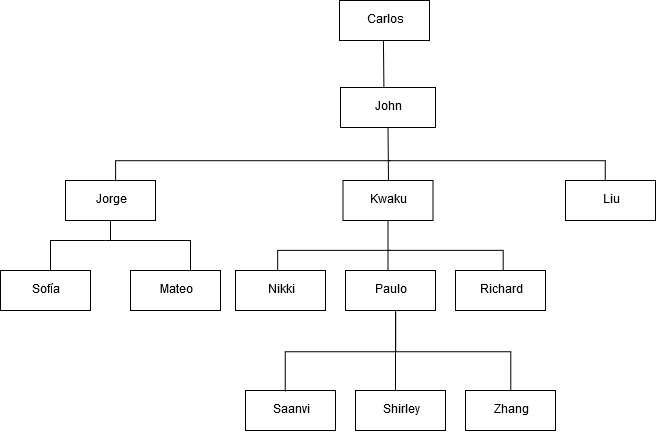

Amazon Redshift will no longer support the creation of new Python UDFs starting November 1, 2025.
If you would like to use Python UDFs, create the UDFs prior to that date.
Existing Python UDFs will continue to function as normal. For more information, see the
[blog post](https://aws.amazon.com/blogs/big-data/amazon-redshift-python-user-defined-functions-will-reach-end-of-support-after-june-30-2026/ "https://aws.amazon.com/blogs/big-data/amazon-redshift-python-user-defined-functions-will-reach-end-of-support-after-june-30-2026/") .

# CONNECT BY clause

The CONNECT BY clause specifies the relationship between rows in a hierarchy. You can use CONNECT BY to select rows
in a hierarchical order by joining the table to itself and processing the hierarchical data.
For example, you can use it to recursively loop through an organization chart and list data.

Hierarchical queries process in the following order:

1. If the FROM clause has a join, it is processed first.
2. The CONNECT BY clause is evaluated.
3. The WHERE clause is evaluated.

## Syntax

```
[START WITH start_with_conditions]
CONNECT BY connect_by_conditions

```

###### Note

While START and CONNECT are not reserved words, use delimited identifiers (double quotation marks) or AS if
you're using START and CONNECT as table aliases in your query to avoid failure at runtime.

```
SELECT COUNT(*)
FROM Employee "start"
CONNECT BY PRIOR id = manager_id
START WITH name = 'John'

```

```
SELECT COUNT(*)
FROM Employee AS start
CONNECT BY PRIOR id = manager_id
START WITH name = 'John'

```

## Parameters

_start_with_conditions_

Conditions that specify the root row(s) of the hierarchy

_connect_by_conditions_

Conditions that specify the relationship between parent rows and child rows of the hierarchy. At least one condition
must be qualified with the unary operator used to refer to the parent row.

```
PRIOR column = expression
-- or
expression > PRIOR column

```

## Operators

You can use the following operators in a CONNECT BY query.

_LEVEL_

Pseudocolumn that returns the current row level in the hierarchy. Returns 1 for the root row,
2 for the child of the root row, and so on.

_PRIOR_

Unary operator that evaluates the expression for the parent row of the current row in the hierarchy.

## Examples

The following example is a CONNECT BY query that returns the number of employees
that report directly or indirectly to John, no deeper than 4 levels.

```
SELECT id, name, manager_id
FROM employee
WHERE LEVEL < 4
START WITH name = 'John'
CONNECT BY PRIOR id = manager_id;

```

Following is the result of the query.

```
id      name      manager_id
------+----------+--------------
  101     John        100
  102     Jorge       101
  103     Kwaku       101
  110     Liu         101
  201     Sofía       102
  106     Mateo       102
  110     Nikki       103
  104     Paulo       103
  105     Richard     103
  120     Saanvi      104
  200     Shirley     104
  205     Zhang       104

```

Table definition for this example:

```
CREATE TABLE employee (
   id INT,
   name VARCHAR(20),
   manager_id INT
   );

```

Following are the rows inserted into the table.

```
INSERT INTO employee(id, name, manager_id)  VALUES
(100, 'Carlos', null),
(101, 'John', 100),
(102, 'Jorge', 101),
(103, 'Kwaku', 101),
(110, 'Liu', 101),
(106, 'Mateo', 102),
(110, 'Nikki', 103),
(104, 'Paulo', 103),
(105, 'Richard', 103),
(120, 'Saanvi', 104),
(200, 'Shirley', 104),
(201, 'Sofía', 102),
(205, 'Zhang', 104);

```

Following is an organization chart for John's department.


