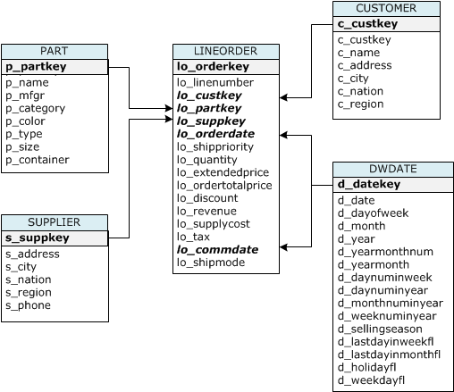
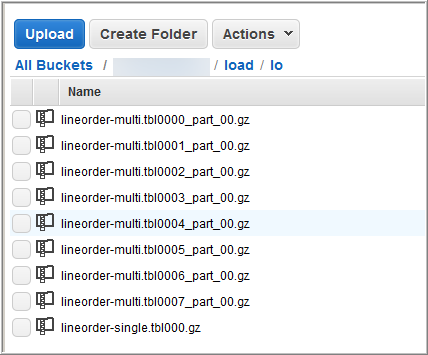

Amazon Redshift will no longer support the creation of new Python UDFs starting November 1, 2025.
If you would like to use Python UDFs, create the UDFs prior to that date.
Existing Python UDFs will continue to function as normal. For more information, see the
[blog post](https://aws.amazon.com/blogs/big-data/amazon-redshift-python-user-defined-functions-will-reach-end-of-support-after-june-30-2026/ "https://aws.amazon.com/blogs/big-data/amazon-redshift-python-user-defined-functions-will-reach-end-of-support-after-june-30-2026/") .

# Tutorial: Loading data from Amazon S3

In this tutorial, you walk through the process of loading data into your Amazon Redshift database
tables from data files in an Amazon S3 bucket from beginning to end.

In this tutorial, you do the following:

- Download data files that use comma-separated value (CSV), character-delimited, and
  fixed width formats.
- Create an Amazon S3 bucket and then upload the data files to the bucket.
- Launch an Amazon Redshift cluster and create database tables.
- Use COPY commands to load the tables from the data files on Amazon S3.
- Troubleshoot load errors and modify your COPY commands to correct the
  errors.

## Prerequisites

You need the following prerequisites:

- An AWS account to launch an Amazon Redshift cluster and to create a bucket in
  Amazon S3.
- Your AWS credentials (IAM role) to load test
  data from Amazon S3. If you need a new IAM role, go to
  [Creating IAM roles](../../../IAM/latest/UserGuide/id_roles_create.md "../../../IAM/latest/UserGuide/id_roles_create.md").
- An SQL client such as the Amazon Redshift console query editor.

This tutorial is designed so that it can be taken by itself. In addition to this
tutorial, we recommend completing the following tutorials to gain a more complete
understanding of how to design and use Amazon Redshift databases:

- [Amazon Redshift Getting Started Guide](../gsg.md "../gsg.md") walks you through the process of creating an Amazon Redshift cluster
  and loading sample data.

## Overview

You can add data to your Amazon Redshift tables either by using an INSERT command or by using
a COPY command. At the scale and speed of an Amazon Redshift data warehouse, the COPY command
is many times faster and more efficient than INSERT commands.

The COPY command uses the Amazon Redshift massively parallel processing (MPP) architecture to
read and load data in parallel from multiple data sources. You can load from data files
on Amazon S3, Amazon EMR, or any remote host accessible through a Secure Shell (SSH) connection.
Or you can load directly from an Amazon DynamoDB table.

In this tutorial, you use the COPY command to load data from Amazon S3. Many of the
principles presented here apply to loading from other data sources as well.

To learn more about using the COPY command, see these resources:

- [Amazon Redshift best practices for loading
  data](c_loading-data-best-practices.md "c_loading-data-best-practices.md")
- [Loading data from Amazon EMR](loading-data-from-emr.md "loading-data-from-emr.md")
- [Loading data from remote hosts](loading-data-from-remote-hosts.md "loading-data-from-remote-hosts.md")
- [Loading data from an Amazon DynamoDB
  table](t_Loading-data-from-dynamodb.md "t_Loading-data-from-dynamodb.md")

## Step 1: Create a cluster

If you already have a cluster that you want to use, you can skip this step.

For the exercises in this tutorial, use a four-node cluster.

###### To create a cluster

1. Sign in to the AWS Management Console and open the Amazon Redshift console at
   [https://console.aws.amazon.com/redshiftv2/](https://console.aws.amazon.com/redshiftv2/ "https://console.aws.amazon.com/redshiftv2/").

Using the navigation menu, choose the **Provisioned clusters dashboard**.

###### Important

Make sure that you have the necessary
permissions to perform the cluster operations. For information on
granting the necessary permissions, see
[Authorizing Amazon Redshift to access AWS services](../mgmt/authorizing-redshift-service.md "../mgmt/authorizing-redshift-service.md"). 2. At top right, choose the AWS Region in which you want to create the
cluster. For the purposes of this tutorial, choose
**US West (Oregon)**. 3. On the navigation menu, choose **Clusters**, then choose **Create cluster**.
The **Create cluster** page appears. 4. On the **Create cluster** page enter parameters for your cluster.
Choose your own values for the parameters, except change the following values:

    * Choose `dc2.large` for the node type.
    * Choose `4` for the **Number of nodes**.
    * In the **Cluster permissions** section, choose an IAM
     role from **Available IAM roles**. This role should be
     one that you previously created and that has access to Amazon S3.
     Then choose **Associate IAM role** to add it to the list of
     **Associated IAM roles** for the cluster.

5. Choose **Create cluster**.

Follow the [Amazon Redshift Getting Started Guide](../gsg.md "../gsg.md") steps to connect to your cluster from a SQL client and test a
connection. You don't need to complete the remaining Getting Started steps to
create tables, upload data, and try example queries.

## Step 2: Download the data

files

In this step, you download a set of sample data files to your computer. In the next
step, you upload the files to an Amazon S3 bucket.

###### To download the data files

1. Download the zipped file: [LoadingDataSampleFiles.zip](samples/LoadingDataSampleFiles.md "samples/LoadingDataSampleFiles.md").
2. Extract the files to a folder on your computer.
3. Verify that your folder contains the following files.

```
customer-fw-manifest
customer-fw.tbl-000
customer-fw.tbl-000.bak
customer-fw.tbl-001
customer-fw.tbl-002
customer-fw.tbl-003
customer-fw.tbl-004
customer-fw.tbl-005
customer-fw.tbl-006
customer-fw.tbl-007
customer-fw.tbl.log
dwdate-tab.tbl-000
dwdate-tab.tbl-001
dwdate-tab.tbl-002
dwdate-tab.tbl-003
dwdate-tab.tbl-004
dwdate-tab.tbl-005
dwdate-tab.tbl-006
dwdate-tab.tbl-007
part-csv.tbl-000
part-csv.tbl-001
part-csv.tbl-002
part-csv.tbl-003
part-csv.tbl-004
part-csv.tbl-005
part-csv.tbl-006
part-csv.tbl-007
```

## Step 3: Upload the files to an Amazon S3

bucket

In this step, you create an Amazon S3 bucket and upload the data files to the
bucket.

###

###### To upload the files to an Amazon S3 bucket

1. Create a bucket in Amazon S3.

For more information about creating a bucket, see
[Creating a bucket](../../../AmazonS3/latest/userguide/create-bucket-overview.md "../../../AmazonS3/latest/userguide/create-bucket-overview.md") in the _Amazon Simple Storage Service User Guide_.

    1. Sign in to the AWS Management Console and open the Amazon S3 console at
     [https://console.aws.amazon.com/s3/](https://console.aws.amazon.com/s3/ "https://console.aws.amazon.com/s3/").
    2. Choose **Create bucket**.
    3. Choose an AWS Region.


    Create the bucket in the same Region as your cluster. If your
     cluster is in the US West (Oregon) Region, choose
     **US West (Oregon) Region (us-west-2)**.
    4. In the **Bucket Name** box of the
     **Create bucket** dialog box, enter a bucket name.


    The bucket name you choose must be unique among all existing
     bucket names in Amazon S3. One way to help ensure uniqueness is to prefix
     your bucket names with the name of your organization. Bucket names
     must comply with certain rules. For more information, go to [Bucket restrictions
     and limitations](../../../AmazonS3/latest/userguide/BucketRestrictions.md "../../../AmazonS3/latest/userguide/BucketRestrictions.md") in the
     *Amazon Simple Storage Service User Guide.*
    5. Choose the recommended defaults for the rest of the options.
    6. Choose **Create bucket**.


    When Amazon S3 successfully creates your bucket, the console displays
     your empty bucket in the **Buckets** panel.

2. Create a folder.
   1. Choose the name of the new bucket.
   2. Choose the **Create Folder** button.
   3. Name the new folder `load`.

   ###### Note

   The bucket that you created is not in a sandbox. In this
   exercise, you add objects to a real bucket. You're charged
   a nominal amount for the time that you store the objects in the
   bucket. For more information about Amazon S3 pricing, go to the
   [Amazon S3
   pricing](https://aws.amazon.com/s3/pricing/ "https://aws.amazon.com/s3/pricing/") page.

3. Upload the data files to the new Amazon S3 bucket.
   1. Choose the name of the data folder.
   2. In the Upload wizard, choose **Add
      files**.

   Follow the Amazon S3 console instructions to upload all of the files you downloaded and extracted, 3. Choose **Upload**.

###### User Credentials

The Amazon Redshift COPY command must have access to read the file objects in the
Amazon S3 bucket. If you use the same user credentials to create the Amazon S3 bucket and
to run the Amazon Redshift COPY command, the COPY command has all necessary
permissions. If you want to use different user credentials, you can grant access
by using the Amazon S3 access controls. The Amazon Redshift COPY command requires at least
ListBucket and GetObject permissions to access the file objects in the Amazon S3
bucket. For more information about controlling access to Amazon S3 resources, go to
[Managing access permissions
to your Amazon S3 resources](../../../AmazonS3/latest/userguide/s3-access-control.md "../../../AmazonS3/latest/userguide/s3-access-control.md").

## Step 4: Create the sample

tables

For this tutorial, you use a set of tables based on the Star Schema Benchmark
(SSB) schema. The following diagram shows the SSB data model.



The SSB tables might already exist in the current database. If so, drop the tables to
remove them from the database before you create them using the CREATE TABLE commands in
the next step. The tables used in this tutorial might have different attributes than the
existing tables.

###### To create the sample tables

1. To drop the SSB tables, run the following commands in your SQL client.

```
drop table part cascade;
drop table supplier;
drop table customer;
drop table dwdate;
drop table lineorder;
```

2. Run the following CREATE TABLE commands in your SQL client.

```
CREATE TABLE part
(
  p_partkey     INTEGER NOT NULL,
  p_name        VARCHAR(22) NOT NULL,
  p_mfgr        VARCHAR(6),
  p_category    VARCHAR(7) NOT NULL,
  p_brand1      VARCHAR(9) NOT NULL,
  p_color       VARCHAR(11) NOT NULL,
  p_type        VARCHAR(25) NOT NULL,
  p_size        INTEGER NOT NULL,
  p_container   VARCHAR(10) NOT NULL
);

CREATE TABLE supplier
(
  s_suppkey   INTEGER NOT NULL,
  s_name      VARCHAR(25) NOT NULL,
  s_address   VARCHAR(25) NOT NULL,
  s_city      VARCHAR(10) NOT NULL,
  s_nation    VARCHAR(15) NOT NULL,
  s_region    VARCHAR(12) NOT NULL,
  s_phone     VARCHAR(15) NOT NULL
);

CREATE TABLE customer
(
  c_custkey      INTEGER NOT NULL,
  c_name         VARCHAR(25) NOT NULL,
  c_address      VARCHAR(25) NOT NULL,
  c_city         VARCHAR(10) NOT NULL,
  c_nation       VARCHAR(15) NOT NULL,
  c_region       VARCHAR(12) NOT NULL,
  c_phone        VARCHAR(15) NOT NULL,
  c_mktsegment   VARCHAR(10) NOT NULL
);

CREATE TABLE dwdate
(
  d_datekey            INTEGER NOT NULL,
  d_date               VARCHAR(19) NOT NULL,
  d_dayofweek          VARCHAR(10) NOT NULL,
  d_month              VARCHAR(10) NOT NULL,
  d_year               INTEGER NOT NULL,
  d_yearmonthnum       INTEGER NOT NULL,
  d_yearmonth          VARCHAR(8) NOT NULL,
  d_daynuminweek       INTEGER NOT NULL,
  d_daynuminmonth      INTEGER NOT NULL,
  d_daynuminyear       INTEGER NOT NULL,
  d_monthnuminyear     INTEGER NOT NULL,
  d_weeknuminyear      INTEGER NOT NULL,
  d_sellingseason      VARCHAR(13) NOT NULL,
  d_lastdayinweekfl    VARCHAR(1) NOT NULL,
  d_lastdayinmonthfl   VARCHAR(1) NOT NULL,
  d_holidayfl          VARCHAR(1) NOT NULL,
  d_weekdayfl          VARCHAR(1) NOT NULL
);
CREATE TABLE lineorder
(
  lo_orderkey          INTEGER NOT NULL,
  lo_linenumber        INTEGER NOT NULL,
  lo_custkey           INTEGER NOT NULL,
  lo_partkey           INTEGER NOT NULL,
  lo_suppkey           INTEGER NOT NULL,
  lo_orderdate         INTEGER NOT NULL,
  lo_orderpriority     VARCHAR(15) NOT NULL,
  lo_shippriority      VARCHAR(1) NOT NULL,
  lo_quantity          INTEGER NOT NULL,
  lo_extendedprice     INTEGER NOT NULL,
  lo_ordertotalprice   INTEGER NOT NULL,
  lo_discount          INTEGER NOT NULL,
  lo_revenue           INTEGER NOT NULL,
  lo_supplycost        INTEGER NOT NULL,
  lo_tax               INTEGER NOT NULL,
  lo_commitdate        INTEGER NOT NULL,
  lo_shipmode          VARCHAR(10) NOT NULL
);
```

## Step 5: Run the COPY commands

You run COPY commands to load each of the tables in the SSB schema. The COPY command
examples demonstrate loading from different file formats, using several COPY command
options, and troubleshooting load errors.

### COPY command syntax

The basic [COPY](r_COPY.md "r_COPY.md") command syntax is as
follows.

```
COPY table_name [ column_list ] FROM data_source CREDENTIALS access_credentials [options]
```

To run a COPY command, you provide the following values.

###### Table name

The target table for the COPY command. The table must already exist in the
database. The table can be temporary or persistent. The COPY command appends the
new input data to any existing rows in the table.

###### Column list

By default, COPY loads fields from the source data to the table columns in
order. You can optionally specify a _column list,_ that is a
comma-separated list of column names, to map data fields to specific columns.
You don't use column lists in this tutorial. For more information, see
[Column List](copy-parameters-column-mapping.md#copy-column-list "copy-parameters-column-mapping.md#copy-column-list") in the COPY command reference.

Data
source

You can use the COPY command to load data from an Amazon S3 bucket, an Amazon EMR cluster, a
remote host using an SSH connection, or an Amazon DynamoDB table. For this tutorial, you
load from data files in an Amazon S3 bucket. When loading from Amazon S3, you must provide the
name of the bucket and the location of the data files. To do this, provide either an
object path for the data files or the location of a manifest file that explicitly
lists each data file and its location.

- Key prefix

An object stored in Amazon S3 is uniquely identified by an object key, which
includes the bucket name, folder names, if any, and the object name. A
_key prefix_ refers to a set of objects
with the same prefix. The object path is a key prefix that the COPY command
uses to load all objects that share the key prefix. For example, the key
prefix `custdata.txt` can refer to a single file or to a set of
files, including `custdata.txt.001`,
`custdata.txt.002`, and so on.

- Manifest file

In some cases, you might need to load files with different prefixes, for
example from multiple buckets or folders. In others, you might need to
exclude files that share a prefix. In these cases, you can use a manifest
file. A _manifest file_ explicitly lists
each load file and its unique object key. You use a manifest file to load
the PART table later in this tutorial.

###### Credentials

To access the AWS resources that contain the data to load, you must provide
AWS access credentials for a user with sufficient
privileges.

These credentials include an IAM role Amazon Resource Name (ARN).
To load data from Amazon S3, the credentials must include ListBucket and GetObject
permissions. Additional credentials are required if your data is encrypted.

For more information, see [Authorization parameters](copy-parameters-authorization.md "copy-parameters-authorization.md") in the COPY command
reference. For more information about managing access, go to [Managing access permissions to your
Amazon S3 resources](../../../AmazonS3/latest/userguide/s3-access-control.md "../../../AmazonS3/latest/userguide/s3-access-control.md").

Options

You can specify a number of parameters with the COPY command to specify file
formats, manage data formats, manage errors, and control other features. In this
tutorial, you use the following COPY command options and features:

- Key prefix

For information on how to load from multiple files by specifying a key prefix, see [Load the PART table using NULL
AS](#tutorial-loading-load-part "#tutorial-loading-load-part").

- CSV format

For information on how to load data that is in CSV format, see [Load the PART table using NULL
AS](#tutorial-loading-load-part "#tutorial-loading-load-part").

- NULL AS

For information on how to load PART using the NULL AS option, see [Load the PART table using NULL
AS](#tutorial-loading-load-part "#tutorial-loading-load-part").

- Character-delimited format

For information on how to use the DELIMITER option, see [The DELIMITER and REGION options](#tutorial-loading-load-supplier "#tutorial-loading-load-supplier").

- REGION

For information on how to use the REGION option, see [The DELIMITER and REGION options](#tutorial-loading-load-supplier "#tutorial-loading-load-supplier").

- Fixed-format width

For information on how to load the CUSTOMER table from fixed-width data, see [Load the CUSTOMER table using
MANIFEST](#tutorial-loading-load-customer "#tutorial-loading-load-customer").

- MAXERROR

For information on how to use the MAXERROR option, see [Load the CUSTOMER table using
MANIFEST](#tutorial-loading-load-customer "#tutorial-loading-load-customer").

- ACCEPTINVCHARS

For information on how to use the ACCEPTINVCHARS option, see [Load the CUSTOMER table using
MANIFEST](#tutorial-loading-load-customer "#tutorial-loading-load-customer").

- MANIFEST

For information on how to use the MANIFEST option, see [Load the CUSTOMER table using
MANIFEST](#tutorial-loading-load-customer "#tutorial-loading-load-customer").

- DATEFORMAT

For information on how to use the DATEFORMAT option, see [Load the DWDATE table using
DATEFORMAT](#tutorial-loading-load-dwdate "#tutorial-loading-load-dwdate").

- GZIP, LZOP and BZIP2

For information on how to compress your files, see [Load multiple data files](#tutorial-loading-load-lineorder "#tutorial-loading-load-lineorder").

- COMPUPDATE

For information on how to use the COMPUPDATE option, see [Load multiple data files](#tutorial-loading-load-lineorder "#tutorial-loading-load-lineorder").

- Multiple files

For information on how to load multiple files, see [Load multiple data files](#tutorial-loading-load-lineorder "#tutorial-loading-load-lineorder").

### Loading the SSB

tables

You use the following COPY commands to load each of the tables in the SSB schema.
The command to each table demonstrates different COPY options and troubleshooting
techniques.

To load the SSB tables, follow these steps:

1. [Replace the bucket name
   and AWS credentials](#tutorial-loading-run-copy-replaceables "#tutorial-loading-run-copy-replaceables")
2. [Load the PART table using NULL
   AS](#tutorial-loading-load-part "#tutorial-loading-load-part")
3. [Load the CUSTOMER table using
   MANIFEST](#tutorial-loading-load-customer "#tutorial-loading-load-customer")
4. [Load the DWDATE table using
   DATEFORMAT](#tutorial-loading-load-dwdate "#tutorial-loading-load-dwdate")

#### Replace the bucket name

and AWS credentials

The COPY commands in this tutorial are presented in the following
format.

```
copy table from 's3://`<your-bucket-name>`/load/*key\_prefix*'
credentials 'aws_iam_role=arn:aws:iam::`<aws-account-id>`:role/`<role-name>`'
options;
```

For each COPY command, do the following:

1. Replace `<your-bucket-name>` with the
   name of a bucket in the same region as your cluster.

This step assumes the bucket and the cluster are in the same region.
Alternatively, you can specify the region using the [REGION](copy-parameters-data-source-s3.md#copy-region "copy-parameters-data-source-s3.md#copy-region") option with the COPY command. 2. Replace `<aws-account-id>` and
`<role-name>` with your
own AWS account and IAM role. The segment of the credentials
string that is enclosed in single quotation marks must not contain any
spaces or line breaks. Note that the ARN might differ slightly in format than the sample. It's best to
copy the ARN for the role from the IAM console, to ensure that it's accurate, when you run the COPY commands.

#### Load the PART table using NULL

AS

In this step, you use the CSV and NULL AS options to load the PART table.

The COPY command can load data from multiple files in parallel, which is much
faster than loading from a single file. To demonstrate this principle, the data
for each table in this tutorial is split into eight files, even though the files
are very small. In a later step, you compare the time difference between loading
from a single file and loading from multiple files. For more information, see
[Loading data files](c_best-practices-use-multiple-files.md "c_best-practices-use-multiple-files.md").

###### Key prefix

You can load from multiple files by specifying a key prefix for the file
set, or by explicitly listing the files in a manifest file. In this step,
you use a key prefix. In a later step, you use a manifest file. The key
prefix `'s3://amzn-s3-demo-bucket/load/part-csv.tbl'` loads the following
set of the files in the `load` folder.

```
part-csv.tbl-000
part-csv.tbl-001
part-csv.tbl-002
part-csv.tbl-003
part-csv.tbl-004
part-csv.tbl-005
part-csv.tbl-006
part-csv.tbl-007

```

###### CSV format

CSV, which stands for comma separated values, is a common format used for
importing and exporting spreadsheet data. CSV is more flexible than
comma-delimited format because it enables you to include quoted strings
within fields. The default quotation mark character for COPY from CSV format is a
double quotation mark ( " ), but you can specify another quotation mark character by
using the QUOTE AS option. When you use the quotation mark character within the
field, escape the character with an additional quotation mark character.

The following excerpt from a CSV-formatted data file for the PART table shows
strings enclosed in double quotation marks (`"LARGE ANODIZED
 BRASS"`). It also shows a string enclosed in two double quotation marks
within a quoted string (`"MEDIUM ""BURNISHED"" TIN"`).

```
15,dark sky,MFGR#3,MFGR#47,MFGR#3438,indigo,"LARGE ANODIZED BRASS",45,LG CASE
22,floral beige,MFGR#4,MFGR#44,MFGR#4421,medium,"PROMO, POLISHED BRASS",19,LG DRUM
23,bisque slate,MFGR#4,MFGR#41,MFGR#4137,firebrick,"MEDIUM ""BURNISHED"" TIN",42,JUMBO JAR
```

The data for the PART table contains characters that cause COPY to fail. In
this exercise, you troubleshoot the errors and correct them.

To load data that is in CSV format, add `csv` to your COPY command.
Run the following command to load the PART table.

```
copy part from 's3://`<your-bucket-name>`/load/part-csv.tbl'
credentials 'aws_iam_role=arn:aws:iam::`<aws-account-id>`:role/`<role-name>`'
csv;
```

You might get an error message similar to the following.

```
An error occurred when executing the SQL command:
copy part from 's3://amzn-s3-demo-bucket/load/part-csv.tbl'
credentials' ...

ERROR: Load into table 'part' failed.  Check 'stl_load_errors' system table for details. [SQL State=XX000]

Execution time: 1.46s

1 statement(s) failed.
1 statement(s) failed.
```

To get more information about the error, query the STL_LOAD_ERRORS table. The
following query uses the SUBSTRING function to shorten columns for readability
and uses LIMIT 10 to reduce the number of rows returned. You can adjust the
values in `substring(filename,22,25)` to allow for the length of your
bucket name.

```
select query, substring(filename,22,25) as filename,line_number as line,
substring(colname,0,12) as column, type, position as pos, substring(raw_line,0,30) as line_text,
substring(raw_field_value,0,15) as field_text,
substring(err_reason,0,45) as reason
from stl_load_errors
order by query desc
limit 10;
```

```
 query  |    filename      | line |  column   |    type    | pos |
--------+-------------------------+-----------+------------+------------+-----+----
 333765 | part-csv.tbl-000 |    1 |           |            |   0 |

 line_text        | field_text |                    reason
------------------+------------+----------------------------------------------
 15,NUL next,     |            | Missing newline: Unexpected character 0x2c f
```

###### NULL AS

The `part-csv.tbl` data files use the NUL terminator character
(`\x000` or `\x0`) to indicate NULL values.

###### Note

Despite very similar spelling, NUL and NULL are not the same. NUL is a
UTF-8 character with codepoint `x000` that is often used to
indicate end of record (EOR). NULL is a SQL value that represents an absence
of data.

By default, COPY treats a NUL terminator character as an EOR character and
terminates the record, which often results in unexpected results or an error.
There is no single standard method of indicating NULL in text data. Thus, the
NULL AS COPY command option enables you to specify which character to substitute
with NULL when loading the table. In this example, you want COPY to treat the
NUL terminator character as a NULL value.

###### Note

The table column that receives the NULL value must be configured as
_nullable._ That is, it must not include the NOT NULL
constraint in the CREATE TABLE specification.

To load PART using the NULL AS option, run the following COPY
command.

```
copy part from 's3://`<your-bucket-name>`/load/part-csv.tbl'
credentials 'aws_iam_role=arn:aws:iam::`<aws-account-id>`:role/`<role-name>`'
csv
null as '\000';
```

To verify that COPY loaded NULL values, run the following command to
select only the rows that contain NULL.

```
select p_partkey, p_name, p_mfgr, p_category from part where p_mfgr is null;
```

```
 p_partkey |  p_name  | p_mfgr | p_category
-----------+----------+--------+------------
        15 | NUL next |        | MFGR#47
        81 | NUL next |        | MFGR#23
       133 | NUL next |        | MFGR#44
(2 rows)
```

#### The DELIMITER and REGION options

The DELIMITER and REGION options are important to understand how load data.

###### Character-delimited format

The fields in a character-delimited file are separated by a specific
character, such as a pipe character ( | ), a comma ( , ) or a tab ( \t ).
Character-delimited files can use any single ASCII character, including one
of the nonprinting ASCII characters, as the delimiter. You specify the
delimiter character by using the DELIMITER option. The default delimiter is
a pipe character ( | ).

The following excerpt from the data for the SUPPLIER table uses pipe-delimited
format.

```
1|1|257368|465569|41365|19950218|2-HIGH|0|17|2608718|9783671|4|2504369|92072|2|19950331|TRUCK
1|2|257368|201928|8146|19950218|2-HIGH|0|36|6587676|9783671|9|5994785|109794|6|19950416|MAIL
```

###### REGION

Whenever possible, you should locate your load data in the same AWS region
as your Amazon Redshift cluster. If your data and your cluster are in the same
region, you reduce latency and avoid
cross-region data transfer costs. For more information, see [Amazon Redshift best practices for loading
data](c_loading-data-best-practices.md "c_loading-data-best-practices.md").

If you must load data from a different AWS region, use the REGION option to
specify the AWS region in which the load data is located. If you specify a
region, all of the load data, including manifest files, must be in the named
region. For more information, see [REGION](copy-parameters-data-source-s3.md#copy-region "copy-parameters-data-source-s3.md#copy-region").

For example, if your cluster is in the US East (N. Virginia) Region, and your Amazon S3 bucket
is located in the US West (Oregon) Region, the following COPY
command shows how to load the SUPPLIER table from pipe-delimited data.

```
copy supplier from 's3://amzn-s3-demo-bucket/ssb/supplier.tbl'
credentials 'aws_iam_role=arn:aws:iam::`<aws-account-id>`:role/`<role-name>`'
delimiter '|'
gzip
region 'us-west-2';
```

#### Load the CUSTOMER table using

MANIFEST

In this step, you use the FIXEDWIDTH, MAXERROR, ACCEPTINVCHARS, and MANIFEST
options to load the CUSTOMER table.

The sample data for this exercise contains characters that cause errors when
COPY attempts to load them. You use the MAXERRORS option and the STL_LOAD_ERRORS
system table to troubleshoot the load errors and then use the ACCEPTINVCHARS and
MANIFEST options to eliminate the errors.

###### Fixed-Width Format

Fixed-width format defines each field as a fixed number of characters,
rather than separating fields with a delimiter. The following excerpt from
the data for the CUSTOMER table uses fixed-width format.

```
1   Customer#000000001   IVhzIApeRb           MOROCCO  0MOROCCO  AFRICA      25-705
2   Customer#000000002   XSTf4,NCwDVaWNe6tE   JORDAN   6JORDAN   MIDDLE EAST 23-453
3   Customer#000000003   MG9kdTD              ARGENTINA5ARGENTINAAMERICA     11-783
```

The order of the label/width pairs must match the order of the table columns
exactly. For more information, see [FIXEDWIDTH](copy-parameters-data-format.md#copy-fixedwidth "copy-parameters-data-format.md#copy-fixedwidth").

The fixed-width specification string for the CUSTOMER table data is as
follows.

```
fixedwidth 'c_custkey:10, c_name:25, c_address:25, c_city:10, c_nation:15,
c_region :12, c_phone:15,c_mktsegment:10'
```

To load the CUSTOMER table from fixed-width data, run the following
command.

```
copy customer
from 's3://`<your-bucket-name>`/load/customer-fw.tbl'
credentials 'aws_iam_role=arn:aws:iam::`<aws-account-id>`:role/`<role-name>`'
fixedwidth 'c_custkey:10, c_name:25, c_address:25, c_city:10, c_nation:15, c_region :12, c_phone:15,c_mktsegment:10';
```

You should get an error message, similar to the following.

```
An error occurred when executing the SQL command:
copy customer
from 's3://amzn-s3-demo-bucket/load/customer-fw.tbl'
credentials'...

ERROR: Load into table 'customer' failed.  Check 'stl_load_errors' system table for details. [SQL State=XX000]

Execution time: 2.95s

1 statement(s) failed.
```

###### MAXERROR

By default, the first time COPY encounters an error, the command fails and
returns an error message. To save time during testing, you can use the
MAXERROR option to instruct COPY to skip a specified number of errors before
it fails. Because we expect errors the first time we test loading the
CUSTOMER table data, add `maxerror 10` to the COPY command.

To test using the FIXEDWIDTH and MAXERROR options, run the following
command.

```
copy customer
from 's3://`<your-bucket-name>`/load/customer-fw.tbl'
credentials 'aws_iam_role=arn:aws:iam::`<aws-account-id>`:role/`<role-name>`'
fixedwidth 'c_custkey:10, c_name:25, c_address:25, c_city:10, c_nation:15, c_region :12, c_phone:15,c_mktsegment:10'
maxerror 10;
```

This time, instead of an error message, you get a warning message similar to
the following.

```
Warnings:
Load into table 'customer' completed, 112497 record(s) loaded successfully.
Load into table 'customer' completed, 7 record(s) could not be loaded.  Check 'stl_load_errors' system table for details.
```

The warning indicates that COPY encountered seven errors. To check the errors,
query the STL_LOAD_ERRORS table, as shown in the following example.

```
select query, substring(filename,22,25) as filename,line_number as line,
substring(colname,0,12) as column, type, position as pos, substring(raw_line,0,30) as line_text,
substring(raw_field_value,0,15) as field_text,
substring(err_reason,0,45) as error_reason
from stl_load_errors
order by query desc, filename
limit 7;
```

The results of the STL_LOAD_ERRORS query should look similar to the
following.

```
 query  |         filename          | line |  column   |    type    | pos |           line_text           | field_text |              error_reason
--------+---------------------------+------+-----------+------------+-----+-------------------------------+------------+----------------------------------------------
 334489 | customer-fw.tbl.log       |    2 | c_custkey | int4       |  -1 | customer-fw.tbl               | customer-f | Invalid digit, Value 'c', Pos 0, Type: Integ
 334489 | customer-fw.tbl.log       |    6 | c_custkey | int4       |  -1 | Complete                      | Complete   | Invalid digit, Value 'C', Pos 0, Type: Integ
 334489 | customer-fw.tbl.log       |    3 | c_custkey | int4       |  -1 | #Total rows                   | #Total row | Invalid digit, Value '#', Pos 0, Type: Integ
 334489 | customer-fw.tbl.log       |    5 | c_custkey | int4       |  -1 | #Status                       | #Status    | Invalid digit, Value '#', Pos 0, Type: Integ
 334489 | customer-fw.tbl.log       |    1 | c_custkey | int4       |  -1 | #Load file                    | #Load file | Invalid digit, Value '#', Pos 0, Type: Integ
 334489 | customer-fw.tbl000        |    1 | c_address | varchar    |  34 | 1         Customer#000000001  | .Mayag.ezR | String contains invalid or unsupported UTF8
 334489 | customer-fw.tbl000        |    1 | c_address | varchar    |  34 | 1         Customer#000000001  | .Mayag.ezR | String contains invalid or unsupported UTF8
(7 rows)
```

By examining the results, you can see that there are two messages in the
`error_reasons` column:

- ```
  Invalid digit, Value '#', Pos 0, Type: Integ
  ```

````

These errors are caused by the `customer-fw.tbl.log` file.
 The problem is that it is a log file, not a data file, and should not be
 loaded. You can use a manifest file to avoid loading the wrong file.
* ```
String contains invalid or unsupported UTF8
````

The VARCHAR data type supports multibyte UTF-8 characters up to three
bytes. If the load data contains unsupported or invalid characters, you
can use the ACCEPTINVCHARS option to replace each invalid character with
a specified alternative character.

Another problem with the load is more difficult to detect—the load
produced unexpected results. To investigate this problem, run the following
command to query the CUSTOMER table.

```
select c_custkey, c_name, c_address
from customer
order by c_custkey
limit 10;

```

```
 c_custkey |          c_name           |         c_address
-----------+---------------------------+---------------------------
         2 | Customer#000000002        | XSTf4,NCwDVaWNe6tE
         2 | Customer#000000002        | XSTf4,NCwDVaWNe6tE
         3 | Customer#000000003        | MG9kdTD
         3 | Customer#000000003        | MG9kdTD
         4 | Customer#000000004        | XxVSJsL
         4 | Customer#000000004        | XxVSJsL
         5 | Customer#000000005        | KvpyuHCplrB84WgAi
         5 | Customer#000000005        | KvpyuHCplrB84WgAi
         6 | Customer#000000006        | sKZz0CsnMD7mp4Xd0YrBvx
         6 | Customer#000000006        | sKZz0CsnMD7mp4Xd0YrBvx
(10 rows)
```

The rows should be unique, but there are duplicates.

Another way to check for unexpected results is to verify the number of rows
that were loaded. In our case, 100000 rows should have been loaded, but the load
message reported loading 112497 records. The extra rows were loaded because the
COPY loaded an extraneous file, `customer-fw.tbl0000.bak`.

In this exercise, you use a manifest file to avoid loading the wrong files.

###### ACCEPTINVCHARS

By default, when COPY encounters a character that is not supported by the
column's data type, it skips the row and returns an error. For information
about invalid UTF-8 characters, see [Multibyte character load
errors](multi-byte-character-load-errors.md "multi-byte-character-load-errors.md").

You could use the MAXERRORS option to ignore errors and continue loading, then
query STL_LOAD_ERRORS to locate the invalid characters, and then fix the data
files. However, MAXERRORS is best used for troubleshooting load problems and
should generally not be used in a production environment.

The ACCEPTINVCHARS option is usually a better choice for managing invalid
characters. ACCEPTINVCHARS instructs COPY to replace each invalid character with
a specified valid character and continue with the load operation. You can
specify any valid ASCII character, except NULL, as the replacement character.
The default replacement character is a question mark ( ? ). COPY replaces
multibyte characters with a replacement string of equal length. For example, a
4-byte character would be replaced with `'????'`.

COPY returns the number of rows that contained invalid UTF-8 characters. It
also adds an entry to the STL_REPLACEMENTS system table for each affected row,
up to a maximum of 100 rows per node slice. Additional invalid UTF-8 characters
are also replaced, but those replacement events are not recorded.

ACCEPTINVCHARS is valid only for VARCHAR columns.

For this step, you add the ACCEPTINVCHARS with the replacement character
`'^'`.

###### MANIFEST

When you COPY from Amazon S3 using a key prefix, there is a risk that you might
load unwanted tables. For example, the `'s3://amzn-s3-demo-bucket/load/`
folder contains eight data files that share the key prefix
`customer-fw.tbl`: `customer-fw.tbl0000`,
`customer-fw.tbl0001`, and so on. However, the same folder
also contains the extraneous files `customer-fw.tbl.log` and
`customer-fw.tbl-0001.bak`.

To ensure that you load all of the correct files, and only the correct files,
use a manifest file. The manifest is a text file in JSON format that explicitly
lists the unique object key for each source file to be loaded. The file objects
can be in different folders or different buckets, but they must be in the same
region. For more information, see [MANIFEST](copy-parameters-data-source-s3.md#copy-manifest "copy-parameters-data-source-s3.md#copy-manifest").

The following shows the `customer-fw-manifest` text.

```
{
  "entries": [
    {"url":"s3://`<your-bucket-name>`/load/customer-fw.tbl-000"},
    {"url":"s3://`<your-bucket-name>`/load/customer-fw.tbl-001"},
    {"url":"s3://`<your-bucket-name>`/load/customer-fw.tbl-002"},
    {"url":"s3://`<your-bucket-name>`/load/customer-fw.tbl-003"},
    {"url":"s3://`<your-bucket-name>`/load/customer-fw.tbl-004"},
    {"url":"s3://`<your-bucket-name>`/load/customer-fw.tbl-005"},
    {"url":"s3://`<your-bucket-name>`/load/customer-fw.tbl-006"},
    {"url":"s3://`<your-bucket-name>`/load/customer-fw.tbl-007"}
    ]
}
```

###### To load the data for the CUSTOMER table using the manifest file

1. Open the file `customer-fw-manifest` in a text
   editor.
2. Replace `<your-bucket-name>` with the
   name of your bucket.
3. Save the file.
4. Upload the file to the load folder on your bucket.
5. Run the following COPY command.

```
copy customer from 's3://`<your-bucket-name>`/load/customer-fw-manifest'
credentials 'aws_iam_role=arn:aws:iam::`<aws-account-id>`:role/`<role-name>`'
fixedwidth 'c_custkey:10, c_name:25, c_address:25, c_city:10, c_nation:15, c_region :12, c_phone:15,c_mktsegment:10'
maxerror 10
acceptinvchars as '^'
manifest;
```

#### Load the DWDATE table using

DATEFORMAT

In this step, you use the DELIMITER and DATEFORMAT options to load the DWDATE
table.

When loading DATE and TIMESTAMP columns, COPY expects the default format,
which is YYYY-MM-DD for dates and YYYY-MM-DD HH:MI:SS for timestamps. If the
load data does not use a default format, you can use DATEFORMAT and TIMEFORMAT
to specify the format.

The following excerpt shows date formats in the DWDATE table. Notice that the
date formats in column two are inconsistent.

```
19920104	1992-01-04          Sunday		January	1992	199201	Jan1992	1	4	4	1...
19920112	January 12, 1992	Monday		January	1992	199201	Jan1992	2	12	12	1...
19920120	January 20, 1992	Tuesday	    January	1992	199201	Jan1992	3	20	20	1...
```

###### DATEFORMAT

You can specify only one date format. If the load data contains
inconsistent formats, possibly in different columns, or if the format is not
known at load time, you use DATEFORMAT with the `'auto'`
argument. When `'auto'` is specified, COPY recognizes any valid
date or time format and convert it to the default format. The
`'auto'` option recognizes several formats that are not
supported when using a DATEFORMAT and TIMEFORMAT string. For more
information, see [Using automatic recognition with DATEFORMAT and
TIMEFORMAT](automatic-recognition.md "automatic-recognition.md").

To load the DWDATE table, run the following COPY command.

```
copy dwdate from 's3://`<your-bucket-name>`/load/dwdate-tab.tbl'
credentials 'aws_iam_role=arn:aws:iam::`<aws-account-id>`:role/`<role-name>`'
delimiter '\t'
dateformat 'auto';
```

#### Load multiple data files

You can use the GZIP and COMPUPDATE options to load a table.

You can load a table from a single data file or
multiple files. Do this to compare the
load times for the two methods.

###### GZIP, LZOP and BZIP2

You can compress your files using either gzip, lzop, or bzip2 compression
formats. When loading from compressed files, COPY uncompresses the files
during the load process. Compressing your files saves storage space and
shortens upload times.

###### COMPUPDATE

When COPY loads an empty table with no compression encodings, it analyzes
the load data to determine the optimal encodings. It then alters the table
to use those encodings before beginning the load. This analysis process
takes time, but it occurs, at most, once per table. To save time, you can
skip this step by turning COMPUPDATE off. To enable an accurate evaluation
of COPY times, you turn COMPUPDATE off for this step.

###### Multiple Files

The COPY command can load data very efficiently when it loads from
multiple files in parallel instead of from a single file. You can split your
data into files so that the number of files is a multiple of the number of
slices in your cluster. If you do, Amazon Redshift divides the workload and
distributes the data evenly among the slices. The number of slices per node
depends on the node size of the cluster. For more information about the
number of slices that each node size has, see [About clusters and nodes](../mgmt/working-with-clusters.md#rs-about-clusters-and-nodes "../mgmt/working-with-clusters.md#rs-about-clusters-and-nodes") in the
_Amazon Redshift Management Guide_.

For example, the compute nodes in your cluster in this tutorial can have two slices
each, so a four-node cluster has eight slices. In previous steps, the load
data was contained in eight files, even though the files are very small.
You can compare the time difference between loading from a single large file
and loading from multiple files.

Even files that contain 15 million records and
occupy about 1.2 GB are very small in Amazon Redshift scale. But they are
sufficient to demonstrate the performance advantage of loading from multiple
files.

The following image shows the data files for LINEORDER.



###### To evaluate the performance of COPY with multiple files

1. In a lab test, the following command was run to COPY from a single file. This command shows a fictitious bucket.

```
copy lineorder from 's3://amzn-s3-demo-bucket/load/lo/lineorder-single.tbl'
credentials 'aws_iam_role=arn:aws:iam::`<aws-account-id>`:role/`<role-name>`'
gzip
compupdate off
region 'us-east-1';
```

2. The results were as follows. Note the execution
   time.

```
Warnings:
Load into table 'lineorder' completed, 14996734 record(s) loaded successfully.

0 row(s) affected.
copy executed successfully

Execution time: 51.56s
```

3. Then the following command to COPY from multiple files was run.

```
copy lineorder from 's3://amzn-s3-demo-bucket/load/lo/lineorder-multi.tbl'
credentials 'aws_iam_role=arn:aws:iam::`<aws-account-id>`:role/`<role-name>`'
gzip
compupdate off
region 'us-east-1';

```

4. The results were as follows. Note the execution
   time.

```
Warnings:
Load into table 'lineorder' completed, 14996734 record(s) loaded successfully.

0 row(s) affected.
copy executed successfully

Execution time: 17.7s
```

5. Compare execution times.

In our experiment, the time to load 15 million records decreased from
51.56 seconds to 17.7 seconds, a reduction of 65.7 percent.

These results are based on using a four-node cluster. If your cluster
has more nodes, the time savings is multiplied. For typical Amazon Redshift
clusters, with tens to hundreds of nodes, the difference is even more
dramatic. If you have a single node cluster, there is little difference
between the execution times.

## Step 6: Vacuum and analyze the

database

Whenever you add, delete, or modify a significant number of rows, you should run a
VACUUM command and then an ANALYZE command. A _vacuum_ recovers the
space from deleted rows and restores the sort order. The ANALYZE command updates the
statistics metadata, which enables the query optimizer to generate more accurate query
plans. For more information, see [Vacuuming tables](t_Reclaiming_storage_space202.md "t_Reclaiming_storage_space202.md").

If you load the data in sort key order, a vacuum is fast. In this tutorial, you added
a significant number of rows, but you added them to empty tables. That being the case,
there is no need to resort, and you didn't delete any rows. COPY automatically updates
statistics after loading an empty table, so your statistics should be up-to-date.
However, as a matter of good housekeeping, you complete this tutorial by vacuuming and
analyzing your database.

To vacuum and analyze the database, run the following commands.

```
vacuum;
analyze;
```

## Step 7: Clean up your resources

Your cluster continues to accrue charges as long as it is running. When you have
completed this tutorial, you should return your environment to the previous state by
following the steps in [Step 5:
Revoke access and delete your sample cluster](../gsg/rs-gsg-clean-up-tasks.md "../gsg/rs-gsg-clean-up-tasks.md") in the
_Amazon Redshift Getting Started Guide_.

If you want to keep the cluster, but recover the storage used by the SSB tables,
run the following commands.

```
drop table part;
drop table supplier;
drop table customer;
drop table dwdate;
drop table lineorder;
```

### Next

[Summary](#tutorial-loading-data-summary "#tutorial-loading-data-summary")

## Summary

In this tutorial, you uploaded data files to Amazon S3 and then used COPY commands to load
the data from the files into Amazon Redshift tables.

You loaded data using the following formats:

- Character-delimited
- CSV
- Fixed-width

You used the STL_LOAD_ERRORS system table to troubleshoot load errors, and then used
the REGION, MANIFEST, MAXERROR, ACCEPTINVCHARS, DATEFORMAT, and NULL AS options to
resolve the errors.

You applied the following best practices for loading data:

- [Use a COPY command to load data](c_best-practices-use-copy.md "c_best-practices-use-copy.md")
- [Loading data files](c_best-practices-use-multiple-files.md "c_best-practices-use-multiple-files.md")
- [Use a single COPY command to load
  from multiple files](c_best-practices-single-copy-command.md "c_best-practices-single-copy-command.md")
- [Compressing your data files](c_best-practices-compress-data-files.md "c_best-practices-compress-data-files.md")
- [Verify data files before and
  after a load](c_best-practices-verifying-data-files.md "c_best-practices-verifying-data-files.md")

For more information about Amazon Redshift best practices, see the following links:

- [Amazon Redshift best practices for loading
  data](c_loading-data-best-practices.md "c_loading-data-best-practices.md")
- [Amazon Redshift best practices for designing
  tables](c_designing-tables-best-practices.md "c_designing-tables-best-practices.md")
- [Amazon Redshift best practices for designing
  queries](c_designing-queries-best-practices.md "c_designing-queries-best-practices.md")
