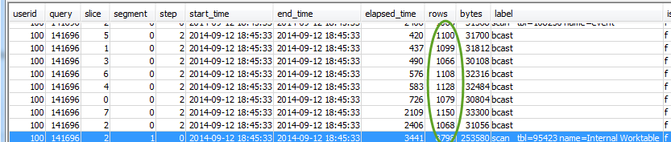
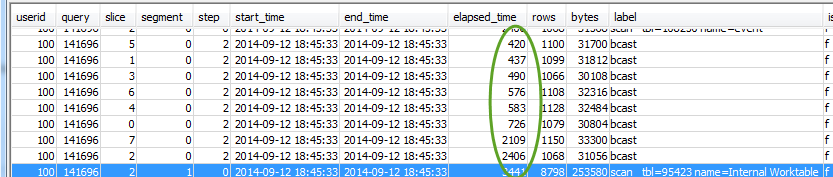

Amazon Redshift will no longer support the creation of new Python UDFs starting Patch 198.
Existing Python UDFs will continue to function until June 30, 2026. For more information, see the
[blog post](https://aws.amazon.com/blogs/big-data/amazon-redshift-python-user-defined-functions-will-reach-end-of-support-after-june-30-2026/ "https://aws.amazon.com/blogs/big-data/amazon-redshift-python-user-defined-functions-will-reach-end-of-support-after-june-30-2026/") .

# Using the SVL_QUERY_REPORT view

To analyze query summary information by slice using
[SVL_QUERY_REPORT](r_SVL_QUERY_REPORT.md "r_SVL_QUERY_REPORT.md"), do the following:

1. Run the following to determine your query ID:

```
select query, elapsed, substring
from svl_qlog
order by query
desc limit 5;
```

Examine the truncated query text in the `substring` field to
determine which `query` value represents your query. If you have run
the query more than once, use the `query` value from the row with
the lower `elapsed` value. That is the row for the compiled version.
If you have been running many queries, you can raise the value used by the
LIMIT clause used to make sure that your query is included. 2. Select rows from SVL_QUERY_REPORT for your query. Order the results by
segment, step, elapsed_time, and rows:

```
select * from svl_query_report where query = MyQueryID order by segment, step, elapsed_time, rows;
```

3. For each step, check to see that all slices are processing approximately the
   same number of rows:



Also check to see that all slices are taking approximately the same amount
of time:



Large discrepancies in these values can indicate data distribution skew due
to a suboptimal distribution style for this particular query. For recommended
solutions, see [Suboptimal data distribution](query-performance-improvement-opportunities.md#suboptimal-data-distribution "query-performance-improvement-opportunities.md#suboptimal-data-distribution").
