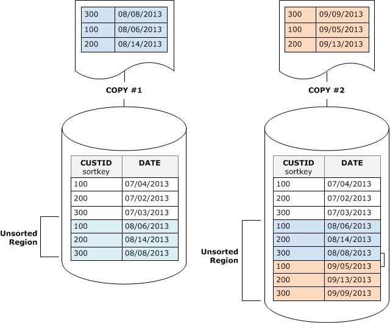
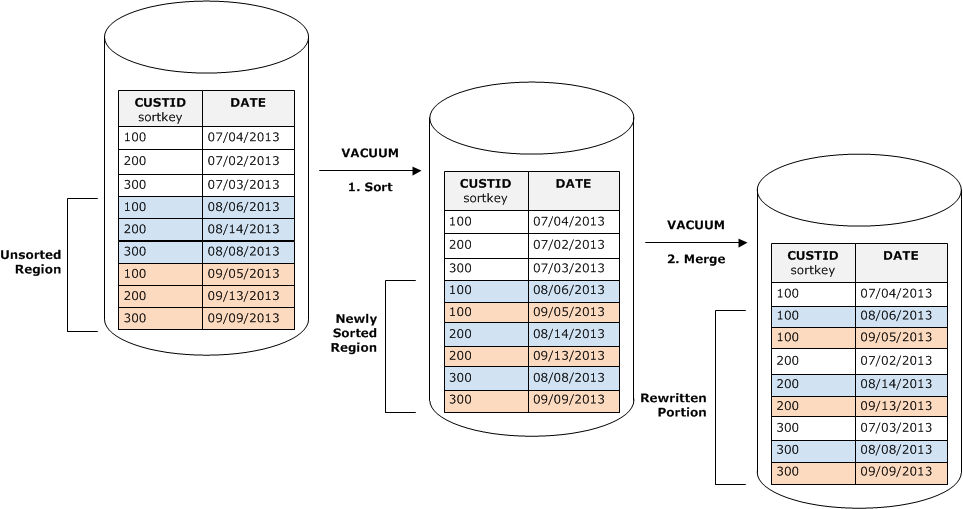
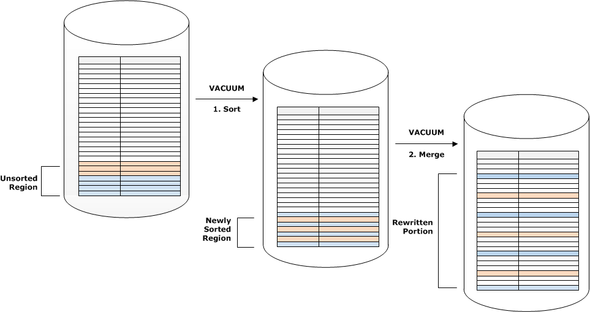
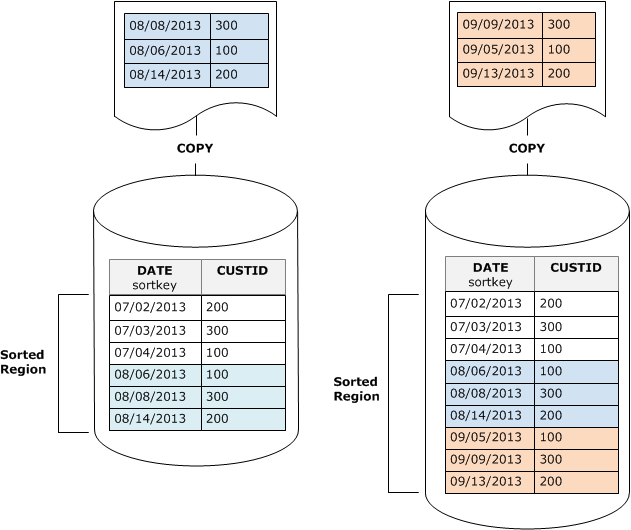
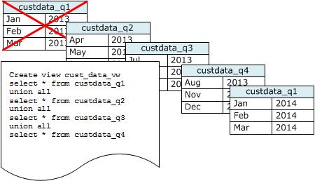

Amazon Redshift will no longer support the creation of new Python UDFs starting November 1, 2025.
If you would like to use Python UDFs, create the UDFs prior to that date.
Existing Python UDFs will continue to function as normal. For more information, see the
[blog post](https://aws.amazon.com/blogs/big-data/amazon-redshift-python-user-defined-functions-will-reach-end-of-support-after-june-30-2026/ "https://aws.amazon.com/blogs/big-data/amazon-redshift-python-user-defined-functions-will-reach-end-of-support-after-june-30-2026/") .

# Minimizing vacuum times

Amazon Redshift automatically sorts data and runs VACUUM DELETE in the background.
This lessens the need to run the VACUUM command. Vacuuming is potentially a time consuming process.
Depending on the nature of your data, we recommend the following practices to minimize vacuum times.

###### Topics

- [Decide whether to reindex](#r_vacuum-decide-whether-to-reindex "#r_vacuum-decide-whether-to-reindex")
- [Reduce the size of the unsorted region](#r_vacuum_diskspacereqs "#r_vacuum_diskspacereqs")
- [Reduce the volume of merged rows](#vacuum-managing-volume-of-unmerged-rows "#vacuum-managing-volume-of-unmerged-rows")
- [Load your data in sort key order](#vacuum-load-in-sort-key-order "#vacuum-load-in-sort-key-order")
- [Use time series tables to reduce stored data](#vacuum-time-series-tables "#vacuum-time-series-tables")

## Decide whether to reindex

You can often significantly improve query performance by using an interleaved sort
style, but over time performance might degrade if the distribution of the values in
the sort key columns changes.

When you initially load an empty interleaved table using COPY or CREATE TABLE AS,
Amazon Redshift automatically builds the interleaved index. If you initially load an interleaved
table using INSERT, you need to run VACUUM REINDEX afterwards to initialize the
interleaved index.

Over time, as you add rows with new sort key values, performance might degrade if
the distribution of the values in the sort key columns changes. If your new rows fall
primarily within the range of existing sort key values, you don’t need to reindex.
Run VACUUM SORT ONLY or VACUUM FULL to restore the sort order.

The query engine is able to use sort order to efficiently select which data blocks
need to be scanned to process a query. For an interleaved sort, Amazon Redshift analyzes the
sort key column values to determine the optimal sort order. If the distribution of
key values changes, or skews, as rows are added, the sort strategy will no longer be
optimal, and the performance benefit of sorting will degrade. To reanalyze the sort
key distribution you can run a VACUUM REINDEX. The reindex operation is time
consuming, so to decide whether a table will benefit from a reindex, query the [SVV_INTERLEAVED_COLUMNS](r_SVV_INTERLEAVED_COLUMNS.md "r_SVV_INTERLEAVED_COLUMNS.md")
view.

For example, the following query shows details for tables that use interleaved
sort keys.

```
`select tbl as tbl_id, stv_tbl_perm.name as table_name,
col, interleaved_skew, last_reindex
from svv_interleaved_columns, stv_tbl_perm
where svv_interleaved_columns.tbl = stv_tbl_perm.id
and interleaved_skew is not null;`
`tbl_id | table_name | col | interleaved_skew | last_reindex
--------+------------+-----+------------------+--------------------
 100048 | customer | 0 | 3.65 | 2015-04-22 22:05:45
 100068 | lineorder | 1 | 2.65 | 2015-04-22 22:05:45
 100072 | part | 0 | 1.65 | 2015-04-22 22:05:45
 100077 | supplier | 1 | 1.00 | 2015-04-22 22:05:45
(4 rows)`
```

The value for `interleaved_skew` is a ratio that indicates the amount
of skew. A value of 1 means that there is no skew. If the skew is greater than 1.4, a
VACUUM REINDEX will usually improve performance unless the skew is inherent in the
underlying set.

You can use the date value in `last_reindex` to determine how long it
has been since the last reindex.

## Reduce the size of the unsorted region

The unsorted region grows when you load large amounts of new data into tables that
already contain data or when you do not vacuum tables as part of your routine
maintenance operations. To avoid long-running vacuum operations, use the following
practices:

- Run vacuum operations on a regular schedule.

If you load your tables in small increments (such as daily updates that
represent a small percentage of the total number of rows in the table), running
VACUUM regularly will help ensure that individual vacuum operations go
quickly.

- Run the largest load first.

If you need to load a new table with multiple COPY operations, run the
largest load first. When you run an initial load into a new or truncated table,
all of the data is loaded directly into the sorted region, so no vacuum is
required.

- Truncate a table instead of deleting all of the rows.

Deleting rows from a table does not reclaim the space that the rows occupied
until you perform a vacuum operation; however, truncating a table empties the
table and reclaims the disk space, so no vacuum is required. Alternatively,
drop the table and re-create it.

- Truncate or drop test tables.

If you are loading a small number of rows into a table for test purposes,
don't delete the rows when you are done. Instead, truncate the table and reload
those rows as part of the subsequent production load operation.

- Perform a deep copy.

If a table that uses a compound sort key table has a large unsorted region,
a deep copy is much faster than a vacuum. A deep copy recreates and repopulates
a table by using a bulk insert, which automatically re-sorts the table. If a
table has a large unsorted region, a deep copy is much faster than a vacuum.
The trade off is that you cannot make concurrent updates during a deep copy
operation, which you can do during a vacuum. For more information, see [Amazon Redshift best practices for designing
queries](c_designing-queries-best-practices.md "c_designing-queries-best-practices.md").

## Reduce the volume of merged rows

If a vacuum operation needs to merge new rows into a table's sorted region, the
time required for a vacuum will increase as the table grows larger. You can improve
vacuum performance by reducing the number of rows that must be merged.

Before a vacuum, a table consists of a sorted region at the head of the table,
followed by an unsorted region, which grows whenever rows are added or updated. When
a set of rows is added by a COPY operation, the new set of rows is sorted on the sort
key as it is added to the unsorted region at the end of the table. The new rows are
ordered within their own set, but not within the unsorted region.

The following diagram illustrates the unsorted region after two successive COPY
operations, where the sort key is CUSTID. For simplicity, this example shows a
compound sort key, but the same principles apply to interleaved sort keys, except
that the impact of the unsorted region is greater for interleaved tables.



A vacuum restores the table's sort order in two stages:

1. Sort the unsorted region into a newly-sorted region.

The first stage is relatively cheap, because only the unsorted region is
rewritten. If the range of sort key values of the newly sorted region is higher
than the existing range, only the new rows need to be rewritten, and the vacuum
is complete. For example, if the sorted region contains ID values 1 to 500 and
subsequent copy operations add key values greater than 500, then only the
unsorted region needs to be rewritten. 2. Merge the newly-sorted region with the previously-sorted region.

If the keys in the newly sorted region overlap the keys in the sorted
region, then VACUUM needs to merge the rows. Starting at the beginning of the
newly-sorted region (at the lowest sort key), the vacuum writes the merged rows
from the previously sorted region and the newly sorted region into a new set of
blocks.

The extent to which the new sort key range overlaps the existing sort keys
determines the extent to which the previously-sorted region will need to be
rewritten. If the unsorted keys are scattered throughout the existing sort range, a
vacuum might need to rewrite existing portions of the table.

The following diagram shows how a vacuum would sort and merge rows that are added
to a table where CUSTID is the sort key. Because each copy operation adds a new set
of rows with key values that overlap the existing keys, almost the entire table needs
to be rewritten. The diagram shows single sort and merge, but in practice, a large
vacuum consists of a series of incremental sort and merge steps.



If the range of sort keys in a set of new rows overlaps the range of existing
keys, the cost of the merge stage continues to grow in proportion to the table size
as the table grows while the cost of the sort stage remains proportional to the size
of the unsorted region. In such a case, the cost of the merge stage overshadows the
cost of the sort stage, as the following diagram shows.



To determine what proportion of a table was remerged, query SVV_VACUUM_SUMMARY
after the vacuum operation completes. The following query shows the effect of six
successive vacuums as CUSTSALES grew larger over time.

```
`select * from svv_vacuum_summary
where table_name = 'custsales';`
`table_name | xid | sort_ | merge_ | elapsed_ | row_ | sortedrow_ | block_ | max_merge_
 | | partitions | increments | time | delta | delta | delta | partitions
 -----------+------+------------+------------+------------+-------+------------+---------+---------------
 custsales | 7072 | 3 | 2 | 143918314 | 0 | 88297472 | 1524 | 47
 custsales | 7122 | 3 | 3 | 164157882 | 0 | 88297472 | 772 | 47
 custsales | 7212 | 3 | 4 | 187433171 | 0 | 88297472 | 767 | 47
 custsales | 7289 | 3 | 4 | 255482945 | 0 | 88297472 | 770 | 47
 custsales | 7420 | 3 | 5 | 316583833 | 0 | 88297472 | 769 | 47
 custsales | 9007 | 3 | 6 | 306685472 | 0 | 88297472 | 772 | 47
 (6 rows)`
```

The merge_increments column gives an indication of the amount of data that was
merged for each vacuum operation. If the number of merge increments over consecutive
vacuums increases in proportion to the growth in table size, it indicates that each
vacuum operation is remerging an increasing number of rows in the table because the
existing and newly sorted regions overlap.

## Load your data in sort key order

If you load your data in sort key order using a COPY command, you might reduce or
even remove the need to vacuum.

COPY automatically adds new rows to the table's sorted region when all of the
following are true:

- The table uses a compound sort key with only one sort column.
- The sort column is NOT NULL.
- The table is 100 percent sorted or empty.
- All the new rows are higher in sort order than the existing rows, including
  rows marked for deletion. In this instance, Amazon Redshift uses the first eight bytes of
  the sort key to determine sort order.

For example, suppose you have a table that records customer events using a
customer ID and time. If you sort on customer ID, it’s likely that the sort key range
of new rows added by incremental loads will overlap the existing range, as shown in
the previous example, leading to an expensive vacuum operation.

If you set your sort key to a timestamp column, your new rows will be appended in
sort order at the end of the table, as the following diagram shows, reducing or even
removing the need to vacuum.



## Use time series tables to reduce stored data

If you maintain data for a rolling time period, use a series of tables, as the
following diagram illustrates.



Create a new table each time you add a set of data, then delete the oldest table
in the series. You gain a double benefit:

- You avoid the added cost of deleting rows, because a DROP TABLE operation is
  much more efficient than a mass DELETE.
- If the tables are sorted by timestamp, no vacuum is needed. If each table
  contains data for one month, a vacuum will at most have to rewrite one month’s
  worth of data, even if the tables are not sorted by timestamp.

You can create a UNION ALL view for use by reporting queries that hides the fact
that the data is stored in multiple tables. If a query filters on the sort key, the
query planner can efficiently skip all the tables that aren't used. A UNION ALL can
be less efficient for other types of queries, so you should evaluate query
performance in the context of all queries that use the tables.
