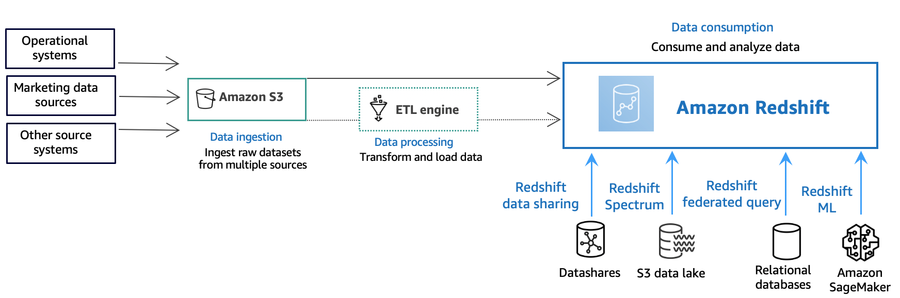

Amazon Redshift will no longer support the creation of new Python UDFs starting Patch 198.
Existing Python UDFs will continue to function until June 30, 2026. For more information, see the
[blog post](https://aws.amazon.com/blogs/big-data/amazon-redshift-python-user-defined-functions-will-reach-end-of-support-after-june-30-2026/ "https://aws.amazon.com/blogs/big-data/amazon-redshift-python-user-defined-functions-will-reach-end-of-support-after-june-30-2026/") .

# Learn Amazon Redshift concepts

Amazon Redshift Serverless lets you access and analyze data without all of the configurations of
a provisioned data warehouse. Resources are automatically provisioned and data warehouse
capacity is intelligently scaled to deliver fast performance for even the most demanding and
unpredictable workloads. You don't incur charges when the data warehouse is idle, so you only
pay for what you use. You can load data and start querying right away in the Amazon Redshift query editor v2
or in your favorite business intelligence (BI) tool. Enjoy the best price performance and
familiar SQL features in an easy-to-use, zero administration environment.

If you are a first-time user of Amazon Redshift, we recommend that you begin by reading the
following sections:

- [Amazon Redshift Serverless feature overview](../mgmt/serverless-considerations.md "../mgmt/serverless-considerations.md") –
  In this topic, you can find an overview of Amazon Redshift Serverless and its key capabilities.
- [Service highlights and pricing](https://aws.amazon.com/redshift/redshift-serverless "https://aws.amazon.com/redshift/redshift-serverless") –
  On this product detail page, you can find details about Amazon Redshift Serverless highlights and
  pricing.
- [Get started with Amazon Redshift Serverless data warehouses](new-user-serverless.md "new-user-serverless.md"). –
  In this topic, you can learn more about how to create an Amazon Redshift Serverless data warehouse, and start querying data using query editor v2.
  If you prefer to manage your Amazon Redshift resources manually, you can create provisioned
  clusters for your data querying needs. For more information, see [Amazon Redshift clusters](../mgmt/working-with-clusters.md "../mgmt/working-with-clusters.md").

If your organization is eligible and your cluster is being created in an AWS Region where Amazon Redshift Serverless is unavailable,
you might be able to create a cluster under the Amazon Redshift free trial program.
Choose either
**Production** or **Free trial** to
answer the question **What are you planning to use this cluster
for?**
When you choose **Free trial**, you create a configuration with the dc2.large node type.
For more information about choosing a free trial, see
[Amazon Redshift free trial](https://aws.amazon.com/redshift/free-trial/ "https://aws.amazon.com/redshift/free-trial/").

For a list of AWS Regions where Amazon Redshift Serverless is available, see the Amazon Redshift endpoints listed for the
[Redshift Serverless API](../../../general/latest/gr/redshift-service.md "../../../general/latest/gr/redshift-service.md") in the
_Amazon Web Services General Reference_.

The following are some key Amazon Redshift Serverless concepts.

- **Namespace** – A collection of database objects and users. Namespaces group
  together all of the resources you use in Amazon Redshift Serverless, such as schemas, tables, users, datashares, and snapshots.
- **Workgroup** – A collection of compute resources. Workgroups house compute resources that Amazon Redshift Serverless use to run computational tasks.
  Some examples of such resources include Redshift Processing Units (RPUs), security groups, usage limits. Workgroups have network and security settings that you can
  configure using the Amazon Redshift Serverless console, the AWS Command Line Interface, or the Amazon Redshift Serverless APIs.
  For more information about configuring namespace and workgroup resources, see [Working with namespaces](../mgmt/serverless-console-configure-namespace-working.md "../mgmt/serverless-console-configure-namespace-working.md")
  and [Working with workgroups](../mgmt/serverless-console-configure-workgroup-working.md "../mgmt/serverless-console-configure-workgroup-working.md").

Following are some key Amazon Redshift provisioned clusters concepts:

- **Cluster** – The core infrastructure
  component of an Amazon Redshift data warehouse is a cluster.

A _cluster_ is composed of one or more compute
nodes. The _compute nodes_ run the compiled code.

If a cluster is provisioned with two or more compute nodes, an additional
_leader node_ coordinates the compute nodes. The leader node
handles external communication with applications, such as business intelligence
tools and query editors. Your client application interacts directly only with the
leader node. The compute nodes are transparent to external applications.

- **Database** – A cluster contains one or more
  _databases_.

User data is stored in one or more databases on the compute nodes. Your SQL
client communicates with the leader node, which in turn coordinates running
queries with the compute nodes. For details about compute nodes and leader nodes,
see [Data warehouse
system architecture](../dg/c_high_level_system_architecture.md "../dg/c_high_level_system_architecture.md"). Within a database, user data is organized into one
or more schemas.

Amazon Redshift is a relational database management system (RDBMS) and is compatible
with other RDBMS applications. It provides the same functionality as a typical
RDBMS, including online transaction processing (OLTP) functions such as inserting
and deleting data. Amazon Redshift also is optimized for high-performance batch analysis
and reporting of datasets.
Following, you can find a description of typical data processing flow in Amazon Redshift,
along with descriptions of different parts of the flow. For further information about
Amazon Redshift system architecture, see [Data warehouse system
architecture](../dg/c_high_level_system_architecture.md "../dg/c_high_level_system_architecture.md").

The following diagram illustrates a typical data processing flow in Amazon Redshift.

An Amazon Redshift _data warehouse_ is an enterprise-class
relational database query and management system. Amazon Redshift supports client connections
with many types of applications, including business intelligence (BI), reporting, data,
and analytics tools. When you run analytic queries, you are retrieving, comparing, and
evaluating large amounts of data in multiple-stage operations to produce a final
result.

At the _data ingestion_ layer, different types of
data sources continuously upload structured, semi-structured, or unstructured data to the
data storage layer. This data storage area serves as a staging area that stores data in
different states of consumption readiness. An example of storage might be an Amazon Simple Storage Service
(Amazon S3) bucket.

At the optional _data processing_ layer, the
source data goes through preprocessing, validation, and transformation using extract,
transform, load (ETL) or extract, load, transform (ELT) pipelines. These raw datasets
are then refined by using ETL operations. An example of an ETL engine is
AWS Glue.

At the _data consumption_ layer, data is loaded into your
Amazon Redshift cluster, where you can run analytical workloads.

For some examples of analytical workloads, see [Querying outside data sources](data-querying.md "data-querying.md").
