Amazon Redshift will no longer support the creation of new Python UDFs starting Patch 198.
Existing Python UDFs will continue to function until June 30, 2026. For more information, see the
[blog post](https://aws.amazon.com/blogs/big-data/amazon-redshift-python-user-defined-functions-will-reach-end-of-support-after-june-30-2026/ "https://aws.amazon.com/blogs/big-data/amazon-redshift-python-user-defined-functions-will-reach-end-of-support-after-june-30-2026/") .

# Get started with Amazon Redshift Serverless data warehouses

If you are a first-time user of Amazon Redshift Serverless, we recommend that you read the following sections to help you get started
using Amazon Redshift Serverless. The basic flow of Amazon Redshift Serverless is to create serverless resources, connect to Amazon Redshift Serverless,
load sample data, and then run queries on the data. In this guide, you can choose to load sample data from Amazon Redshift Serverless or from an Amazon S3 bucket.
The sample data is used throughout the Amazon Redshift documentation to demonstrate features.
To get started using Amazon Redshift provisioned data warehouses, see
[Get started with Amazon Redshift provisioned data warehouses](new-user.md "new-user.md").

- [Signing up for AWS](#serverless-prereq-signup "#serverless-prereq-signup")
- [Creating a data warehouse with Amazon Redshift Serverless](#serverless-console-resource-creation "#serverless-console-resource-creation")
- [Loading in data from Amazon S3](#serverless-load-data-from-s3 "#serverless-load-data-from-s3")

## Signing up for AWS

If you don't already have an AWS account, sign up for one. If you already have an account,
you can skip this prerequisite and use your existing account.

1. Open [https://portal.aws.amazon.com/billing/signup](https://portal.aws.amazon.com/billing/signup "https://portal.aws.amazon.com/billing/signup").
2. Follow the online instructions.

When you sign up for an AWS account, an AWS account root user is created.
The root user has access to all AWS services and resources in the account.
As a security best practice, [assign administrative access to an administrative user](../../../singlesignon/latest/userguide/getting-started.md "../../../singlesignon/latest/userguide/getting-started.md"), and use
only the root user to perform
[tasks that require root user access](../../../accounts/latest/reference/root-user-tasks.md "../../../accounts/latest/reference/root-user-tasks.md").

## Creating a data warehouse with Amazon Redshift Serverless

The first time you log in to the Amazon Redshift Serverless console, you are prompted to access the getting started experience, which
you can use to create and manage serverless resources.
In this guide, you'll create serverless resources using Amazon Redshift Serverless's default settings.

For more granular control of your setup, choose **Customize
settings**.

###### Note

Redshift Serverless requires an Amazon VPC with three subnets in three different availability zones. Redshift Serverless also requires at least 3 available IP addresses.
Make sure that the Amazon VPC that you use for Redshift Serverless has three subnets in three different availability zones, and at least 3
available IP addresses, before continuing. For more information
about creating subnets in an Amazon VPC, see [Create a subnet](../../../vpc/latest/userguide/create-subnets.md "../../../vpc/latest/userguide/create-subnets.md")
in the _Amazon Virtual Private Cloud User Guide_. For more information about IP addresses in an Amazon VPC, see
[IP addressing for your VPCs and subnets](../../../vpc/latest/userguide/vpc-ip-addressing.md "../../../vpc/latest/userguide/vpc-ip-addressing.md").

###### To configure with default settings:

1. Sign in to the AWS Management Console and open the Amazon Redshift console at
   [https://console.aws.amazon.com/redshiftv2/](https://console.aws.amazon.com/redshiftv2/ "https://console.aws.amazon.com/redshiftv2/").

Choose **Try Redshift Serverless Free Trial**. 2. Under **Configuration**, choose **Use
default settings**. Amazon Redshift Serverless creates a default
namespace with a default workgroup associated with this namespace. Choose **Save configuration**.

###### Note

A **Namespace** is a collection of database objects and users.
Namespaces group together all of the resources you use in Redshift Serverless, such as schemas, tables, users, datashares, and snapshots.

A **Workgroup** is a collection of compute resources. Workgroups house compute resources
that Redshift Serverless uses to run computational tasks.

The following screenshot shows the default settings for
Amazon Redshift Serverless.

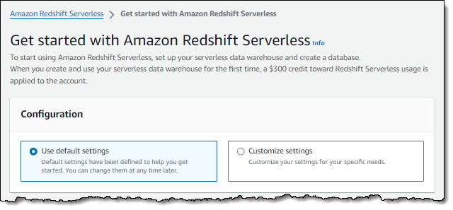 3. After setup completes, choose **Continue** to go to
your **Serverless dashboard**. You can see that the serverless workgroup and namespace are available.

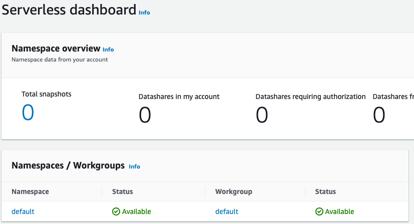

###### Note

If Redshift Serverless doesn't create the workgroup successfully, you can do the following:

    * Address any errors that Redshift Serverless reports, such as having too few subnets in your Amazon VPC.
    * Delete the namespace by choosing **default-namespace** in the Redshift Serverless dashboard,
     and then choosing **Actions**, **Delete namespace**. Deleting a namespace
     takes several minutes.
    * When you open the Redshift Serverless console again, the welcome screen appears.

### Loading sample data

Now that you've set up your data warehouse with Amazon Redshift Serverless, you can use the Amazon Redshift query editor v2 to load sample data.

1. To launch query editor v2 from the Amazon Redshift Serverless console, choose **Query data**. When you invoke query editor v2
   from the Amazon Redshift Serverless console, a new browser tab opens with the query editor. The query editor v2 connects from
   your client machine to the Amazon Redshift Serverless environment.

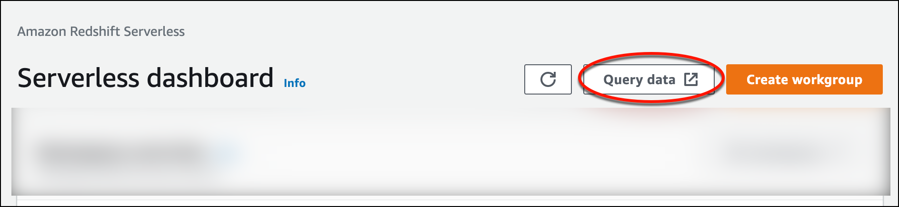 2. For this guide, you'll use your AWS administrator account and the default AWS KMS key.
For information about configuring the query editor v2, including which permissions are needed, see [Configuring
your AWS account](../mgmt/query-editor-v2-getting-started.md "../mgmt/query-editor-v2-getting-started.md") in the _Amazon Redshift Management Guide_. For information about
configuring Amazon Redshift to use a customer managed key, or to change the KMS key that Amazon Redshift uses, see
[Changing the AWS KMS key for a namespace](../mgmt/serverless-workgroups-and-namespaces-rotate-kms-key.md "../mgmt/serverless-workgroups-and-namespaces-rotate-kms-key.md"). 3. To connect to a workgroup, choose the workgroup name in the tree-view panel.

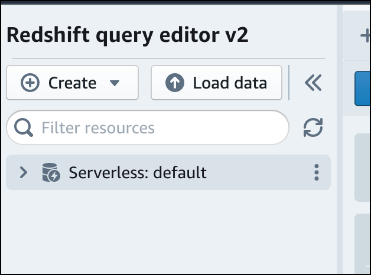 4. When connecting to a new workgroup for the first time within query editor v2, you must select the type of authentication
to use to connect to the workgroup. For this guide, leave **Federated user** selected, and choose
**Create connection**.

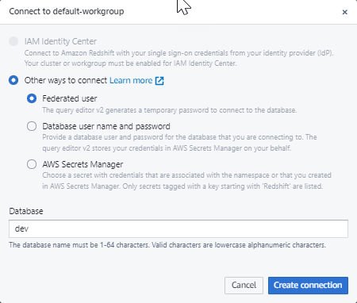

Once you are connected, you can choose to load sample data from Amazon Redshift Serverless or from an Amazon S3 bucket. 5. Under the Amazon Redshift Serverless default workgroup, expand the
**sample_data_dev** database. There are three sample
schemas corresponding to three sample datasets that you can load into the
Amazon Redshift Serverless database. Choose the sample dataset that you want to load,
and choose **Open sample notebooks**.

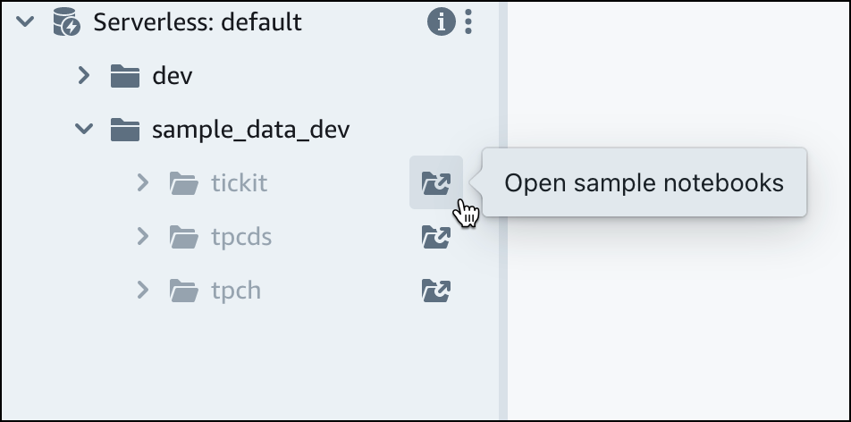

###### Note

A SQL notebook is a container for SQL and Markdown cells. You can use notebooks to organize, annotate, and share multiple
SQL commands in a single document. 6. When loading data for the first time, query editor v2 will prompt you to create
a sample database. Choose **Create**.

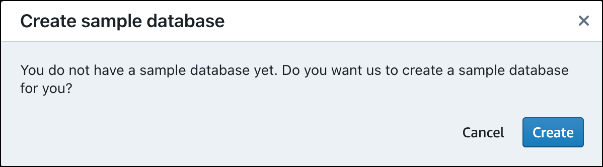

### Running sample queries

After setting up Amazon Redshift Serverless, you can start using a sample dataset in Amazon Redshift Serverless. Amazon Redshift Serverless automatically loads the sample dataset,
such as the tickit dataset, and you can immediately query the data.

- Once Amazon Redshift Serverless finishes loading the sample data, all of the sample queries are loaded in the editor.
  You can choose **Run all** to run all of the
  queries from the sample notebooks.

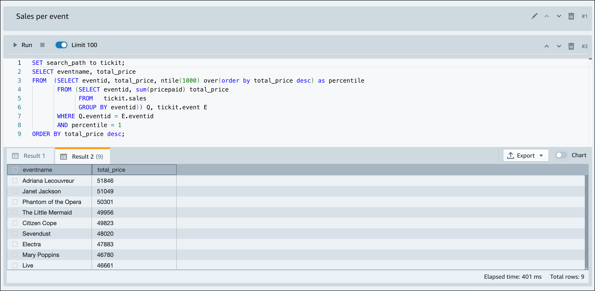

You can also export the results as a JSON or CSV file or view the results in a chart.

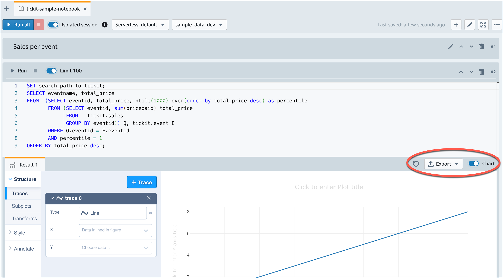

You can also load data from an Amazon S3 bucket. See [Loading in data from Amazon S3](#serverless-load-data-from-s3 "#serverless-load-data-from-s3") to learn more.

## Loading in data from Amazon S3

After creating your data warehouse, you can load data from Amazon S3.

At this point, you have a database named `dev`.
Next, you will create some tables in the database, upload data to the tables, and try a query.
For your convenience, the sample data that you load is available in an Amazon S3 bucket.

1. Before you can load data from Amazon S3, you must first create an IAM role with the
   necessary permissions and attach it to your serverless namespace. To do so,
   return to the Redshift Serverless console and
   choose **Namespace configuration**. From the navigation menu, choose your namespace, and
   then choose **Security and encryption**. Then, choose **Manage
   IAM roles**.

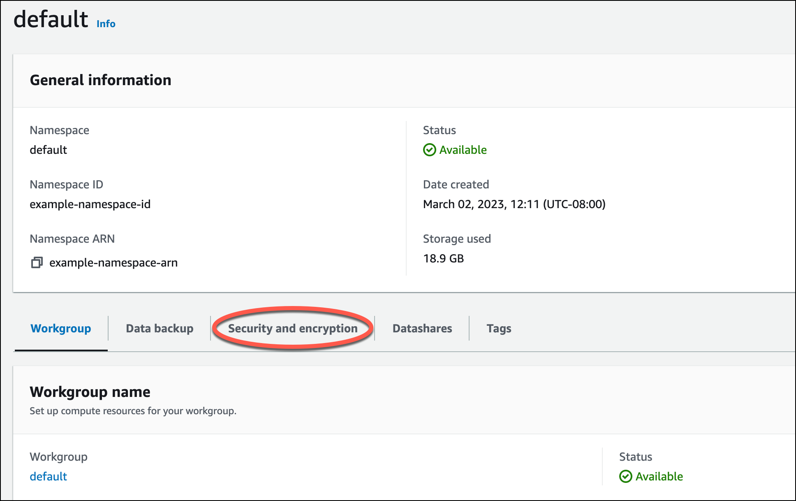 2. Expand the **Manage IAM roles** menu, and choose **Create IAM role**.

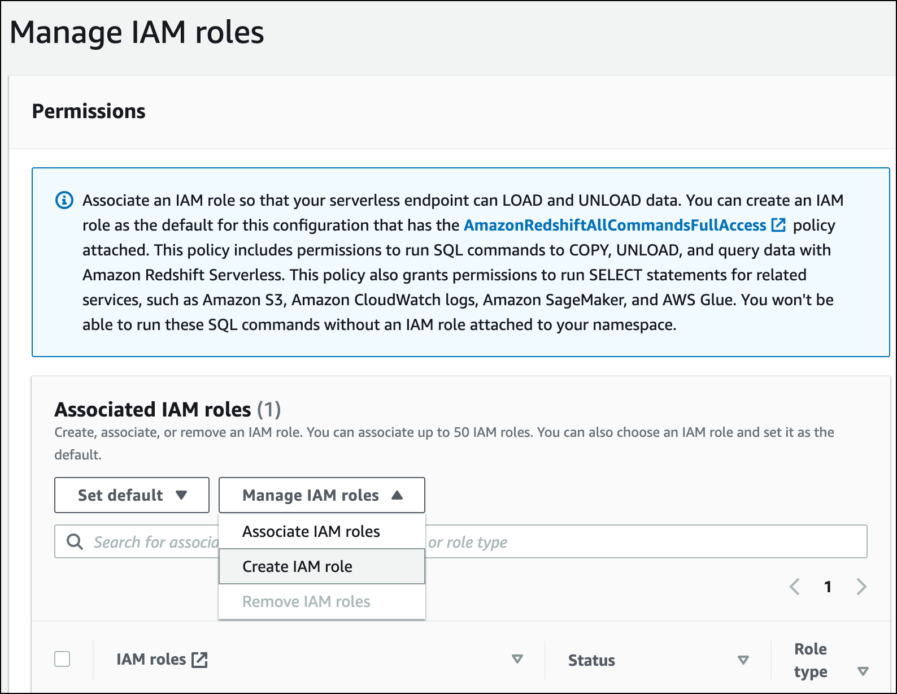 3. Choose the level of S3 bucket access that you want to grant to this role, and choose
**Create IAM role as default**.

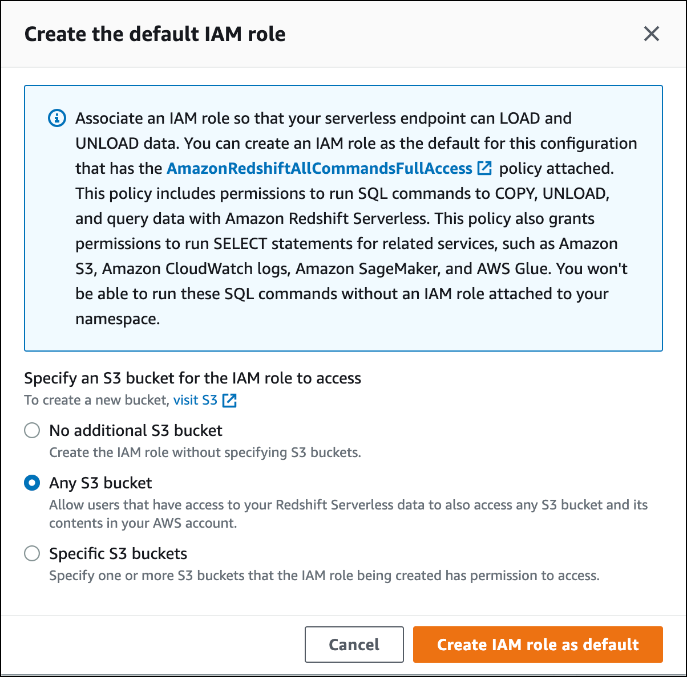 4. Choose **Save changes**. You can now load sample data from Amazon S3.

The following steps use data within a public Amazon Redshift S3 bucket, but you can replicate the same steps
using your own S3 bucket and SQL commands.

###### Load sample data from Amazon S3

1. In query editor v2, choose
   
   Add, then choose
   **Notebook** to create a new SQL notebook.

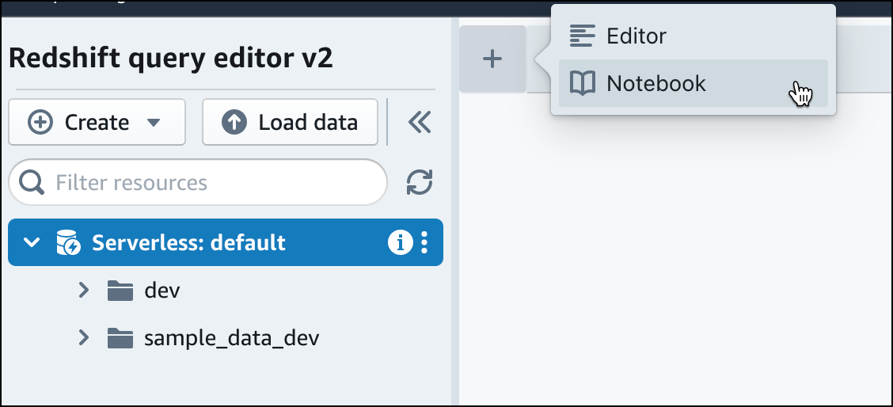 2. Switch to the `dev` database.

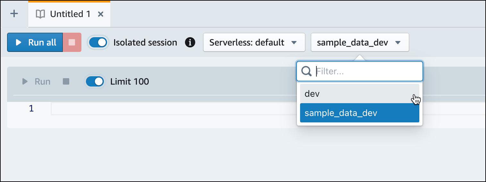 3. Create tables.

If you are using the query editor v2, copy and run the following
create table statements to create tables in the `dev` database. For more information about the syntax, see [CREATE TABLE](../dg/r_CREATE_TABLE_NEW.md "../dg/r_CREATE_TABLE_NEW.md") in the
_Amazon Redshift Database Developer Guide_.

```
create table users(
userid integer not null distkey sortkey,
username char(8),
firstname varchar(30),
lastname varchar(30),
city varchar(30),
state char(2),
email varchar(100),
phone char(14),
likesports boolean,
liketheatre boolean,
likeconcerts boolean,
likejazz boolean,
likeclassical boolean,
likeopera boolean,
likerock boolean,
likevegas boolean,
likebroadway boolean,
likemusicals boolean);

create table event(
eventid integer not null distkey,
venueid smallint not null,
catid smallint not null,
dateid smallint not null sortkey,
eventname varchar(200),
starttime timestamp);

create table sales(
salesid integer not null,
listid integer not null distkey,
sellerid integer not null,
buyerid integer not null,
eventid integer not null,
dateid smallint not null sortkey,
qtysold smallint not null,
pricepaid decimal(8,2),
commission decimal(8,2),
saletime timestamp);

```

4. In the query editor v2, create a new SQL cell in your notebook.

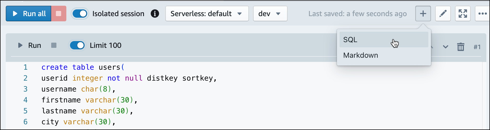 5. Now use the COPY command in query editor v2 to load large datasets from Amazon S3 or Amazon DynamoDB into Amazon Redshift.
For more information about COPY syntax, see [COPY](../dg/r_COPY.md "../dg/r_COPY.md") in the
_Amazon Redshift Database Developer Guide_.

You can run the COPY command with some sample data available in a public S3 bucket. Run the following
SQL commands in the query editor v2.

```
COPY users
FROM 's3://redshift-downloads/tickit/allusers_pipe.txt'
DELIMITER '|'
TIMEFORMAT 'YYYY-MM-DD HH:MI:SS'
IGNOREHEADER 1
REGION 'us-east-1'
IAM_ROLE default;

COPY event
FROM 's3://redshift-downloads/tickit/allevents_pipe.txt'
DELIMITER '|'
TIMEFORMAT 'YYYY-MM-DD HH:MI:SS'
IGNOREHEADER 1
REGION 'us-east-1'
IAM_ROLE default;

COPY sales
FROM 's3://redshift-downloads/tickit/sales_tab.txt'
DELIMITER '\t'
TIMEFORMAT 'MM/DD/YYYY HH:MI:SS'
IGNOREHEADER 1
REGION 'us-east-1'
IAM_ROLE default;

```

6. After loading data, create another SQL cell in your notebook and try some example queries. For more information on working
   with the SELECT command, see [SELECT](../dg/r_SELECT_synopsis.md "../dg/r_SELECT_synopsis.md")
   in the _Amazon Redshift Developer Guide_. To understand the sample data's structure and schemas,
   explore using the query editor v2.

```
-- Find top 10 buyers by quantity.
SELECT firstname, lastname, total_quantity
FROM   (SELECT buyerid, sum(qtysold) total_quantity
        FROM  sales
        GROUP BY buyerid
        ORDER BY total_quantity desc limit 10) Q, users
WHERE Q.buyerid = userid
ORDER BY Q.total_quantity desc;

-- Find events in the 99.9 percentile in terms of all time gross sales.
SELECT eventname, total_price
FROM  (SELECT eventid, total_price, ntile(1000) over(order by total_price desc) as percentile
       FROM (SELECT eventid, sum(pricepaid) total_price
             FROM   sales
             GROUP BY eventid)) Q, event E
       WHERE Q.eventid = E.eventid
       AND percentile = 1
ORDER BY total_price desc;
```

Now that you've loaded in data and ran some sample queries, you can explore other areas of Amazon Redshift Serverless. See the
following list to learn more about how you can use Amazon Redshift Serverless.

- You can load data from an Amazon S3 bucket. See [Loading data from Amazon S3](../mgmt/query-editor-v2-loading.md#query-editor-v2-loading-data "../mgmt/query-editor-v2-loading.md#query-editor-v2-loading-data") for more information.
- You can use the query editor v2 to load in data from a local character-separated file that is smaller than 5 MB.
  For more information, see [Loading data from a local file](../mgmt/query-editor-v2-loading.md#query-editor-v2-loading-data-local "../mgmt/query-editor-v2-loading.md#query-editor-v2-loading-data-local").
- You can connect to Amazon Redshift Serverless with third-party SQL tools with the JDBC and ODBC driver. See
  [Connecting to Amazon Redshift Serverless](../mgmt/serverless-connecting.md "../mgmt/serverless-connecting.md") for
  more information.
- You can also use the Amazon Redshift Data API to connect to Amazon Redshift Serverless. See [Using the Amazon Redshift Data API](https://github.com/aws-samples/getting-started-with-amazon-redshift-data-api "https://github.com/aws-samples/getting-started-with-amazon-redshift-data-api")
  for more information.
- You can use your data in Amazon Redshift Serverless with Redshift ML to create machine learning models with the CREATE MODEL command.
  See [Tutorial: Building
  customer churn models](../dg/tutorial_customer_churn.md "../dg/tutorial_customer_churn.md") to learn how to build a Redshift ML model.
- You can query data from an Amazon S3 data lake without loading any data into Amazon Redshift Serverless. See [Querying a data lake](../mgmt/query-editor-v2-querying-data-lake.md "../mgmt/query-editor-v2-querying-data-lake.md") for more information.
